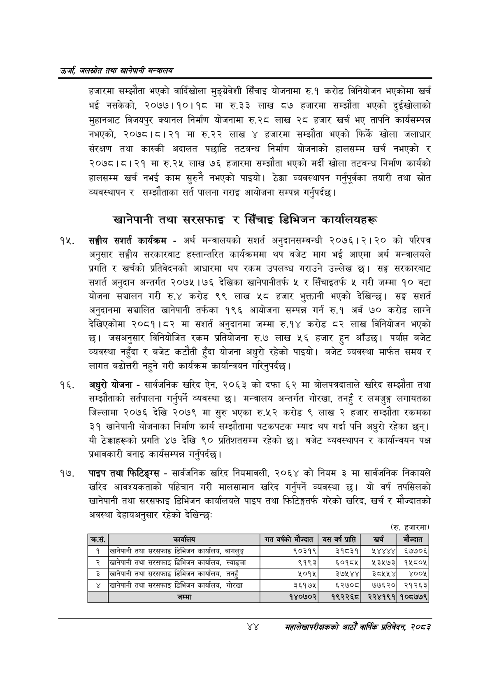

# Page 66 QA

## Rendered page


## Extracted text

```text
उर्जा जलखोत तथा खानेपानी सन्तालय
हजारमा सम्झौता भएको वार्दिखोला मुङ्ग्रेवशी सिँचाइ योजनामा रु.१ करोड विनियोजन भएकोमा खर्च भई नसकेको, २०७७।१०।१८ मा रु.३३ लाख ८७ हजारमा सम्झौता भएको दुईखोलाको मुहानबाट विजयपुर क्यानल निर्माण योजनामा रु.२८ लाख २८ हजार खर्च भए तापनि कार्यसम्पन्न नभएको, २०७८।८।२१ मा रु.२२ लाख ४ हजारमा सम्झौता भएको फिर्के खोला जलाधार संरक्षण तथा कास्की अदालत पछाडि तटबन्ध निर्माण योजनाको हालसम्म खर्च नभएको र २०७८।८।२१ मा रु.२५ लाख ७६ हजारमा सम्झौता भएको मर्दी खोला तटबन्ध निर्माण कार्यको हालसम्म खर्च नभई काम सुरुनै नभएको पाइयो। ठेक्का व्यवस्थापन गर्नुपूर्वका तयारी तथा स्रोत व्यवस्थापन र सम्झौताका सर्त पालना गराइ आयोजना सम्पन्न गर्नुपर्दछ |
खानेपानी तथा सरसफाइ र सिँचाइ डिभिजन कार्यालयहरू
सङ्घीय सशर्त कार्यक्रम -अर्थ मन्त्रालयको सशर्त अनुदानसम्बन्धी २०७६।२।२० को परिपत्र अनुसार सङ्घीय सरकारबाट हस्तान्तरित कार्यक्रममा थप बजेट माग भई आएमा अर्थ मन्त्रालयले प्रगति र खर्चको प्रतिवेदनको आधारमा थप रकम उपलब्ध गराउने उल्लेख छ। सङ्घ सरकारबाट अनुदान अन्तर्गत २०७५।७६ देखिका खानेपानीतर्फ ५ र सिँचाइतर्फ ५ गरी जम्मा १० वटा योजना सञ्चालन गरी रु.४ करोड ९९ लाख ५८ हजार भुक्तानी भएको देखिन्छ। सङ्घ सशर्त अनुदानमा सञ्चालित खानेपानी तर्फका १९६ आयोजना सम्पन्न गर्न रु.१ अर्ब ७० करोड लाग्ने देखिएकोमा २०८१।८२ मा सशर्त अनुदानमा जम्मा रु.१४ करोड ८२ लाख विनियोजन भएको छ। जसअनुसार विनियोजित रकम प्रतियोजना रु.७ लाख ५६ हजार हुन आँउछ। पर्याप्त बजेट व्यवस्था नहुँदा र बजेट कटौती हुँदा योजना अधुरो रहेको पाइयो। बजेट व्यवस्था मार्फत समय र लागत बढोत्तरी नहुने गरी कार्यक्रम कार्यान्वयन गरिनुपर्दछ |
अधुरो योजना -सार्वजनिक खरिद ऐन, २०६३ को दफा ६२ मा बोलपत्रदाताले खरिद सम्झौता तथा सम्झौताको सर्तपालना गर्नुपर्ने व्यवस्था छ। मन्त्रालय अन्तर्गत गोरखा, तनहुँ र लमजुङ्ग लगायतका जिल्लामा २०७६ देखि २०७९ मा सुरु भएका रु.५२ करोड ९ लाख २ हजार सम्झौता रकमका ३१ खानेपानी योजनाका निर्माण कार्य सम्झौतामा पटकपटक म्याद थप गर्दा पनि अधुरो रहेका छन्‌। यी ठेक्काहरूको प्रगति ४७ देखि ९० प्रतिशतसम्म रहेको छ। बजेट व्यवस्थापन र कार्यान्वयन पक्ष प्रभावकारी बनाइ कार्यसम्पन्न गर्नुपर्दछ |
पाइप तथा फिटिङ्ग्स -सार्वजनिक खरिद नियमावली, २०६४ को नियम ३ मा सार्वजनिक निकायले खरिद आवश्यकताको पहिचान गरी मालसामान खरिद गर्नुपर्ने व्यवस्था छ। यो वर्ष तपसिलको खानेपानी तथा सरसफाइ डिभिजन कार्यालयले पाइप तथा फिटिङ्गतर्फ गरेको खरिद, खर्च र मौज्दातको अवस्था देहायअनुसार रहेको देखिन्छ:
(रु. हजारमा
४४
महालेखापरीक्षकको आठौ वाषिकि प्रतिवेदन २०८२

| क्रस. | कार्यालय | गत वर्षको मेज्दात | यस वर्ष प्राप्ति | खर्च | मेंज्दात |
| --- | --- | --- | --- | --- | --- |
| १ | खानेपानी तथा सरसफाइ डिभिजन , बागलुङ्ग | ९०३१९ | ३१८३१ | १४४४४ | ६७७०६ |
| २ | खानेपानी तथा सरसफाइ डिभिजन कार्बाल, स्याङ्जा | ९१९३ | ६५०१८५ | ४१३५७३ | १५८०५ |
| ३ | खानेपानी तथा स९९%ाइ डिभिजन कार्यालव, तनहुँ | ५०१५ | ३७५४४ | ३े८१५५४ | ४००५ |
| ४ | खानेपानी तथा सरसफाइ डिभिजन कार्यालय, गोरखा | ३६१७५ | ६५२७०८ | ७७६२० | २१२६३ |
| ५ | जम्मा | १४०७०२ | १९२२६८ | २२४१९१ | १०८७७९ |
```

## Flags
- table_page
- medium_quality_table
