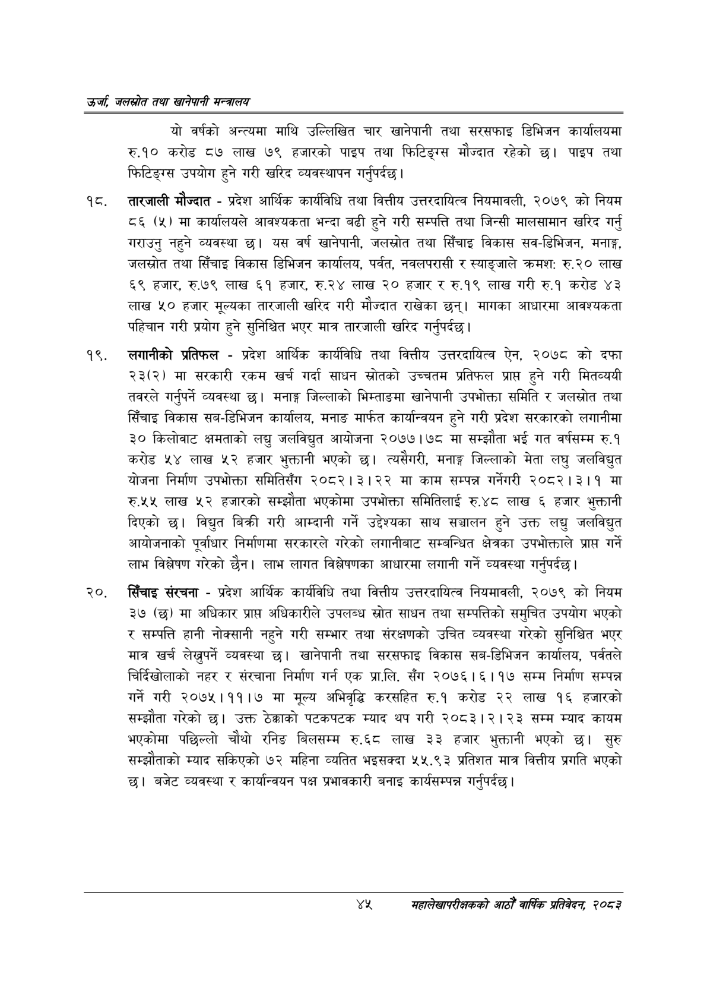

# Page 67 QA

## Rendered page


## Extracted text

```text
उर्जा जलखोत तथा खानेपानी सन्तालय
यो वर्षको अन्त्यमा माथि उल्लिखित चार खानेपानी तथा सरसफाइ डिभिजन कार्यालयमा रु.१० करोड ८७ लाख ७९ हजारको पाइप तथा फिटिङ्ग्स मौज्दात रहेको छ। पाइप तथा फिटिङ्ग्स उपयोग हुने गरी खरिद व्यवस्थापन गर्नुपर्दछ |
१८, तारजाली मौज्दात -प्रदेश आर्थिक कार्यविधि तथा वित्तीय उत्तरदायित्व नियमावली, २०७९ को नियम ८६ (५) मा कार्यालयले आवश्यकता भन्दा बढी हुने गरी सम्पत्ति तथा जिन्सी मालसामान खरिद गर्नु गराउनु नहुने व्यवस्था छ। यस वर्ष खानेपानी, जलस्रोत तथा सिँचाइ विकास सव-डिभिजन, मनाङ्ग, जलस्रोत तथा सिँचाइ विकास डिभिजन कार्यालय, पर्वत, नवलपरासी र स्याङ्जाले क्रमश: रु.२० लाख ६९ हजार, रु.७९ लाख ६१ हजार, रु.२४ लाख २० हजार र रु.१९ लाख गरी रु.१ करोड ४३ लाख ५० हजार मूल्यका तारजाली खरिद गरी मौज्दात राखेका छन्‌। मागका आधारमा आवश्यकता पहिचान गरी प्रयोग हुने सुनिश्चित भएर मात्र तारजाली खरिद गर्नुपर्दछ |
लगानीको प्रतिफल -प्रदेश आर्थिक कार्यविधि तथा वित्तीय उत्तरदायित्व ऐन, २०७८ को दफा २३(२) मा सरकारी रकम खर्च गर्दा साधन स्रोतको उच्चतम प्रतिफल प्राप्त हुने गरी मितव्ययी तवरले गर्नुपर्ने व्यवस्था | मनाङ्ग जिल्लाको भिम्ताङमा खानेपानी उपभोक्ता समिति र जलस्रोत तथा सिँचाइ विकास सब-डिभिजन कार्यालय, मनाङ मार्फत कार्यान्वयन हुने गरी प्रदेश सरकारको लगानीमा ३० किलोवाट क्षमताको लघ्चु जलविद्युत आयोजना २०७७।७८ मा सम्झौता भई गत वर्षसम्म रु.१ करोड ५४ लाख ५२ हजार भुक्तानी भएको छ। त्यसैगरी, मनाङ्ग जिल्लाको मेता लघु जलविद्युत योजना निर्माण उपभोक्ता समितिसँग २०८२।३।२२ मा काम सम्पन्न गर्नेगरी २०८२।३।१ मा रु.५५ लाख ५२ हजारको सम्झौता भएकोमा उपभोक्ता समितिलाई रु.४८ लाख ६ हजार भुक्तानी दिएको छ। विद्युत बिक्री गरी आम्दानी गर्ने उद्देश्यका साथ सञ्चालन हुने उक्त ९ जलविद्युत आयोजनाको पूर्वाधार निर्माणमा सरकारले गरेको लगानीबाट सम्बन्धित क्षेत्रका उपभोक्ताले प्राप्त गर्ने लाभ विश्लेषण गरेको छैन। लाभ लागत विश्लेषणका आधारमा लगानी गर्ने व्यवस्था गर्नुपर्दछ |
सिँचाइ संरचना -प्रदेश आर्थिक कार्यविधि तथा वित्तीय उत्तरदायित्व नियमावली, २०७९ को नियम ३७ (छ) मा अधिकार प्रापत अधिकारीले उपलब्ध स्रोत साधन तथा सम्पत्तिको समुचित उपयोग भएको र सम्पत्ति हानी नोक्सानी नहुने गरी सम्भार तथा संरक्षणको उचित व्यवस्था गरेको सुनिश्चित भएर मात्र खर्च लेख्नुपर्ने व्यवस्था खानेपानी तथा सरसफाइ विकास सब-डिभिजन कार्यालय, पर्वतले चिर्दिखोलाको नहर र संरचाना निर्माण गर्न एक प्रा.लि. सँग २०७६।१६।१७ सम्म निर्माण सम्पन्न गर्ने गरी २०७५।११।७ मा मूल्य अभिवृद्धि करसहित रु.१ करोड २२ लाख १६ हजारको सम्झौता गरेको | उक्त ठेक्काको पटकपटक म्याद थप गरी २०८३।२।२३ सम्म म्याद कायम भएकोमा पछिल्लो चौथो रनिङ बिलसम्म रु.६८ लाख ३३ हजार भुक्तानी भएको छ। सुरु सम्झौताको म्याद सकिएको ७२ महिना व्यतित भइसक्दा ५५.९३ प्रतिशत मात्र वित्तीय प्रगति भएको छ। बजेट व्यवस्था र कार्यान्वयन पक्ष प्रभावकारी बनाइ कार्यसम्पन्न गर्नुपर्दछ |
रप महालेखापरीक्षकको आठौ वाषिकि प्रतिवेदन २०८२
```

## Flags
- None
