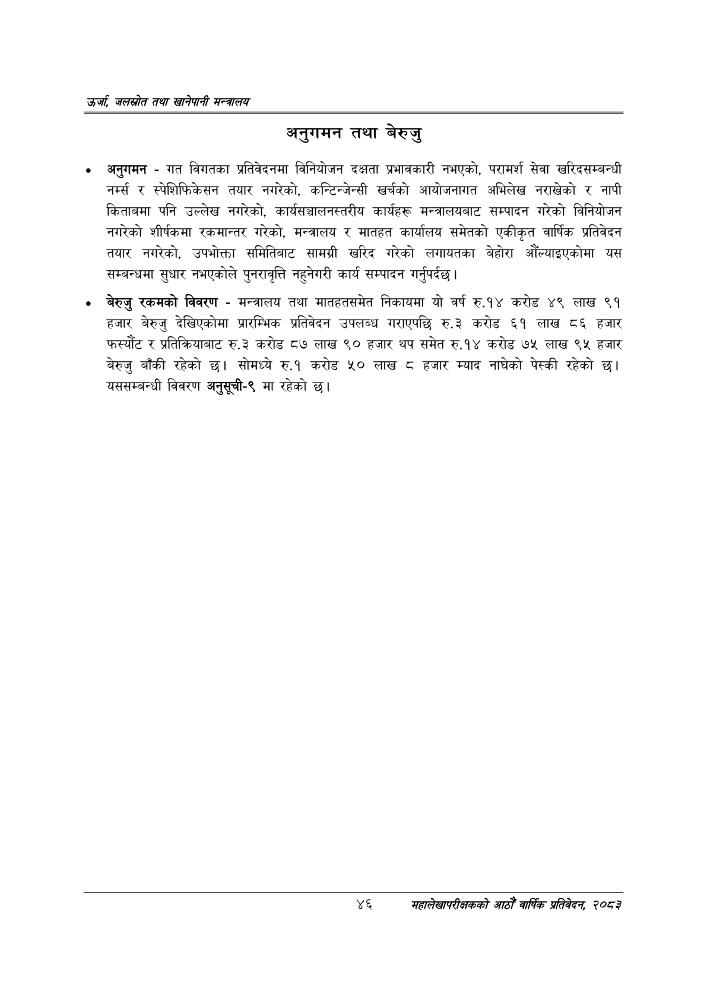

# Page 68 QA

## Rendered page


## Extracted text

```text
उर्जा जलखोत तथा खानेपानी सन्तालय
अनुगमन तथा बेरुजु
अनुगमन -गत विगतका प्रतिवेदनमा विनियोजन दक्षता प्रभावकारी नभएको, परामर्श सेवा खरिदसम्बन्धी र स्पेशिफिकेसन तयार नगरेको, कन्टिन्जेन्सी खर्चको आयोजनागत अभिलेख नराखेको र नापी किताबमा पनि उल्लेख नगरेको, कार्यसञ्चालनस्तरीय कार्यहरू मन्त्रालयबाट सम्पादन गरेको विनियोजन नगरेको शीर्षकमा रकमान्तर गरेको, मन्त्रालय र मातहत कार्यालय समेतको एकीकृत वार्षिक प्रतिवेदन तयार नगरेको, उपभोक्ता समितिबाट सामग्री खरिद गरेको लगायतका बेहोरा औँल्याइएकोमा यस सम्बन्धमा सुधार नभएकोले पुनरावृत्ति नहुनेगरी कार्य सम्पादन गर्नुपर्दछ |
बेरुजु रकमको विवरण -मन्त्रालय तथा मातहतसमेत निकायमा यो वर्ष रु.१४ करोड ४९ लाख ९१ हजार बेरुजु देखिएकोमा प्रारम्भिक प्रतिवेदन उपलब्ध गराएपछि रु.३ करोड ६१ लाख ८६ हजार फरस्यौट र प्रतिक्रियाबाट रु.३ करोड ८७ लाख ९० हजार थप समेत रु.१४ करोड ७५ लाख ९५ हजार बेरुजु बाँकी रहेको छ। सोमध्ये रु.१ करोड ५२० लाख ८ हजार म्याद नाघेको पेस्की रहेको यससम्बन्धी विवरण अनुसूची-९ मा रहेको |
४६
महालेखापरीक्षकको आठौ वाषिकि प्रतिवेदन २०८२
```

## Flags
- None
