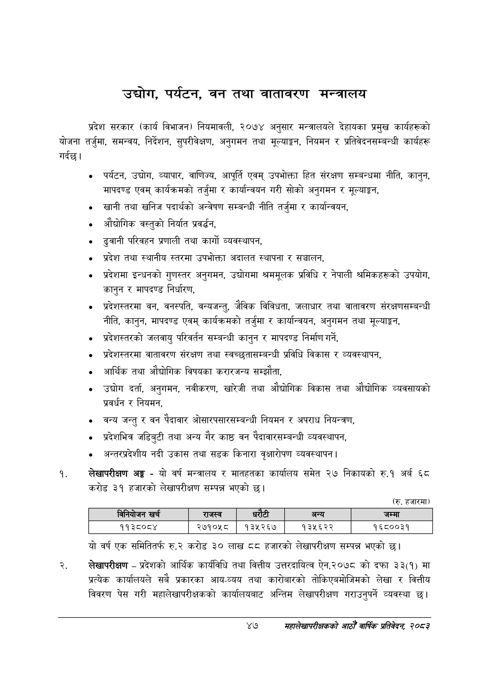

# Page 69 QA

## Rendered page


## Extracted text

```text
उद्योग, पर्यटन, वन तथा वातावरण मन्त्रालय
गर्दछ। प्रदेश सरकार (कार्य विभाजन) नियमावली, २०७४ अनुसार मन्त्रालयले देहायका प्रमुख कार्यहरूको योजना तर्जुमा, समन्वय, निर्देशन, सुपरीवेक्षण, अनुगमन तथा मूल्याङ्कन, नियमन र प्रतिवेदनसम्बन्धी कार्यहरू
पर्यटन, उद्योग, व्यापार, वाणिज्य, आपूर्ति एवम्‌ उपभोक्ता हित संरक्षण सम्बन्धमा नीति, कानुन, मापदण्ड एवम्‌ कार्यक्रमको तर्जुमा र कार्यान्वयन गरी सोको अनुगमन र मूल्याङ्कन,
खानी तथा खनिज पदार्थको अन्वेषण सम्बन्धी नीति तर्जुमा र कार्यान्वयन,
औद्योगिक वस्तुको निर्यात प्रवर्द्धन,
ढुवानी परिवहन प्रणाली तथा कार्गो व्यवस्थापन,
प्रदेश तथा स्थानीय स्तरमा उपभोक्ता अदालत स्थापना र सञ्चालन,
«० प्रदेशमा इन्धनको गुणस्तर अनुगमन, उद्योगमा श्रममूलक प्रविधि र नेपाली श्रमिकहरूको उपयोग, कानुन र मापदण्ड निर्धारण,
० प्रदेशस्तरमा वन, वनस्पति, वन्यजन्तु, जैविक विविधता, जलाधार तथा वातावरण संरक्षणसम्बन्धी नीति, कानुन, मापदण्ड एवम्‌ कार्यक्रमको तर्जुमा र कार्यान्वयन, अनुगमन तथा मूल्याङ्कन,
० प्रदेशस्तरको जलवायु परिवर्तन सम्बन्धी कानुन र मापदण्ड निर्माण गर्ने,
«० प्रदेशस्तरमा वातावरण संरक्षण तथा स्वच्छतासम्बन्धी प्रविधि विकास र व्यवस्थापन,
आर्थिक तथा औद्योगिक विषयका करारजन्य सम्झौता,
० उद्योग दर्ता, अनुगमन, नवीकरण, खारेजी तथा औद्योगिक विकास तथा औद्योगिक व्यवसायको प्रवर्धन र नियमन,
वन्य जन्तु र वन पैदावार ओसारपसारसम्बन्धी नियमन र अपराध नियन्त्रण,
प्रदेशभित्र जडिबुटी तथा अन्य गैर काष्ठ वन पैदावारसम्बन्धी व्यवस्थापन,
० अन्तरप्रदेशीय नदी उकास तथा सडक किनारा वृक्षारोपण व्यवस्थापन |
लेखापरीक्षण अङ्ग -यो वर्ष मन्त्रालय र मातहतका कार्यालय समेत २७ निकायको रु.१ अर्ब ६८ करोड ३९ हजारको लेखापरीक्षण सम्पन्न भएको छ।
(रु. हजारमा)
यो वर्ष एक समितितर्फ रु.२ करोड ३० लाख ८८ हजारको लेखापरीक्षण सम्पन्न भएको छ।
लेखापरीक्षण -प्रदेशको आर्थिक कार्यविधि तथा वित्तीय उत्तरदायित्व ऐन,२०७८ को दफा ३३(१) मा प्रत्येक कार्यालयले सबै प्रकारका आय-व्यय तथा कारोबारको तोकिएबमोजिमको लेखा र वित्तीय विवरण पेस गरी महालेखापरीक्षकको कार्यालयबाट अन्तिम लेखापरीक्षण गराउनुपर्ने व्यवस्था छ।
४७
महालेखापरीक्षकको आठौ वाषिकि प्रतिवेदन २०८२

|  | नानिकोजन खर्च | राजस्व | धरटी |  | अन्य |
| --- | --- | --- | --- | --- | --- |
|  | ११३८०८४ | २७१०५८० | १३५२६७ |  | १३५६२२ |
```

## Flags
- table_page
- medium_quality_table
