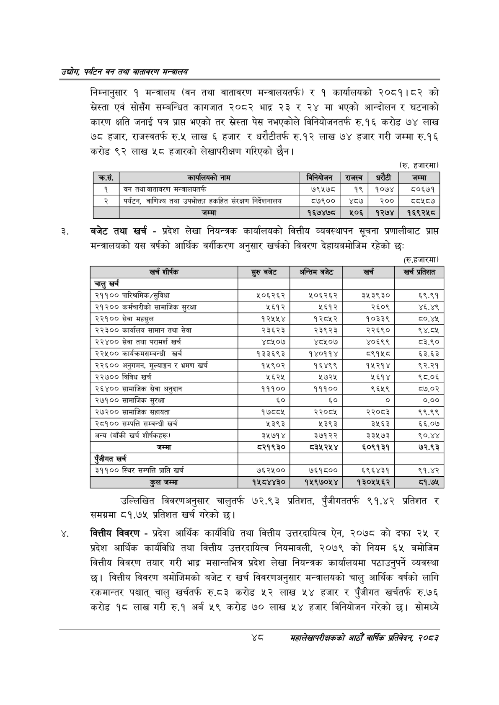

# Page 70 QA

## Rendered page


## Extracted text

```text
उद्योग पर्यटन वन तथा वातावरण मन्वालय
निम्नानुसार १ मन्त्रालय (वन तथा वातावरण मन्त्रालयतर्फ) र १ कार्यालयको २०८१।८२ को स्रेस्ता एवं सोसँग सम्बन्धित कागजात २०८२ भाद्र २३ र २४ मा भएको आन्दोलन र घटनाको कारण क्षति जनाई पत्र प्रापत भएको तर स्रेस्ता पेस नभएकोले विनियोजनतर्फ रु.१६ करोड ७४ लाख ७८ हजार, राजस्वतर्फ रु.« लाख ६ हजार र धरौटीतर्फ रु.१२ लाख ७४ हजार गरी जम्मा रु.१६ करोड ९२ लाख ५८ हजारको लेखापरीक्षण गरिएको छैन।
(रु. हजारमा)
बजेट तथा खर्च -प्रदेश लेखा नियन्त्रक कार्यालयको वित्तीय व्यवस्थापन सूचना प्रणालीबाट प्राप्त मन्त्रालयको यस वर्षको आर्थिक वर्गीकरण अनुसार खर्चको विवरण देहायबमोजिम रहेको छः
(रु.हजारमा)
उल्लिखित विवरणअनुसार चालुतर्फ ७२.९३ प्रतिशत, पुँजीगततर्फ ९१.४२ प्रतिशत र समग्रमा ८१.७५ प्रतिशत खर्च गरेको छ।
वकित्तीय विवरण -प्रदेश आर्थिक कार्यविधि तथा वित्तीय उत्तरदायित्व ऐन, २०७८ को दफा २५ र प्रदेश आर्थिक कार्यविधि तथा वित्तीय उत्तरदायित्व नियमावली, २०७९ को नियम ६५ बमोजिम वित्तीय विवरण तयार गरी भाद्र मसान्तभित्र प्रदेश लेखा नियन्त्रक कार्यालयमा पठाउनुपर्ने व्यवस्था छ। वित्तीय विवरण बमोजिमको बजेट र खर्च विवरणअनुसार मन्त्रालयको चालु आर्थिक वर्षको लागि रकमान्तर पश्चात्‌ चालु खर्चतर्फ रु.८३ करोड ५२ लाख ५४ हजार र पुँजीगत खर्चतर्फ रु.७६ करोड १८ लाख गरी रु.१ अर्ब ५९ करोड ७० लाख ५४ हजार विनियोजन गरेको छ। सोमध्ये
महालेखापरीक्षकको आठौ वाषिकि प्रतिवेदन २०८२

| क्रस. | नाम | बिनबाणन | राजस्व | धरेटी | जम्मा |
| --- | --- | --- | --- | --- | --- |
| १ | बन तथा वातावरण मन्न्रालबतर्फ | ७९५७८ | १९ | १०७४ | ब८०६७१ |
| २ | पर्यटन, वाणिज्य तथा उपभोक्ता हकहित संरक्षण निर्देशनालय | ८७९०० | ४८७ | २०० | ८५८७ |
|  | जम्मा | १६७४७८ | ५०६ | १२७४ | १६९२५८ |

| खर्च शीर्षक | सुरु बजेट | अन्तिम बजेट | खर्च | खर्च प्रतिशत |
| --- | --- | --- | --- | --- |
| चालु खर्च |  |  |  |  |
| २११०० पारिश्रमिक/सुविधा | ५०६२६२ | ५०६२६२ | ३५३९३० | ६९.९१ |
| २१२०० कर्षचारीको सामाजिक सुरक्षा | ५६१२ | ५६१२ | २६०९ | ४६.४९ |
| २२१०० सेवा महसुल | १२५४५४ | १२८५२ | १०३३९ | ८०.४५ |
| २२३०० कार्यालय सामान तथा सेवा | २३६२३ | २३९२३ | २२६९० | ९४.८४५ |
| २२४०० सेवा तथा परामर्श खर्च | ४८४५०७ | ४८४५०७ | ४०६९९ | ८३.९० |
| २२५०० कार्यक्रमसम्बन्धी खर्च | १३३६९३ | १४०११४ | ८९१४५८ | ६३.६३ |
| २२६०० अनुगमन, मूल्याङ्कन र भ्रमण खर्च | १५९०२ | १६४९९ | १५२१४ | ९२.२१ |
| २२७०० विविध खर्च | २६२५ | २७२५ | २६१४ | ९८.०६ |
| २६४०० खामाजिक सेवा अनुदान | १११०० | १११०० | ९६५९ | ८५७.०२ |
| २७१०० खामाजिक सुरक्षा | ६० | ६० | ० | ०.०० |
| २७२०० सहायता | १७८८५ | २२०८४५ | २२०८३ | ९९.९९ |
| २८१०० सम्पत्ति सम्वन्धी खर्च | ५३९३ | ५३९३ | ३५६३ | ६६.०७ |
| अन्य (बाँकी खर्च शीर्षकहरू। | ३५७१४ | ३७१२२ | ३३५७३ | ९०.४४ |
| जम्मा | ८२१९३० | ८३५२४५४ | ६०९१३१ | ७२.९३ |
| पुँजीगत खर्च |  |  |  |  |
| ३११०० स्थिर सम्पत्ति प्राप्ति खर्च | ७६२५०० | ७६१८०० | ६९६४३१ | ९१.४२ |
| कुल जम्मा | १५८४४३० | १५९७०५४ | १३०५५६२ | ८१.७४५ |
```

## Flags
- table_page
- medium_quality_table
