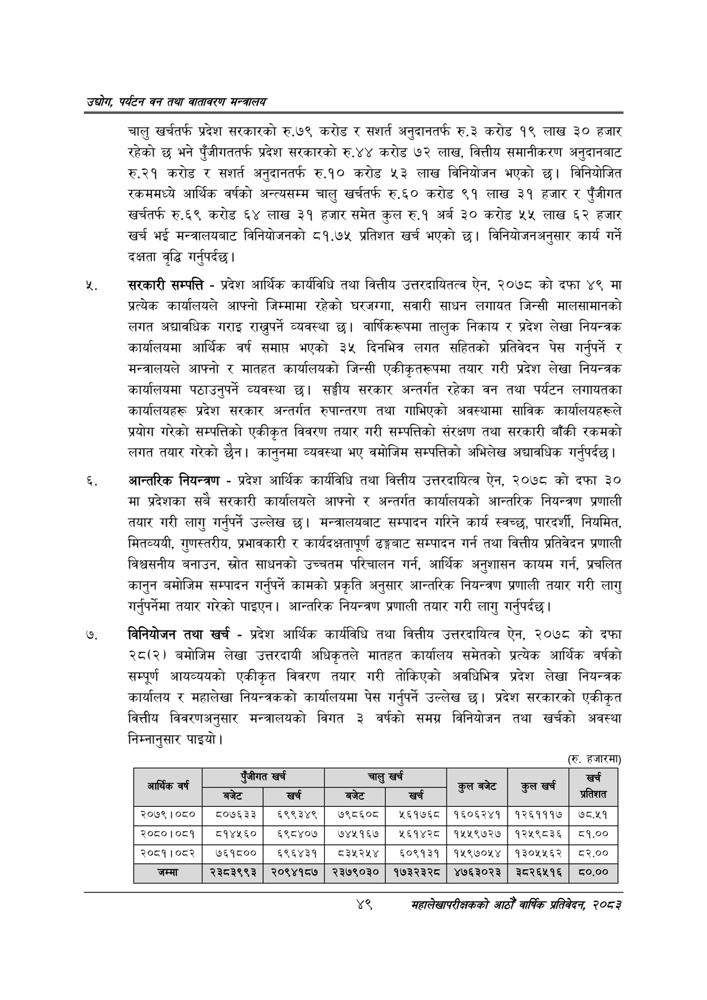

# Page 71 QA

## Rendered page


## Extracted text

```text
उद्योग पर्यटन वन तथा वातावरण मन्वालय
चालु खर्चतर्फ प्रदेश सरकारको रु.७९ करोड र अनुदानतर्फ रु.३ करोड १९ लाख ३० हजार रहेको छ भने पुँजीगततर्फ प्रदेश सरकारको रु.४४ करोड ७२ लाख, वित्तीय समानीकरण अनुदानबाट रु.२१ करोड र अनुदानतर्फ रु.१० करोड ५३ लाख विनियोजन भएको छ। विनियोजित रकममध्ये आर्थिक वर्षको अन्त्यसम्म चालु खर्चतर्फ रु.६० करोड ९१ लाख ३१ हजार र पुँजीगत खर्चतर्फ रु.६९ करोड ६४ लाख ३१ हजार समेत कुल रु.१ अर्ब ३० करोड ५५ लाख ६२ हजार खर्च भई मन्त्रालयबाट विनियोजनको ८१.७५ प्रतिशत खर्च भएको छ। विनियोजनअनुसार कार्य गर्ने दक्षता वृद्धि गर्नुपर्दछ |
सरकारी सम्पत्ति -प्रदेश आर्थिक कार्यविधि तथा वित्तीय उत्तरदायितत्व ऐन, २०७८ को दफा ४९ मा प्रत्यक कार्यालयले आफ्नो जिम्मामा रहेको घरजग्गा, सवारी साधन लगायत जिन्सी मालसामानको लगत अद्यावधिक गराइ राख्नुपर्ने व्यवस्था छ। वार्षिकरूपमा तालुक निकाय र प्रदेश लेखा नियन्त्रक कार्यालयमा आर्थिक वर्ष समाप्त भएको ३५ दिनभित्र लगत सहितको प्रतिवेदन पेस गर्नुपर्ने र मन्त्रालयले आफ्नो र मातहत कार्यालयको जिन्सी एकीकृतरूपमा तयार गरी प्रदेश लेखा नियन्त्रक कार्यालयमा पठाउनुपर्ने व्यवस्था | सङ्घीय सरकार अन्तर्गत रहेका वन तथा पर्यटन लगायतका कार्यालयहरू प्रदेश सरकार अन्तर्गत रुपान्तरण तथा गाभिएको अवस्थामा साविक कार्यालयहरूले प्रयोग गरेको सम्पत्तिको एकीकृत विवरण तयार गरी सम्पत्तिको संरक्षण तथा सरकारी बाँकी रकमको लगत तयार गरेको छैन। कानुनमा व्यवस्था भए वमोजिम सम्पत्तिको अभिलेख अद्यावधिक गर्नुपर्दछ |
आन्तरिक नियन्त्रण -प्रदेश आर्थिक कार्यविधि तथा वित्तीय उत्तरदायित्व ऐन, २०७८ को दफा ३० मा प्रदेशका सबै सरकारी कार्यालयले आफ्नो र अन्तर्गत कार्यालयको आन्तरिक नियन्त्रण प्रणाली तयार गरी लागु गर्नुपर्ने उल्लेख छ। मन्त्रालयबाट सम्पादन गरिने कार्य स्वच्छ, पारदर्शी, नियमित, मितव्ययी, गुणस्तरीय, प्रभावकारी र कार्यदक्षतापूर्ण ढङ्गबाट सम्पादन गर्न तथा वित्तीय प्रतिवेदन प्रणाली विश्वसनीय बनाउन, स्रोत साधनको उच्चतम परिचालन गर्न, आर्थिक अनुशासन कायम गर्न, प्रचलित कानुन बमोजिम सम्पादन गर्नुपर्ने कामको प्रकृति अनुसार आन्तरिक नियन्त्रण प्रणाली तयार गरी लागु गर्नुपर्नेमा तयार गरेको पाइएन। आन्तरिक नियन्त्रण प्रणाली तयार गरी लागु गर्नुपर्दछ।
विनियोजन तथा खर्च -प्रदेश आर्थिक कार्यविधि तथा वित्तीय उत्तरदायित्व ऐन, २०७८ को दफा २८(२) बमोजिम लेखा उत्तरदायी अधिकृतले मातहत कार्यालय समेतको प्रत्येक आर्थिक वर्षको सम्पूर्ण आयव्ययको एकीकृत विवरण तयार गरी तोकिएको अवधिभित्र प्रदेश लेखा नियन्त्रक कार्यालय र महालेखा नियन्त्रकको कार्यालयमा पेस गर्नुपर्ने उल्लेख छ। प्रदेश सरकारको एकीकृत वित्तीय विवरणअनुसार मन्त्रालयको विगत ३ वर्षको समग्र विनियोजन तथा खर्चको अवस्था निम्नानुसार पाइयो |
(रू हजारमा)
४९
महालेखापरीक्षकको आठौ वाषिकि प्रतिवेदन २०८२

| आर्थिक वर्ष | एंजीगत | खर्च | चालु | खर्च | बबेट | खर्च | खर्च |
| --- | --- | --- | --- | --- | --- | --- | --- |
|  |  |  |  |  | कुल | कुल | प्रतिशत |
| २०७९।०८० | ८०७६३३ | ६९९३४९ | ७९८६०८ | ५६१७६८ | १६०६२४१ | १२६१११७ | ७८.५१ |
| २०८०।०८१ | व५१४५६० | ६९८४०७ | ७४५२१६७ | २६१४२८ | १४५५९७२७ | १२५९८३६ | ©.०० |
| २०८१।०८२ | ७६१८०० | ६९६४३१ | ८३५२५४ | ६०९१३१ | १५९७०५४ | १३०५५६२ | ८२.०० |
| जम्मा | २३८३९९३ | २०९४१८७ | २३७९०३० | १७३२३२८ | ४७६३०२३ | ३८२६५१६ | ८५०.०० |
```

## Flags
- table_page
- medium_quality_table
