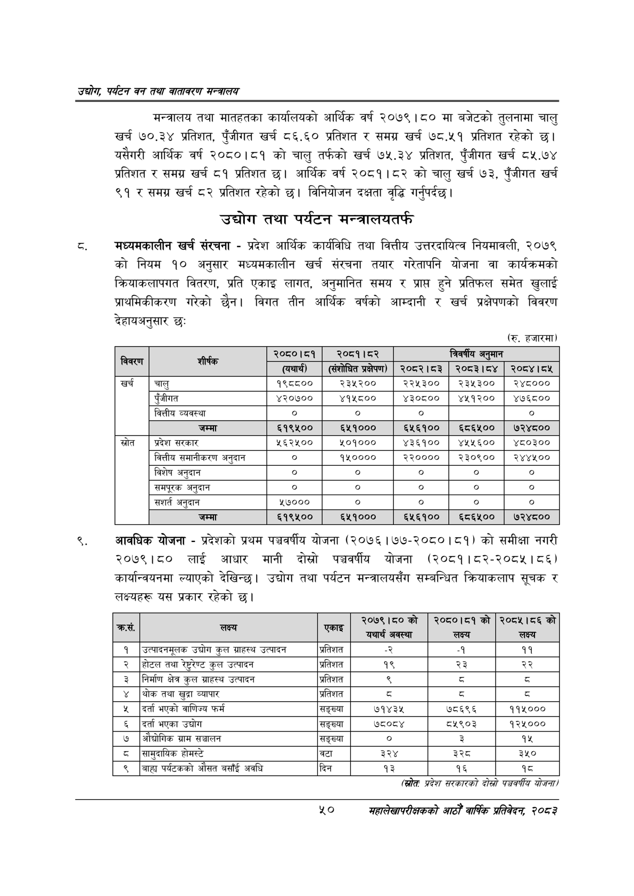

# Page 72 QA

## Rendered page


## Extracted text

```text
उद्योग पर्यटन वन तथा वातावरण मन्वालय
मन्त्रालय तथा मातहतका कार्यालयको आर्थिक वर्ष २०७९ |५० मा बजेटको तुलनामा चालु खर्च ७०.३४ प्रतिशत, पुँजीगत खर्च ८६.६० प्रतिशत र समग्र खर्च ७८.५१ प्रतिशत रहेको छ। यसैगरी आर्थिक वर्ष २०८०।८१ को चालु तर्फको खर्च ७५.३४ प्रतिशत, पुँजीगत खर्च ८५.७४ प्रतिशत र समग्र खर्च ८१ प्रतिशत छ। आर्थिक वर्ष २०८१।८२ को चालु खर्च ७३, पुँजीगत खर्च ९१ र समग्र खर्च ८२ प्रतिशत रहेको छ। विनियोजन दक्षता वृद्धि गर्नुपर्दछ |
उद्योग तथा पर्यटन मन्त्रालयतर्फ
मध्यमकालीन खर्च संरचना -प्रदेश आर्थिक कार्यविधि तथा वित्तीय उत्तरदायित्व नियमावली, २०७९ को नियम १० अनुसार मध्यमकालीन खर्च संरचना तयार गरेतापनि योजना वा कार्यक्रमको क्रियाकलापगत वितरण, प्रति एकाइ लागत, अनुमानित समय र प्राप्त हुने प्रतिफल समेत खुलाई प्राथमिकीकरण गरेको छैन। विगत तीन आर्थिक वर्षको आम्दानी र खर्च प्रक्षेपपको विवरण देहायअनुसार छ:
९, आवधिक योजना -प्रदेशको प्रथम पञ्चवर्षीय योजना (२०७६।७७-२०८०।८१) को समीक्षा नगरी २०७९।८० लाई आधार मानी दोस्रो पञ्चवर्षीय योजना (२०८१।८२-२०८५४। ८६) कार्यान्वयनमा ल्याएको देखिन्छ। उद्योग तथा पर्यटन मन्त्रालयसँग सम्बन्धित क्रियाकलाप सूचक र लक्ष्यहरू यस प्रकार रहेको छ।
(रु. हजारमा)
(स्रोतः प्रदेश सरकारको दोस्रो पञ्चवर्षीय योजना/
५०
महालेखापरीक्षकको आठौ वाषिकि प्रतिवेदन २०८२

| जि | शीर्षक | २०८०।८१ | _ १५३ |  | विवर्षीय अनुमान |
| --- | --- | --- | --- | --- | --- |
|  |  | (यथार्यी | प्रक्षेपण) | २०८२।८३ | २०८३।८४ |
| खर्च | चालु | १९८८०० | २३५२०० | २२५३०० | २३५३०० |
|  | पुँजीगत | ४२०७०० | ४१५८०० | ४३०८०० | ४४५१२०० |
|  | वित्तीय व्यवस्था | ० |  |  |  |
|  | जम्मा | ६१९४५०० | ६५१००० | ६५२६१०० | ६८६५०० |
| स्रोत | प्रदेश सरकार | २६२५०० | ५०१००० | ४३६१०० | ४४५५६०० |
|  | वित्तीय समानीकरण अनुदान |  | ९४०००० | २३०००० | २३०९०० |
|  | विशेष अनुदान | ० | ० | ० | ० |
|  | 'समपूरक अनुदान | ० | ० | ० | ० |
|  | सशर्त अनुदान | ५७००० | ० |  | ० |
|  | जम्मा | ६१९४५०० | ६५१००० | ६५६१०० | ६८६५०० |

| कस, से. | लक्ष्य लक्ष्य | एकाइ | २०७९।८०को यथार्थ अवस्था | २०८०।८१को लब्य | २०८५।८६ को |
| --- | --- | --- | --- | --- | --- |
| १ | उत्पादनमूलक उद्योग कुल ग्राहस्थ उत्पादन | प्रतिशत |  | -४ | ११ |
| २ | होटल तथा रे्ट्रेण्ट कुल उत्पादन | प्रतिशत | १९ | २३ | २२ |
| ३ | नैर्माण क्षेत्र कुल ग्राहस्थ उत्पादन | प्रतिशत | ९ | ३ | ३ |
| ४ | थोक तथा खुद्रा व्यापार | प्रतिशत |  | ३ | ३ |
| ५ | दर्ता भएको वाणिज्य फर्म | सङ्ख्या | ७१४३५ | ७८६९६ | ११५००० |
| ६ | दर्ता भएका उद्योग | सङ्ख्या | ७८०८४ | ८४१९०३ | १२५००० |
| ७ | आँचोनिक ग्राम सञ्चालन | सङ्ख्या |  | ३ | १५ |
| ८ | होमस्टे | वटा | ३२४ | झ्श्व | ३५० |
| ९ | बाहा १र्८८कको औसत बसाई अवधि | दिन | १३ | १६ | १८ |
```

## Flags
- table_page
- medium_quality_table
