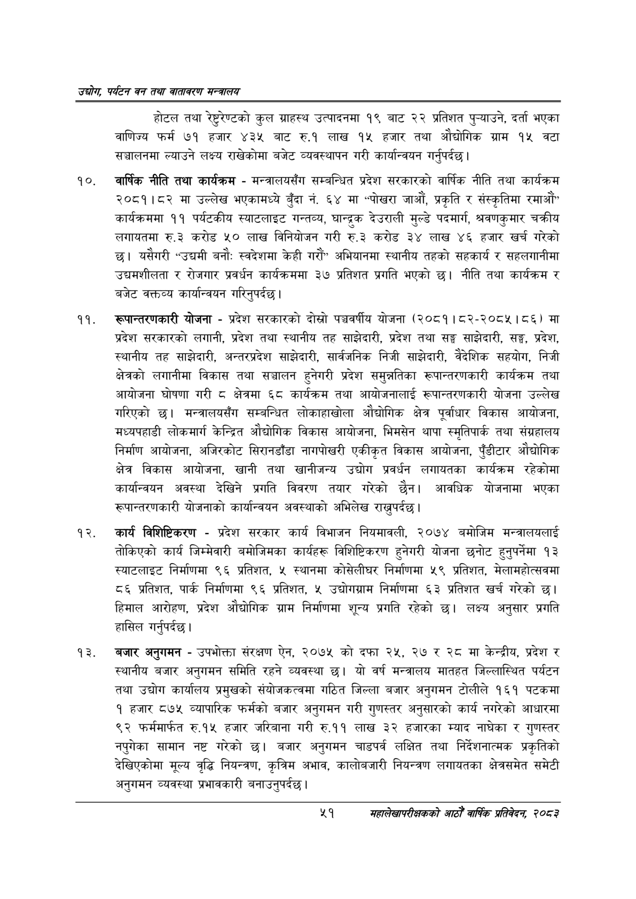

# Page 73 QA

## Rendered page


## Extracted text

```text
उद्योग पर्यटन वन तथा वातावरण मन्वालय
होटल तथा रेष्ट्रेण्टको कुल ग्राहस्थ उत्पादनमा १९ बाट २२ प्रतिशत पुन्याउने, दर्ता भएका बाणिज्य फर्म ७१ हजार ४३५ बाट रु.१ लाख १५ हजार तथा औद्योगिक ग्राम १५ वटा सञ्चालनमा ल्याउने लक्ष्य राखेकोमा बजेट व्यवस्थापन गरी कार्यान्वयन गर्नुपर्दछ |
वार्षिक नीति तथा कार्यक्रम -मन्त्रालयसँग सम्बन्धित प्रदेश सरकारको वार्षिक नीति तथा कार्यक्रम २०८१।८२ मा उल्लेख भएकामध्ये बुँदा नं. ६४ मा "पोखरा जाऔं, प्रकृति र संस्कृतिमा रमाऔं" कार्यक्रममा ११ पर्यटकीय स्याटलाइट गन्तव्य, घान्द्रक देउराली मुल्डे पदमार्ग, श्रवणकुमार चक्रीय लगायतमा रु.३ करोड ५० लाख विनियोजन गरी रु.३ करोड ३४ लाख ४६ हजार खर्च गरेको छ। यसैगरी "उद्यमी बनौ: स्वदेशमा केही गरौं" अभियानमा स्थानीय तहको सहकार्य र सहलगानीमा उद्यमशीलता र रोजगार प्रवर्धन कार्यक्रममा ३७ प्रतिशत प्रगति भएको छ। नीति तथा कार्यक्रम र बजेट वक्तव्य कार्यान्वयन गरिनुपर्दछ |
रूपान्तरणकारी योजना -प्रदेश सरकारको दोस्रो पञ्चवर्षीय योजना (२०८१। ८२-२०८५।८६) मा प्रदेश सरकारको लगानी, प्रदेश तथा स्थानीय तह साझेदारी, प्रदेश तथा सङ्घ साझेदारी, सङ्घ, प्रदेश, स्थानीय तह साझेदारी, अन्तरप्रदेश साझेदारी, सार्वजनिक निजी साझेदारी, वैदेशिक सहयोग, निजी क्षेत्रको लगानीमा विकास तथा सञ्चालन हुनेगरी प्रदेश समुन्नतिका रूपान्तरणकारी कार्यक्रम तथा आयोजना घोषणा गरी क्षेत्रमा ६८ कार्यक्रम तथा आयोजनालाई रूपान्तरणकारी योजना उल्लेख गरिएको छ। मन्त्रालयसँग सम्बन्धित लोकाहाखोला औद्योगिक क्षेत्र पूर्वाधार विकास आयोजना, मध्यपहाडी लोकमार्ग केन्द्रित औद्योगिक विकास आयोजना, भिमसेन थापा स्मृतिपार्क तथा संग्रहालय निर्माण आयोजना, अजिरकोट सिरानडाँडा नागपोखरी एकीकृत विकास आयोजना, पूँडीटार औद्योगिक क्षेत्र विकास आयोजना, खानी तथा खानीजन्य उद्योग प्रवर्धन लगायतका कार्यक्रम रहेकोमा कार्यान्वयन अवस्था देखिने प्रगति विवरण तयार गरेको छैन। आवधिक योजनामा भएका रूपान्तरणकारी योजनाको कार्यान्वयन अवस्थाको अभिलेख राख्नुपर्दछ |
कार्य विशिष्टिकरण -प्रदेश सरकार कार्य विभाजन नियमावली, २०७४ बमोजिम मन्त्रालयलाई तोकिएको कार्य जिम्मेवारी बमोजिमका कार्यहरू विशिष्टिकरण हुनेगरी योजना छनोट हुनुपर्नेमा १३ स्याटलाइट निर्माणमा ९६ प्रतिशत, ४५ स्थानमा कोसेलीघर निर्माणमा ५९ प्रतिशत, मेलामहोत्सवमा ८६ प्रतिशत, पार्क निर्माणमा ९६ प्रतिशत, ५ उद्योगग्राम निर्माणमा ६३ प्रतिशत खर्च गरेको | हिमाल आरोहण, प्रदेश औद्योगिक ग्राम निर्माणमा शून्य प्रगति रहेको छ। लक्ष्य अनुसार प्रगति हासिल गर्नुपर्दछ।
बजार अनुगमन -उपभोक्ता संरक्षण ऐन, २०७५ को दफा २५, २७ र २८ मा केन्द्रीय, प्रदेश र स्थानीय बजार अनुगमन समिति रहने व्यवस्था छ। यो वर्ष मन्त्रालय मातहत जिल्लास्थित पर्यटन तथा उद्योग कार्यालय प्रमुखको संयोजकत्वमा गठित जिल्ला बजार अनुगमन टोलीले १६१ पटकमा १ हजार ८७५ व्यापारिक फर्मको बजार अनुगमन गरी गुणस्तर अनुसारको कार्य नगरेको आधारमा ९२ फर्ममार्फत रु.१५ हजार जरिवाना गरी रु.११ लाख ३२ हजारका म्याद नाघेका र गुणस्तर नपुगेका सामान नष्ट गरेको छ। बजार अनुगमन चाडपर्व लक्षित तथा निर्देशनात्मक प्रकृतिको देखिएकोमा मूल्य वृद्धि नियन्त्रण, कृत्रिम अभाव, कालोबजारी नियन्त्रण लगायतका क्षेत्रसमेत समेटी अनुगमन व्यवस्था प्रभावकारी बनाउनुपर्दछ |
%९
महालेखापरीक्षकको आठौ वाषिकि प्रतिवेदन २०८२
```

## Flags
- None
