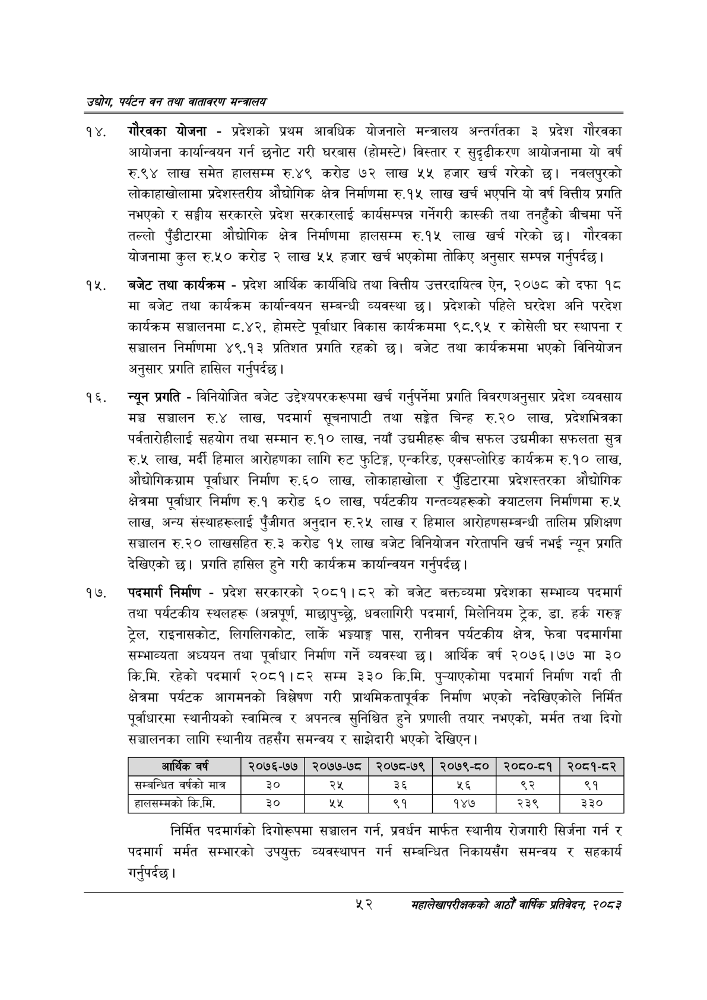

# Page 74 QA

## Rendered page


## Extracted text

```text
उद्योग पर्यटन वन तथा वातावरण मन्वालय
गौरवका योजना -प्रदेशको प्रथम आवधिक योजनाले मन्त्रालय अन्तर्गतका ३ प्रदेश गौरवका आयोजना कार्यान्वयन गर्न छनोट गरी घरबास (होमस्टे) विस्तार र सुदृढीकरण आयोजनामा यो वर्ष रु.९४ लाख समेत हालसम्म रु.४९ करोड ७२ लाख ५५ हजार खर्च गरेको नवलपुरको लोकाहाखोलामा प्रदेशस्तरीय औद्योगिक क्षेत्र निर्माणमा रु.१५ लाख खर्च भएपनि यो वर्ष वित्तीय प्रगति नभएको र सङ्घीय सरकारले प्रदेश सरकारलाई कार्यसम्पन्न गर्नेगरी कास्की तथा तनहुँको बीचमा पर्ने तल्लो पुँडीटारमा औद्योगिक क्षेत्र निर्माणमा हालसम्म रु.१५ लाख खर्च गरेको छ। गौरवका योजनामा कुल रु.५० करोड २ लाख ५५ हजार खर्च भएकोमा तोकिए अनुसार सम्पन्न गर्नुपर्दछ |
बजेट तथा कार्यक्रम -प्रदेश आर्थिक कार्यविधि तथा वित्तीय उत्तरदायित्व ऐन, २०७८ को दफा १८ मा बजेट तथा कार्यक्रम कार्यान्वयन सम्बन्धी व्यवस्था छ। प्रदेशको पहिले घरदेश अनि परदेश कार्यक्रम सञ्चालनमा ८.४२, होमस्टे पूर्वाधार विकास कार्यक्रममा ९८.९५ र कोसेली घर स्थापना र सञ्चालन निर्माणमा ४९.१३ प्रतिशत प्रगति रहको छ। बजेट तथा कार्यक्रममा भएको विनियोजन अनुसार प्रगति हासिल गर्नुपर्दछ |
न्यून प्रगति -विनियोजित बजेट उद्देश्यपरकरूपमा खर्च गर्नुपर्नेमा प्रगति विवरणअनुसार प्रदेश व्यवसाय मञ्च सञ्चालन रु.४ लाख, पदमार्ग सूचनापाटी तथा सङ्गेत चिन्ह रु.२० लाख, प्रदेशभित्रका पर्वतारोहीलाई सहयोग तथा सम्मान रु.१० लाख, नयाँ उद्यमीहरू बीच सफल उद्चयमीका सफलता सुत्र रु.५ लाख, मर्दी हिमाल आरोहणका लागि रुट फुटिङ्ग, एन्करिङ, एक्सप्लोरिङ कार्यक्रम रु.१० लाख, औद्योगिकग्राम पूर्वाधार निर्माण रु.६० लाख, लोकाहाखोला र पुँडिटारमा प्रदेशस्तरका औद्योगिक क्षेत्रमा पूर्वाधार निर्माण रु.१ करोड ६० लाख, पर्यटकीय गन्तव्यहरूको क्याटलग निर्माणमा रु.५ लाख, अन्य संस्थाहरूलाई पुँजीगत अनुदान रु.२५ लाख र हिमाल आरोहणसम्बन्धी तालिम प्रशिक्षण सञ्चालन रु.२० लाखसहित रु.३ करोड १५ लाख बजेट विनियोजन गरेतापनि खर्च नभई न्यून प्रगति देखिएको छ। प्रगति हासिल हुने गरी कार्यक्रम कार्यान्वयन गर्नुपर्दछ |
पदमार्ग निर्माण -प्रदेश सरकारको २०८१।८२ को बजेट बक्तव्यमा प्रदेशका सम्भाव्य पदमार्ग तथा पर्यटकीय स्थलहरू (अन्नपूर्ण, माछापुच्छु, धवलागिरी पदमार्ग, मिलेनियम ट्रेक, डा. हर्क गरुङ्ग ट्रेल, राइनासकोट, लिगलिगकोट, लार्के भञ्ग्याङ्ग पास, रानीवन पर्यटकीय क्षेत्र, फेवा पदमार्गमा सम्भाव्यता अध्ययन तथा पूर्वाधार निर्माण गर्ने व्यवस्था छ। आर्थिक वर्ष २०७६।७७ मा ३० कि.मि. रहेको पदमार्ग २०८१।८२ सम्म ३३० कि.मि. पुन्याएकोमा पदमार्ग निर्माण गर्दा ती क्षेत्रमा पर्यटक आगमनको विश्लेषण गरी प्राथमिकतापूर्वक निर्माण भएको नदेखिएकोले निर्मित पूर्वाधारमा स्थानीयको स्वामित्व र अपनत्व सुनिश्चित हुने प्रणाली तयार नभएको, मर्मत तथा दिगो सञ्चालनका लागि स्थानीय तहसँग समन्वय र साझेदारी भएको देखिएन |
निर्मित पदमार्गको दिगोरूपमा सञ्चालन गर्न, प्रवर्धन मार्फत स्थानीय रोजगारी सिर्जना गर्न र पदमार्ग मर्मत सम्भारको उपयुक्त व्यवस्थापन गर्न सम्बन्धित निकायसँग समन्वय र सहकार्य गर्नुपर्दछ |
महालेखापरीक्षकको आठौ वाषिकि प्रतिवेदन २०८२

| आर्थिक वर्ष | २०७६-७७ | २०७७-७८ | २०७८-७९ | २०७९-८० | २०६०-८१ | २०८१-८२ |
| --- | --- | --- | --- | --- | --- | --- |
| सम्बन्धित वर्षको मात्र | ३० | २५ | ३६ | २६ | ९२ | ९१ |
| हालसम्मको कि.मि. | ३० | श्श्‌ | ९१ | १४७ | २३९ | ३३० |
```

## Flags
- table_page
- medium_quality_table
