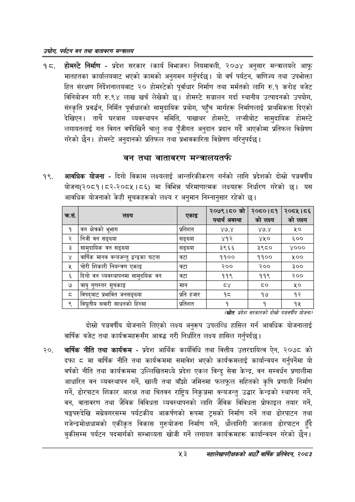

# Page 75 QA

## Rendered page


## Extracted text

```text
उद्योग पर्यटन वन तथा वातावरण मन्वालय
त्‌ ट. होमस्टे निर्माण -प्रदेश सरकार (कार्य विभाजन) नियमावली, २०७४ अनुसार मन्त्रालयले आफू मातहतका कार्यालयबाट भएको कामको अनुगमन गर्नुपर्दछ। यो वर्ष पर्यटन, वाणिज्य तथा उपभोक्ता हित संरक्षण निर्देशनालयबाट २० होमस्टेको पूर्वाधार निर्माण तथा मर्मतको लागि रु.१ करोड बजेट विनियोजन गरी रु.९४ लाख खर्च लेखेको छ। होमस्टे सञ्चालन गर्दा स्थानीय उत्पादनको उपयोग, संस्कृति प्रवर्द्धन, निर्मित पूर्वाधारको सामुदायिक प्रयोग, पहुँच मार्गहरू निर्माणलाई प्राथमिकता दिएको देखिएन। ताचै घरबास व्यवस्थापन समिति, पाखाथर होमस्टे, लप्सीबोट सामुदायिक होमस्टे लगायतलाई गत विगत वर्षदेखिनै चालु तथा पुँजीगत अनुदान प्रदान गर्दै आएकोमा प्रतिफल विश्लेषण गरेको छैन। होमस्टे अनुदानको प्रतिफल तथा प्रभावकारिता विश्लेषण गरिनुपर्दछ |
वन तथा वातावरण मन्त्रालयतर्फ
आवधिक योजना -दिगो विकास लक्ष्यलाई आन्तरिकीकरण गर्नको लागि प्रदेशको दोस्रो पञ्चवर्षीय योजना(२०८१। ८२-२०८४५।८६) मा विभिन्न परिमाणात्मक लक्ष्यहरू निर्धारण गरेको छ। यस आवधिक योजनाको केही सूचकहरूको लक्ष्य र अनुमान निम्नानुसार रहेको छ।
(स्रोतः प्रदेश सरकारको दोस्रो पञ्चवर्षीय योजना
दोस्रो पञ्चवर्षीय योजनाले लिएको लक्ष्य अनुरूप उपलब्धि हासिल गर्न आवधिक योजनालाई वार्षिक बजेट तथा कार्यक्रमहरूसँग आवद्ध गरी निर्धारित लक्ष्य हासिल गर्नुपर्दछ |
२०, वार्षिक नीति तथा कार्यक्रम -प्रदेश आर्थिक कार्यविधि तथा वित्तीय उत्तरदायित्व ऐन, २०७८ को दफा ८ मा वार्षिक नीति तथा कार्यक्रममा समावेश भएको कार्यक्रमलाई कार्यान्वयन गर्नुपर्नेमा यो वर्षको नीति तथा कार्यक्रममा उल्लिखितमध्ये प्रदेश एकल विन्दु सेवा केन्द्र, वन सम्वर्धन प्रणालीमा आधारित वन व्यवस्थापन गर्ने, खाली तथा बाँझो जमिनमा फलफूल सहितको कृषि प्रणाली निर्माण गर्ने, ढोरपाटन शिकार आरक्ष तथा चितवन राष्ट्रिय निकुञ्जमा वन्यजन्तु उद्धार केन्द्रको स्थापना गर्ने, वन, वातावरण तथा जेविक विविधता व्यवस्थापनको लागि जैविक विविधता प्रोफाइल तयार गर्ने, चङ्गपरुदेखि मग्नेबगरसम्म पर्यटकीय आकर्षणको रूपमा ट्रसको निर्माण गर्ने तथा ढोरपाटन तथा गजेन्द्रमोक्षधामको एकीकृत विकास गुरुयोजना निर्माण गर्ने, धौलागिरी जलजला ढोरपाटन हुँदै बुकीसम्म पर्यटन पदमार्गको सम्भाव्यता खोजी गर्ने लगायत कार्यक्रमहरू कार्यान्वयन गरेको छैन।
%३
महालेखापरीक्षकको आठौ वाषिकि प्रतिवेदन २०८२

| =५ | लक्ष्य | रहका | २०७९।८०को यथार्थ अवस्था | २०८०।८१ कोलक््य | २०८१।८६ को लक्ष्य |
| --- | --- | --- | --- | --- | --- |
| १ | वन क्षेत्रको भूभाग | प्रतिशत | ४७.४ | ४७.४ | %० |
| २ | निजी वन सङ्ख्या | सङ्ख्या | ४१२ | ४५० | ६०० |
| ३ | शासुदाथिक वन सङ्ख्या | सङ्ख्या | ३९६६ | ३९८० | ४००० |
| ४ | वार्षिक मानव वन्थभन्तु द्वन्द्वका घटना | बटा | ११०० | ११०० | ५०० |
| ५ | चोरी शिकारी नियन्त्रण एकाइ | वटा | २०० | २०० | ३०० |
| ६ | दिगो वन व्यवस्थापनमा खामुदा४क वन | वटा | ११९ | ११९ | २०० |
| ७ | वायु गुणस्तर सूचकाङ्क | मान |  | ८० | ५० |
| ८ | बिषद्नाट प्रभावित जनसङ्ख्या | प्रति हजार | १८ | १७ | १२ |
| ९ | विच्युतीव सवारी साधनको हिस्सा | प्रतिशत | १ | १ | १५ |
```

## Flags
- table_page
- medium_quality_table
