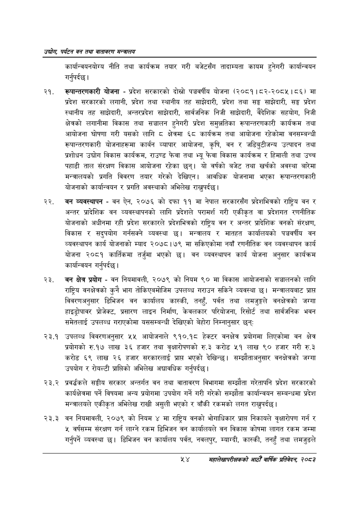

# Page 76 QA

## Rendered page


## Extracted text

```text
उद्योग पर्यटन वन तथा वातावरण मन्वालय
कार्यान्वयनयोग्य नीति तथा कार्यक्रम तयार गरी बजेटसँग तादाम्यता कायम हुनेगरी कार्यान्वयन गर्नुपर्दछ |
रूपान्तरणकारी योजना -प्रदेश सरकारको दोस्रो पञ्चवर्षीय योजना (२०८१।८२-२०८४५।८६) मा प्रदेश सरकारको लगानी, प्रदेश तथा स्थानीय तह साझेदारी, प्रदेश तथा सङ्घ साझेदारी, सङ्ग प्रदेश स्थानीय तह साझेदारी, अन्तरप्रदेश साझेदारी, सार्वजनिक निजी साझेदारी, वैदेशिक सहयोग, निजी क्षेत्रको लगानीमा विकास तथा सञ्चालन हुनेगरी प्रदेश समुन्नतिका रूपान्तरणकारी कार्यक्रम तथा आयोजना घोषणा गरी यसको लागि © क्षेत्रमा ६८ कार्यक्रम तथा आयोजना रहेकोमा वनसम्बन्धी रूपान्तरणकारी योजनाहरूमा कार्बन व्यापार आयोजना, कृषि, वन र जडिबुटीजन्य उत्पादन तथा प्रशोधन उद्योग विकास कार्यक्रम, राउण्ड फेवा तथा भ्यू फेवा विकास कार्यक्रम र हिमाली तथा उच्च पहाडी ताल संरक्षण विकास आयोजना रहेका छन्‌। यो वर्षको बजेट तथा खर्चको अवस्था बारेमा मन्त्रालयको प्रगति विवरण तयार गरेको देखिएन। आवधिक योजनामा भएका रूपान्तरणकारी योजनाको कार्यान्वयन र प्रगति अवस्थाको अभिलेख राख्नुपर्दछ।
वन व्यवस्थापन -वन ऐन, २०७६ को दफा ११ मा नेपाल सरकारसँग प्रदेशभित्रको राष्ट्रिय वन र अन्तर प्रादेशिक वन व्यवस्थापनको लागि प्रदेशले परामर्श गरी एकीकृत वा प्रदेशगत रणनीतिक योजनाको अधीनमा रही प्रदेश सरकारले प्रदेशभित्रको राष्ट्रिय वन र अन्तर प्रादेशिक वनको संरक्षण, विकास र सदुपयोग गर्नसक्ने व्यवस्था छ। मन्त्रालय र मातहत कार्यालयको पञ्चवर्षीय वन व्यवस्थापन कार्य योजनाको म्याद २०७८।७९ मा सकिएकोमा नयाँ रणनीतिक वन व्यवस्थापन कार्य योजना २०८१ कार्तिकमा तर्जुमा भएको | वन व्यवस्थापन कार्य योजना अनुसार कार्यक्रम कार्यान्वयन गर्नुपर्दछ |
वन क्षेत्र प्रयोग -वन नियमावली, २०७९ को नियम ९० मा विकास आयोजनाको सञ्चालनको लागि राष्ट्रिय वनक्षेत्रको कुनै भाग तोकिएबमोजिम उपलब्ध गराउन सकिने व्यवस्था छ। मन्त्रालयबाट प्राप्त विवरणअनुसार डिभिजन वन कार्यालय कास्की, तनहुँ, पर्वत तथा लमजुङ्गले वनक्षेत्रको जग्गा हाइड्रोपावर प्रोजेक्ट, प्रसारण लाइन निर्माण, केवलकार परियोजना, रिसोर्ट तथा सार्वजनिक भवन समेतलाई उपलब्ध गराएकोमा यससम्बन्धी देखिएको बेहोरा निम्नानुसार छन्‌ः
२३.१ उपलब्ध विवरणअनुसार ५५ आयोजनाले ९१०.१८ हेक्टर वनक्षेत्र प्रयोगमा लिएकोमा वन क्षेत्र प्रयोगको रु.१७ लाख ३६ हजार तथा वृक्षारोपणको रु.३ करोड ५१ लाख ९० हजार गरी रु.३ करोड ६९ लाख २६ हजार सरकारलाई प्रापत भएको देखिन्छ। सम्झौताअनुसार वनक्षेत्रको जग्गा उपयोग र रोयल्टी प्राप्तिको अभिलेख अद्यावधिक गर्नुपर्दछ |
प्रवर्धकले सङ्घीय सरकार अन्तर्गत वन तथा वातावरण विभागमा सम्झौता गरेतापनि प्रदेश सरकारको कार्यक्षेत्रमा पर्ने विषयमा अन्य प्रयोगमा उपयोग गर्ने गरी गरेको सम्झौता कार्यान्वयन सम्बन्धमा प्रदेश मन्त्रालयले एकीकृत अभिलेख राखी असुली भएको र बाँकी रकमको लगत राख्नुपर्दछ |
वन नियमावली, २०७९ को नियम ४ मा राष्ट्रिय वनको भोगाधिकार प्राप्त निकायले वृक्षारोपण गर्न र ५ वर्षसम्म संरक्षण गर्न लाग्ने रकम डिभिजन वन कार्यालयले वन विकास कोषमा लागत रकम जम्मा गर्नुपर्ने व्यवस्था छ। डिभिजन वन कार्यालय पर्वत, नवलपुर, म्याग्दी, कास्की, तनहुँ तथा लमजुङले
५४ महालेखापरीक्षकको आठौ वाषिकि प्रतिवेदन २०८२
```

## Flags
- None
