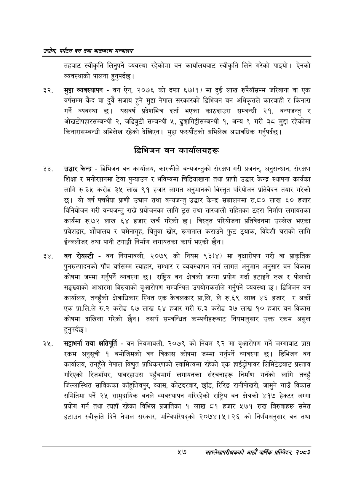

# Page 79 QA

## Rendered page


## Extracted text

```text
उद्योग पर्यटन वन तथा वातावरण मन्वालय
तहबाट स्वीकृति लिनुपर्ने व्यवस्था रहेकोमा वन कार्यालयबाट स्वीकृति लिने गरेको पाइयो। ऐनको व्यवस्थाको पालना हुनुपर्दछ |
मुद्दा व्यवस्थापन -वन ऐन, २०७६ को दफा ६७(१) मा दुई लाख रुपैयाँसम्म जरिबाना वा एक वर्षसम्म कैद वा दुवै सजाय हुने मुद्दा नेपाल सरकारको डिभिजन वन अधिकृतले कारबाही र किनारा गर्ने व्यवस्था छ। यसवर्ष प्रदेशभित्र दर्ता भएका काठदाउरा सम्बन्धी २१, वन्यजन्तु र ओखटोपहारसम्बन्धी २, जडिबुटी सम्बन्धी ५, ढुङ्गागिट्टीसम्बन्धी १, अन्य ९ गरी ३८ मुद्दा रहेकोमा किनारासम्बन्धी अभिलेख रहेको देखिएन। मुद्दा फस्यौटको अभिलेख अद्यावधिक गर्नुपर्दछ |
डिभिजन वन कार्यालयहरू
उद्धार केन्द्र -डिभिजन वन कार्यालय, कास्कीले वन्यजन्तुको संरक्षण गरी प्रजनन्‌, अनुसन्धान, संरक्षण शिक्षा र मनोरञ्जनमा टेवा पुन्याउन र भविष्यमा चिडियाखाना तथा प्राणी उद्धार केन्द्र स्थापना कार्यका लागि रु.३५ करोड ३५ लाख ९१ हजार लागत अनुमानको विस्तृत परियोजन प्रतिवेदन तयार गरेको छ। यो वर्ष पचभैया प्राणी उद्यान तथा वन्यजन्तु उद्धार केन्द्र सञ्चालनमा रु.८० लाख ६० हजार विनियोजन गरी वन्यजन्तु राख्ने प्रयोजनका लागि ट्रस तथा तारजाली सहितका टहरा निर्माण लगायतका कार्यमा रु.७२ लाख हजार खर्च गरेको छ। विस्तृत परियोजना प्रतिवेदनमा उल्लेख भएका प्रवेशद्वार, शौचालय र चमेनागृह, चितुवा खोर, रूपाताल कराउने फुट ट्याक, विदेशी चराको लागि ईन्क्लोजर तथा पानी ट्याङ्गी निर्माण लगायतका कार्य भएको छैन।
२४, वन रोयल्टी -वन नियमावली, २०७९ को नियम ९३(४) मा वृक्षारोपण गरी वा प्राकृतिक पुनरुत्पादनको पाँच वर्षसम्म स्याहार, सम्भार र व्यवस्थापन गर्न लागत अनुमान अनुसार वन विकास कोषमा जम्मा गर्नुपर्ने व्यवस्था छ। राष्ट्रिय वन क्षेत्रको जग्गा प्रयोग गर्दा हटाइने रुख र पोलको सङ्ख्याको आधारमा बिरुवाको वृक्षारोपण सम्बन्धित उपयोगकर्ताले गर्नुपर्ने व्यवस्था | डिभिजन वन कार्यालय, तनहुँको क्षेत्राधिकार स्थित एक केवलकार प्रा.लि. ले रु.६९ लाख ४६ हजार र अर्को एक प्रा.लि.ले रु.२ करोड ६७ लाख ६४ हजार गरी रु.३ करोड ३७ लाख ९० हजार वन विकास कोषमा दाखिला गरेको छैन। तसर्थ सम्बन्धित कम्पनीहरूबाट नियमानुसार उक्त रकम असुल हुनुपर्दछ |
सट्टाभर्ना तथा क्षतिपूर्ति -वन नियमावली, २०७९ को नियम ९२ मा वृक्षारोपण गर्ने जग्गाबाट प्राप्त रकम अनुसूची १ बमोजिमको वन विकास कोषमा जम्मा गर्नुपर्ने व्यवस्था छ। डिभिजन वन कार्यालय, तनहुँले नेपाल विद्युत प्राधिकरणको स्वामित्वमा रहेको एक हाईड्रोपावर लिमिटेडबाट प्रस्ताव गरिएको रिजर्भायर, पावरहाउस पहुँचमार्ग लगायतका संरचनाहरू निर्माण गर्नको लागि तनहुँ जिल्लास्थित साविकका काँहुशिवपुर, व्यास, कोटदरवार, छाँड, रिरिङ रानीपोखरी, जामुने गाउँ विकास समितिमा पर्ने २५ सामुदायिक वनले व्यवस्थापन गरिरहेको राष्ट्रिय वन क्षेत्रको ४१७ हेक्टर जग्गा प्रयोग गर्न तथा त्यहाँ रहेका विभिन्न प्रजातिका १ लाख ८१ हजार ५७१ रुख बिरुवाहरू समेत हटाउन स्वीकृति दिने नेपाल सरकार, मन्त्रिपरिषद्को २०७४।५। २६ को निर्णयअनुसार वन तथा
५७
महालेखापरीक्षकको आठौ वाषिकि प्रतिवेदन २०८२
```

## Flags
- None
