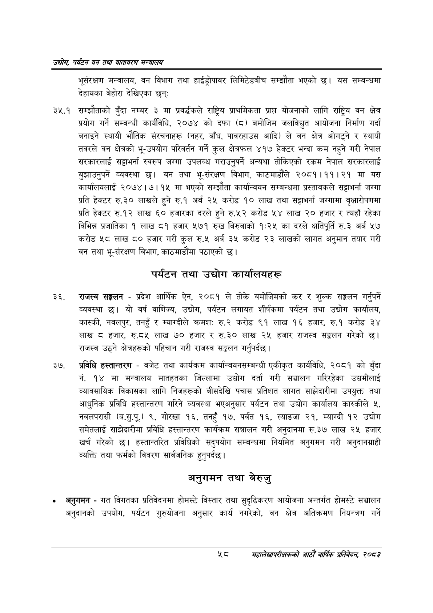

# Page 80 QA

## Rendered page


## Extracted text

```text
उद्योग पर्यटन वन तथा वातावरण मन्वालय
भूसंरक्षण मन्त्रालय, वन विभाग तथा हाईड्रोपावर लिमिटेडबीच सम्झौता भएको छ। यस सम्बन्धमा देहायका बेहोरा देखिएका छन्‌ः
३५.१ सम्झौताको बुँदा नम्बर ३ मा प्रवर््धकले राष्ट्रिय प्राथमिकता प्राप्त योजनाको लागि राष्ट्रिय वन क्षेत्र प्रयोग गर्ने सम्बन्धी कार्यविधि, २०७४ को दफा (८) बमोजिम जलविद्युत आयोजना निर्माण गर्दा बनाइने स्थायी भौतिक संरचनाहरू (नहर, बाँध, पावरहाउस आदि) ले वन क्षेत्र ओगट्ने र स्थायी तवरले वन क्षेत्रको भू-उपयोग परिवर्तन गर्ने कुल क्षेत्रफल ४१७ हेक्टर भन्दा कम नहुने गरी नेपाल सरकारलाई सट्टाभर्ना स्वरुप जग्गा उपलब्ध गराउनुपर्ने अन्यथा तोकिएको रकम नेपाल सरकारलाई बुझाउनुपर्ने व्यवस्था छ। वन तथा भू-संरक्षण विभाग, काठमाडौले २०८१।११।२१ मा यस कार्यालयलाई २०७४।७।१५ मा भएको सम्झौता कार्यान्वयन सम्बन्धमा प्रस्तावकले सट्टाभर्ना जग्गा प्रति हेक्टर रु.३० लाखले हुने रु.१ अर्ब २५ करोड १० लाख तथा सट्टाभर्ना जग्गामा वृक्षारोपणमा प्रति हेक्टर रु.१२ लाख ६० हजारका दरले हुने रु.५२ करोड लाख २० हजार र त्यहाँ रहेका विभिन्न प्रजातिका १ लाख ८१ हजार ५७१ रुख बिरुवाको १:२५ का दरले क्षतिपूर्ति रु.३ अर्ब ५७ करोड ५८ लाख ८० हजार गरी कुल रु.५ अर्ब ३५ करोड २३ लाखको लागत अनुमान तयार गरी वन तथा भू-संरक्षण विभाग, काठमाडौंमा पठाएको छ।
पर्यटन तथा उद्योग कार्यालयहरू
राजस्व सङ्गलन -प्रदेश आर्थिक ऐन, २०८१ ले तोके बमोजिमको कर र शुल्क सङ्कलन गर्नुपर्ने व्यवस्था छु। यो वर्ष वाणिज्य, उद्योग, पर्यटन लगायत शीर्षकमा पर्यटन तथा उद्योग कार्यालय, कास्की, नवलपुर, तनहुँ र म्याग्दीले क्रमशः रु.२ करोड ९१ लाख १६ हजार, रु.१ करोड ३४ लाख हजार, रु.८५ लाख ७० हजार र रु.३० लाख २५ हजार राजस्व सङ्कलन गरेको छ। राजस्व उठ्ने क्षेत्रहरूको पहिचान गरी राजस्व सङ्कलन गर्नुपर्दछ |
प्रविधि हस्तान्तरण -बजेट तथा कार्यक्रम कार्यान्वयनसम्बन्धी एकीकृत कार्यविधि, २०८१ को बुँदा नं. १४ मा मन्त्रालय मातहतका जिल्लामा उद्योग दर्ता गरी सञ्चालन गरिरहेका उद्यमीलाई व्यावसायिक विकासका लागि निजहरूको बीसदेखि पचास प्रतिशत लागत साझेदारीमा उपयुक्त तथा आधुनिक प्रविधि हस्तान्तरण गरिने व्यवस्था भएअनुसार पर्यटन तथा उद्योग कार्यालय कास्कीले ५, नवलपरासी (ब.सु.पू.) ९, गोरखा १६, तनहुँ १७, पर्वत १६, स्याङजा २१, म्याग्दी १२ उद्योग समेतलाई साझेदारीमा प्रविधि हस्तान्तरण कार्यक्रम सञ्चालन गरी अनुदानमा रु.३७ लाख २५ हजार खर्च गरेको छ। हस्तान्तरित प्रविधिको सदुपयोग सम्बन्धमा नियमित अनुगमन गरी अनुदानग्राही व्यक्ति तथा फर्मको विवरण सार्वजनिक |
हुनुपर्दछ
अनुगमन तथा बेरुजु
अनुगमन -गत विगतका प्रतिवेदनमा होमस्टे विस्तार तथा सुदृढिकरण आयोजना अन्तर्गत होमस्टे सञ्चालन अनुदानको उपयोग, पर्यटन गुरुयोजना अनुसार कार्य नगरेको, वन क्षेत्र अतिक्रमण नियन्त्रण गर्ने
महालेखापरीक्षकको आठौ वाषिकि प्रतिवेदन २०८२
```

## Flags
- None
