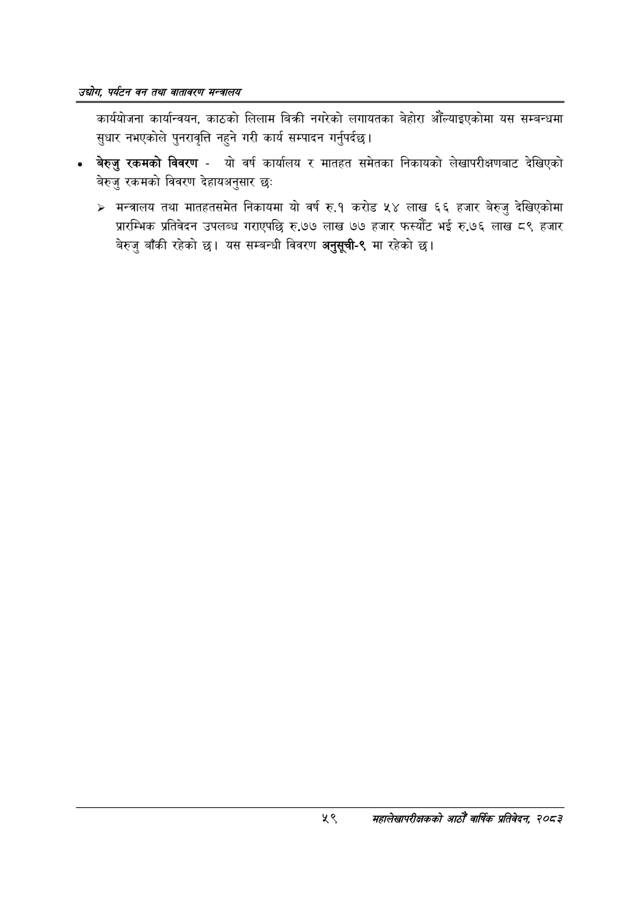

# Page 81 QA

## Rendered page


## Extracted text

```text
उद्योग पर्यटन वन तथा वातावरण मन्वालय
कार्ययोजना कार्यान्वयन, काठको लिलाम बिक्री नगरेको लगायतका बेहोरा औँल्याइएकोमा यस सम्बन्धमा सुधार नभएकोले पुनरावृत्ति नहुने गरी कार्य सम्पादन गर्नुपर्दछ।
बेरुजु रकमको विवरण -यो वर्ष कार्यालय र मातहत समेतका निकायको लेखापरीक्षणबाट देखिएको बेरुजु रकमको विवरण देहायअनुसार छः
> मन्त्रालय तथा मातहतसमेत निकायमा यो वर्ष रु.१ करोड ५४ लाख ६६ हजार बेरुजु देखिएकोमा प्रारम्भिक प्रतिवेदन उपलब्ध गराएपछि रु.७७ लाख ७७ हजार फस्यौट भई रु.७६ लाख ८९ हजार बेरुजु बाँकी रहेको | यस सम्बन्धी विवरण अनुसूची-९ मा रहेको छ।
५९
महालेखापरीक्षकको आठौ वाषिकि प्रतिवेदन २०८२
```

## Flags
- None
