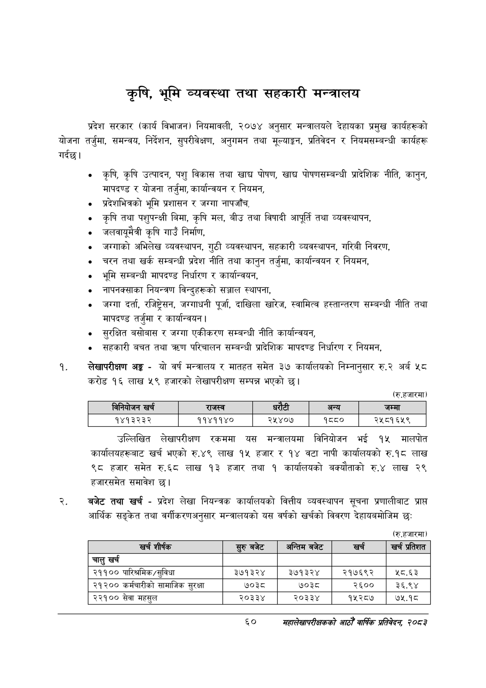

# Page 82 QA

## Rendered page


## Extracted text

```text
कृषि, भूमि व्यवस्था तथा सहकारी मन्त्रालय
प्रदेश सरकार (कार्य विभाजन) नियमावली, २०७४ अनुसार मन्त्रालयले देहायका प्रमुख कार्यहरूको योजना तर्जुमा, समन्वय, निर्देशन, सुपरीवेक्षण, अनुगमन तथा मूल्याङ्कन, प्रतिवेदन र नियमसम्बन्धी कार्यहरू गर्दछ।
कृषि, कृषि उत्पादन, पशु विकास तथा खाद्य पोषण, खाद्य पोषणसम्बन्धी प्रादेशिक नीति, कानुन, मापदण्ड र योजना तर्जुमा, कार्यान्वयन र नियमन,
० प्रदेशभित्रको भूमि प्रशासन र जग्गा नापजाँच,
० कृषि तथा पशुपन्क्षी बिमा, कृषि मल, बीउ तथा विषादी आपूर्ति तथा व्यवस्थापन,
० जलवायुमैत्री कृषि गाउँ निर्माण,
«० जग्गाको अभिलेख व्यवस्थापन, गुठी व्यवस्थापन, सहकारी व्यवस्थापन, गरिबी निवरण,
चरन तथा खर्क सम्बन्धी प्रदेश नीति तथा कानुन तर्जुमा, कार्यान्वयन र नियमन,
भूमि सम्बन्धी मापदण्ड निर्धारण र कार्यान्वयन,
० नापनक्साका नियन्त्रण विन्दुहरूको सञ्जाल स्थापना,
जग्गा दर्ता, रजिष्ट्रेसन, जग्गाधनी पूर्जा, दाखिला खारेज, स्वामित्व हस्तान्तरण सम्बन्धी नीति तथा मापदण्ड तर्जुमा र कार्यान्वयन |
० सुरक्षित बसोबास र जग्गा एकीकरण सम्बन्धी नीति कार्यान्वयन,
० सहकारी बचत तथा क्रण परिचालन सम्बन्धी प्रादेशिक मापदण्ड निर्धारण र नियमन,
लेखापरीक्षण अङ्ग -यो वर्ष मन्त्रालय र मातहत समेत ३७ कार्यालयको निम्नानुसार रु.२ अर्ब ५८ करोड १६ लाख ५९ हजारको लेखापरीक्षण सम्पन्न भएको छ।
(रु.हजारमा)
उल्लिखित लेखापरीक्षण रकममा यस मन्त्रालयमा विनियोजन भई १५४ मालपोत कार्यालयहरूबाट खर्च भएको रु.४९ लाख १५ हजार र १४ वटा नापी कार्यालयको रु.१८ लाख ९८ हजार समेत रु.६८ लाख ४३ हजार तथा १ कार्यालयको बक्यौताको रु.४ लाख २९ हजारसमेत समावेश छ।
बजेट तथा खर्च -प्रदेश लेखा नियन्त्रक कार्यालयको वित्तीय व्यवस्थापन सूचना प्रणालीबाट प्राप्त आर्थिक सङ्केत तथा वर्गीकरणअनुसार मन्त्रालयको यस वर्षको खर्चको विवरण देहायबमोजिम छः
(रु.हजारमा)
६०
महालेखापरीक्षकको आठौ वाषिकि प्रतिवेदन २०८२

|  | ।ननिवोजन खर्च | राजस्व |  |  | अन्य | जम्मा |
| --- | --- | --- | --- | --- | --- | --- |
|  | १४१३२३२ | ११४११४० | २५४०७ |  | ९५५० | २५८१६५९ |

| खर्च शीर्षक | सुरु बजेट | अन्तिम बजेट | खर्च | खु प्रतेशत |
| --- | --- | --- | --- | --- |
| चालु खर्च |  |  |  |  |
| २११०० पारिश्रमिक/सुविधा | ३७१३२४ | ३७१३२४ | २१७६९२ | ५८.६३ |
| २१२०० कर्मचारीको सामाजिक सुरक्षा | ७०३८ | ७०३८ | २६०० | ३६.९४ |
| २२१०० सेवा महसुल | २०३३४ | २०३३४ | १५२८७ | ७५.१८ |
```

## Flags
- table_page
- medium_quality_table
