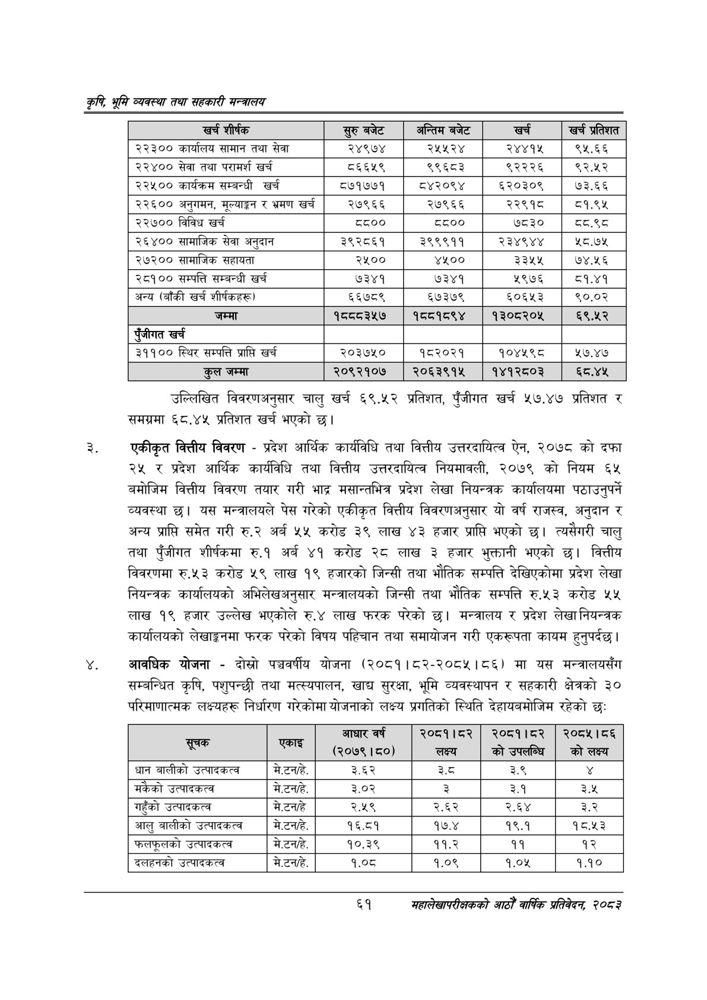

# Page 83 QA

## Rendered page


## Extracted text

```text
कृषि भूमि व्यवस्था तथा सहकारी सन्बालय
उल्लिखित विवरणअनुसार चालु खर्च ६९.५२ प्रतिशत, पुँजीगत खर्च ५७.४७ प्रतिशत र समग्रमा ६८.४५ प्रतिशत खर्च भएको छ।
एकीकृत वित्तीय विवरण -प्रदेश आर्थिक कार्यविधि तथा वित्तीय उत्तरदायित्व ऐन, २०७८ को दफा २५ र प्रदेश आर्थिक कार्यविधि तथा वित्तीय उत्तरदायित्व नियमावली, २०७९ को नियम ६५ बमोजिम वित्तीय विवरण तयार गरी भाद्र मसान्तभित्र प्रदेश लेखा नियन्त्रक कार्यालयमा पठाउनुपर्ने व्यवस्था छ। यस मन्त्रालयले पेस गरेको एकीकृत वित्तीय विवरणअनुसार यो वर्ष राजस्व, अनुदान र अन्य प्राप्ति समेत गरी रु.२ अर्ब ५५ करोड ३९ लाख ४३ हजार प्राप्ति भएको छ। त्यसैगरी चालु तथा पुँजीगत शीर्षकमा रु.१ अर्ब ४१ करोड २८ लाख ३ हजार भुक्तानी भएको छ। वित्तीय विवरणमा रु.५३ करोड ५९ लाख १९ हजारको जिन्सी तथा भौतिक सम्पत्ति देखिएकोमा प्रदेश लेखा नियन्त्रक कार्यालयको अभिलेखअनुसार मन्त्रालयको जिन्सी तथा भौतिक सम्पत्ति रु.५३ करोड ५४५ लाख १९ हजार उल्लेख भएकोले रु.४ लाख फरक परेको छ। मन्त्रालय र प्रदेश लेखा नियन्त्रक कार्यालयको लेखाङ्गनमा फरक परेको विषय पहिचान तथा समायोजन गरी एकरूपता कायम हुनुपर्दछ |
आवधिक योजना -दोस्रो पञ्चवर्षीय योजना (२०८१।८२-२०८५।८६) मा यस मन्त्रालयसँग सम्बन्धित कृषि, पशुपन्छी तथा मत्स्यपालन, खाद्य सुरक्षा, भूमि व्यवस्थापन र सहकारी क्षेत्रको ३० परिमाणात्मक लक्ष्यहरू निर्धारण गरेकोमा योजनाको लक्ष्य प्रगतिको स्थिति देहायबमोजिम रहेको छ:
६१
महालेखापरीक्षकको आठौ वाषिकि प्रतिवेदन २०८२

| खर्च शीर्षक | बजेट | अन्तिम बजेट | खर्च | खु प्रतेशत |
| --- | --- | --- | --- | --- |
| २२३०० कार्यालष सामान तथा सेवा | २४९७४ | २५५२४ | २४४१५ | ९५.६६ |
| २२४०० सेवा तथा परामर्श खर्च | ६६५९ | ९९६८३ | ९२२२६ | ९२.५२ |
| २२५०० कार्यक्रम सम्बन्धी खर्च | ८७१७७१ | ८४२०९४ | ६५२०३०९ | ७३.६६ |
| २२६०० अनुगमन, मूल्याङ्कन र भ्रमण खर्च | २७९६६ | २७९६६ | २२९१८ | ८१.९४५ |
| २२७०० विविध खर्च | ८८०० | ८८०० | ७८३० | द्व.९८ |
| २६४०० चामाजिक सेवा अनुदान | ३९२८६१ | ३९९९११ | २३४९४४ | ५८.७५ |
| २७२०० सहायता | २५०० | ४५०० | २३५४ | ७४.२६ |
| २८१०० सम्पत्ति सम्बन्धी खर्च | ७३४१ | ७३४१ | २९७६ | ८१.४१ |
| अन्य (बाँकी खर्च शीर्षकह) | ६६७८९ | ६७३७९ | ६०६५३ | ९०.०२ |
| जम्मा | १८८८ ३५७ | १८८१८९४ | १३०८२०५ | ६९.५२ |
| पूँजीगत खर्च |  |  |  |  |
| ३११०० स्थिर सम्पत्ति प्राप्ति खर्च | २०३७५० | १८२०२१ | १०४५९८ | १७.४७ |
| कुल जम्मा | २०९२१०७ | २०६३९१५ | १४१२८०३ | ६ठ.४४५ |

| सूचक |  | आधार वर्ष (२०७९। ८०) | २०८१।८२ लक्ष्य | २०८१।८२ कोडउपलन्धि | २०८५।८६ को लक्ष्य |
| --- | --- | --- | --- | --- | --- |
| धान बालीको उत्पादकत्व | मे.टनहे. | ३.६२ | डेट | ३.९ |  |
| मकैको उत्पादकत्व | मे.टनहे. | ३.०२ | ३ | ३.१ | ३.५ |
| गहुँको उत्पादकत्व | मे.टनहे | २.५९ | २.६२ | २.६४ | ३ |
| आलु बालीको उत्पादकत्व | मे.टनहे. | १६.८१ | १७.४ | १९.१ | १८.५३ |
| फलफूलको उत्पादकत्व | मे.टनहे. | १०.३९ | ११.२ | ११ | १२ |
| दलहनको उत्पादकत्व | मे.टनहे. | १.०८ | १.०९ | १.०४५ | १.१० |
```

## Flags
- table_page
- medium_quality_table
