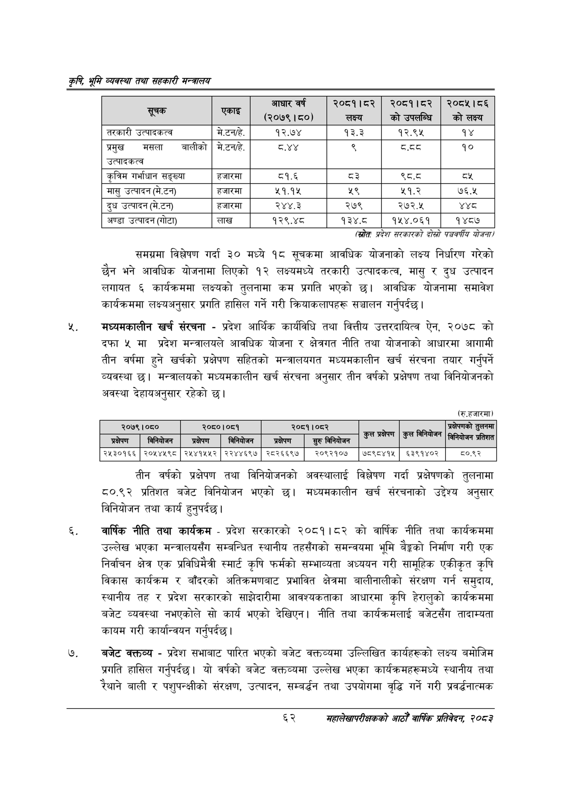

# Page 84 QA

## Rendered page


## Extracted text

```text
कृषि भूमि व्यवस्था तथा सहकारी सन्बालय
(स्रोतः प्रदेश सरकारको दोस्रो पञ्चवर्षीय योजना/
समग्रमा विश्लेषण गर्दा ३० मध्ये १८ सूचकमा आवधिक योजनाको लक्ष्य निर्धारण गरेको छैन भने आवधिक योजनामा लिएको १२ लक्ष्यमध्ये तरकारी उत्पादकत्व, मासु र दुध उत्पादन लगायत ६ कार्यक्रममा लक्ष्यको तुलनामा कम प्रगति भएको छ। आवधिक योजनामा समावेश कार्यक्रममा लक्ष्यअनुसार प्रगति हासिल गर्ने गरी क्रियाकलापहरू सञ्चालन गर्नुपर्दछ |
मंध्यमकालीन खर्च संरचना -प्रदेश आर्थिक कार्यविधि तथा वित्तीय उत्तरदायित्व ऐन, २०७८ को दफा ५ मा प्रदेश मन्त्रालयले आवधिक योजना र क्षेत्रगत नीति तथा योजनाको आधारमा आगामी तीन वर्षमा हुने खर्चको प्रक्षेपण सहितको मन्त्रालयगत मध्यमकालीन खर्च संरचना तयार गर्नुपर्ने व्यवस्था | मन्त्रालयको मध्यमकालीन खर्च संरचना अनुसार तीन वर्षको प्रक्षेपण तथा विनियोजनको अवस्था देहायअनुसार रहेको छ।
(रु.हजारमा)
तीन वर्षको प्रक्षेपण तथा विनियोजनको अवस्थालाई विश्लेषण गर्दा प्रक्षेषणको तुलनामा ८०.९२ प्रतिशत बजेट विनियोजन भएको छ। मध्यमकालीन खर्च संरचनाको उद्देश्य अनुसार विनियोजन तथा कार्य हुनुपर्दछ |
वार्षिक नीति तथा कार्यक्रम -प्रदेश सरकारको २०८१।८२ को वार्षिक नीति तथा कार्यक्रममा उल्लेख भएका मन्त्रालयसँग सम्बन्धित स्थानीय तहसँगको समन्वयमा भूमि बेङ्को निर्माण गरी एक निर्वाचन क्षेत्र एक प्रविधिमैत्री स्मार्ट कृषि फर्मको सम्भाव्यता अध्ययन गरी सामूहिक एकीकृत कृषि विकास कार्यक्रम र बाँदरको अतिक्रमणबाट प्रभावित क्षेत्रमा बालीनालीको संरक्षण गर्न समुदाय, स्थानीय तह र प्रदेश सरकारको साझेदारीमा आवश्यकताका आधारमा कृषि हेरालुको कार्यक्रममा बजेट व्यवस्था नभएकोले सो कार्य भएको देखिएन। नीति तथा कार्यक्रमलाई बजेटसँग तादाम्यता कायम गरी कार्यान्वयन गर्नुपर्दछ |
बजेट क्क्तव्य -प्रदेश सभाबाट पारित भएको बजेट वक्तव्यमा उल्लिखित कार्यहरूको लक्ष्य बमोजिम प्रगति हासिल गर्नुपर्दछ। यो वर्षको बजेट वक्तव्यमा उल्लेख भएका कार्यक्रमहरूमध्ये स्थानीय तथा बाली र पशुपन्क्षीको संरक्षण, उत्पादन, सम्बर्धन तथा उपयोगमा वृद्धि गर्ने गरी प्रवर्द्धनात्मक
६२
महालेखापरीक्षकको आठौ वाषिकि प्रतिवेदन २०८२

|  |  | आधार वर्ष (२०७९।८०। | ०५९१५३ लक्ष्य | २०८१।८२ को उपणन्चि | २०८५।८६ को लक्ष्य |
| --- | --- | --- | --- | --- | --- |
| तरकारी उत्पादकत्व | मे.टनहे. | १२.७४ | १३.३ | १२.९५ | १४ |
| प्रमुख मसला नालीको उत्पादकत्व | मे.टनहे, |  | ३ | (५३ | १० |
| कृतिम गर्भाधान सङ्ख्या | हजारमा | ८१.६ | ३ | क्व्.ट | व्श |
| मासु उत्पादन (मे.टन) | हजारमा | ५१.१४५ | २९ | ५१.२ | ७६.५ |
| दुध उत्पादन (मे.टन) | हजारमा | २४४.३ | २७९ | २७२.५ | श्थ्ठ |
| अण्डा ३त५।९न (गोटा) | लाख | १२९.४८ | १३४.८ | १५४.०६१ | १४८७ |

|  | २०७९।०८० |  | २०८०।०८१ |  | २०६१।०८२ | प्रक्षेपण |  | प्रक्षेपणको तुलनमा |
| --- | --- | --- | --- | --- | --- | --- | --- | --- |
| प्रक्षेण | —।वानिकाणण | प्रक्षेपण | = निनिबोणन | प्रक्षेपण | == सुरु | कुल प्रक्षेपण छ | कुल विनिकोजन छ | नेको निनिकोजन प्रतिशत |
| २५३०१६६ | २०५४५९८ | २५४१५५२ | २२४४६९७ | २८२६६९७ | २०९२१०७ | ७८९८४१५ | ६३९१४०२ | ५०.९२ |
```

## Flags
- table_page
- medium_quality_table
