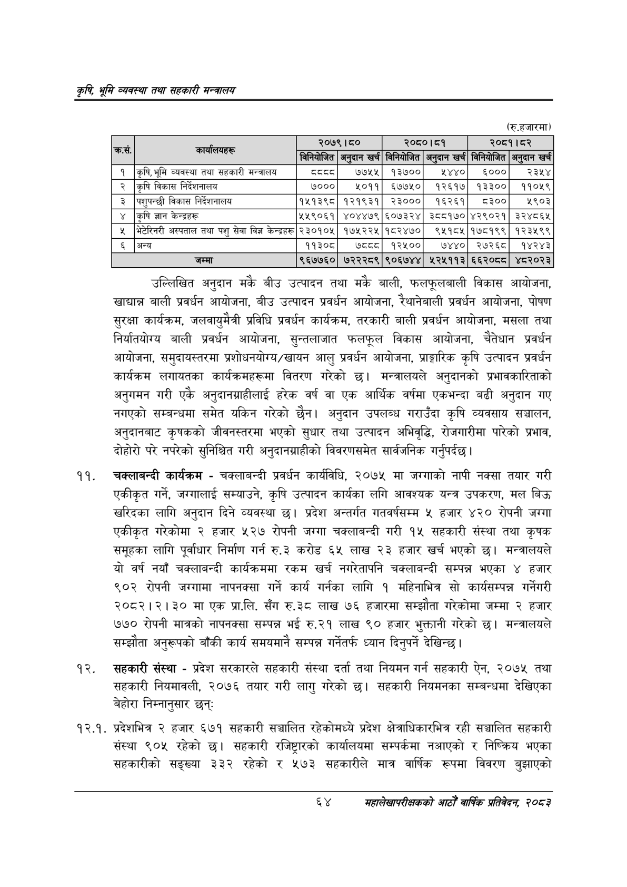

# Page 86 QA

## Rendered page


## Extracted text

```text
कृषि भूमि व्यवस्था तथा सहकारी सन्बालय
(रु.हजारमा)
उल्लिखित अनुदान मकै बीउ उत्पादन तथा मकै बाली, फलफूलबाली विकास आयोजना, खाद्यान्न बाली प्रवर्धन आयोजना, बीउ उत्पादन प्रवर्धन आयोजना, रेथानेवाली प्रवर्धन आयोजना, पोषण सुरक्षा कार्यक्रम, जलवायुमैत्री प्रविधि प्रवर्धन कार्यक्रम, तरकारी बाली प्रवर्धन आयोजना, मसला तथा निर्यातयोग्य बाली प्रवर्धन आयोजना, सुन्तलाजात फलफूल विकास आयोजना, चैतेधान प्रवर्धन आयोजना, समुदायस्तरमा प्रशोधनयोर्य/खायन आलु प्रवर्धन आयोजना, प्राङ्गारिक कृषि उत्पादन प्रवर्धन कार्यक्रम लगायतका कार्यक्रमहरूमा वितरण गरेको छ। मन्त्रालयले अनुदानको प्रभावकारिताको अनुगमन गरी एकै अनुदानग्राहीलाई हरेक वर्ष वा एक आर्थिक वर्षमा एकभन्दा बढी अनुदान गए नगएको सम्बन्धमा समेत यकिन गरेको छैन। अनुदान उपलब्ध गराउँदा कृषि व्यवसाय सञ्चालन, अनुदानबाट कृषकको जीवनस्तरमा भएको सुधार तथा उत्पादन अभिवृद्धि, रोजगारीमा पारेको प्रभाव, दोहोरो परे नपरेको सुनिश्चित गरी अनुदानग्राहीको विवरणसमेत सार्वजनिक गर्नुपर्दछ |
चक्लाबन्दी कार्यक्रम -चक्लाबन्दी प्रवर्धन कार्यविधि, २०७५ मा जग्गाको नापी नक्सा तयार गरी एकीकृत गर्ने, जग्गालाई सम्याउने, कृषि उत्पादन कार्यका लगि आवश्यक यन्त्र उपकरण, मल बिउ खरिदका लागि अनुदान दिने व्यवस्था छ। प्रदेश अन्तर्गत गतवर्षसम्म ५ हजार ४२० रोपनी जग्गा एकीकृत गरेकोमा २ हजार ५२७ रोपनी जग्गा चक्लाबन्दी गरी १५ सहकारी संस्था तथा कृषक समूहका लागि पूर्वाधार निर्माण गर्न रु.३ करोड ६५ लाख २३ हजार खर्च भएको छ। मन्त्रालयले यो वर्ष नयाँ चक्लाबन्दी कार्यक्रममा रकम खर्च नगरेतापनि चक्लाबन्दी सम्पन्न भएका ४ हजार ९०२ रोपनी जग्गामा नापनक्सा गर्ने कार्य गर्नका लागि १ महिनाभित्र सो कार्यसम्पन्न गर्नेगरी २०८२।२।३० मा एक प्रा.लि. सँग रु.३८ लाख ७६ हजारमा सम्झौता गरेकोमा जम्मा २ हजार ७७० रोपनी मात्रको नापनक्सा सम्पन्न भई रु.२१ लाख ९० हजार भुक्तानी गरेको छ। मन्त्रालयले सम्झौता अनुरूपको बाँकी कार्य समयमानै सम्पन्न गर्नेतर्फ ध्यान दिनुपर्ने देखिन्छ |
सहकारी संस्था -प्रदेश सरकारले सहकारी संस्था दर्ता तथा नियमन गर्न सहकारी ऐन, २०७५ तथा सहकारी नियमावली, २०७६ तयार गरी लागु गरेको | सहकारी नियमनका सम्बन्धमा देखिएका बेहोरा निम्नानुसार छन्‌:
१२.१. प्रदेशभित्र २ हजार ६७१ सहकारी सञ्चालित रहेकोमध्ये प्रदेश क्षेत्राधिकारभित्र रही सञ्चालित सहकारी संस्था ९०५ रहेको छ। सहकारी रजिष्ट्रारको कार्यालयमा सम्पर्कमा नआएको र निष्क्रिय भएका सहकारीको सङ्ख्या ३३२ रहेको र ५७३ सहकारीले मात्र वार्षिक रूपमा विवरण बुझाएको
६४
महालेखापरीक्षकको आठौ वाषिकि प्रतिवेदन २०८२

| छै | छ |  | २०७९।८० |  | २०८०।८१ |  | २०८१।८२ |
| --- | --- | --- | --- | --- | --- | --- | --- |
|  |  |  | खर्च |  | अङ्दान खर्च |  | अङ्दान खर्च |
| १ | कृषि, भूमि व्यवस्था तथा सहकारी भन्त्रालय | दददड | ७७५५ | १३७०० | १४४० | ६००० | २३५४ |
| २ | कृषि विकास निर्देशनालय | ७००० | ५०११ | ६७७५० | १२६१७ | १३३०० | ११०१९ |
| ३ | पशुपन्छी विकास निर्देशनालय | १५१३९८ | १२१९३१ | २३००० | १६२६१ | ८३०० | १९०३ |
| ४ | कृषि ज्ञान केन्द्रहरू | १५९०६१ | ४०४४७९ | ६०७३२४ | ३८८१७० | ४२९०२१ | ३२४८६४५ |
| ५ | भेटेरिनरी अस्पताल तथा पशु सेवा विज्ञ केन्द्रहरू | २३०१०५ | १७५२२५ | १८२४७० | ९५१८५ | १७८१९९ | १२३५९९ |
| ६ | अन्य | ११३०८ | ७८८८ | १२५०० | ७४४० | २७२६८ | १४२४३ |
|  | जम्मा | ९६७७६० | ७२२२८९ | ९०६७४४ | २२५११३ | ६६२०८०८ | ४८२०२३ |
```

## Flags
- table_page
- medium_quality_table
