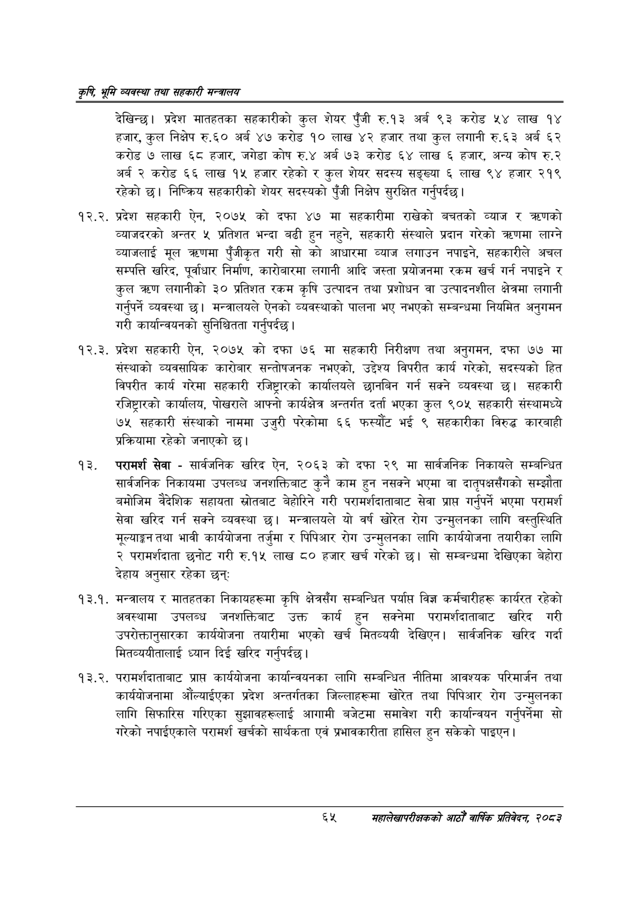

# Page 87 QA

## Rendered page


## Extracted text

```text
कृषि भूमि व्यवस्था तथा सहकारी सन्बालय
देखिन्छ। प्रदेश मातहतका सहकारीको कुल शेयर पुँजी रु.१३ अर्ब ९३ करोड ५४ लाख १४ हजार, कुल निक्षेप रु. ६० अर्ब ४७ करोड १० लाख ४२ हजार तथा कुल लगानी रु.६३ अर्ब ६२ करोड ७ लाख ६८ हजार, जगेडा कोष रु.४ अर्ब ७३ करोड ६४ लाख ६ हजार, अन्य कोष रु.२ अर्ब २ करोड ६६ लाख १५ हजार रहेको र कुल शेयर सदस्य सङ्ख्या ६ लाख ९४ हजार २१९ रहेको छ। निष्क्रिय सहकारीको शेयर सदस्यको पुँजी निक्षेप सुरक्षित गर्नुपर्दछ |
१२.२. प्रदेश सहकारी ऐन, २०७५ को दफा ४७ मा सहकारीमा राखेको बचतको व्याज र करणको व्याजदरको अन्तर ५ प्रतिशत भन्दा बढी हुन नहुने, सहकारी संस्थाले प्रदान गरेको त्रणमा लाग्ने व्याजलाई मूल त्रणमा पुँजीकृत गरी सो को आधारमा व्याज लगाउन नपाइने, सहकारीले अचल सम्पत्ति खरिद, पूर्वाधार निर्माण, कारोबारमा लगानी आदि जस्ता प्रयोजनमा रकम खर्च गर्न नपाइने र कुल क्रण लगानीको ३० प्रतिशत रकम कृषि उत्पादन तथा प्रशोधन वा उत्पादनशील क्षेत्रमा लगानी गर्नुपर्ने व्यवस्था छ। मन्त्रालयले ऐनको व्यवस्थाको पालना भए नभएको सम्बन्धमा नियमित अनुगमन गरी कार्यान्वयनको सुनिश्चितता गर्नुपर्दछ |
१२.३. प्रदेश सहकारी ऐन, २०७५ को दफा ७६ मा सहकारी निरीक्षण तथा अनुगमन, दफा ७७ मा संस्थाको व्यवसायिक कारोबार सन्तोषजनक नभएको, उद्देश्य विपरीत कार्य गरेको, सदस्यको हित विपरीत कार्य गरेमा सहकारी रजिष्ट्रारको कार्यालयले छानबिन गर्न सक्ने व्यवस्था छ। सहकारी रजिष्ट्रारको कार्यालय, पोखराले आफ्नो कार्यक्षेत्र अन्तर्गत दर्ता भएका कुल ९०५ सहकारी संस्थामध्ये ७५ सहकारी संस्थाको नाममा उजुरी परेकोमा ६६ फस्यौट भई ९ सहकारीका विरुद्ध कारबाही प्रक्रियामा रहेको जनाएको छ।
परामर्श सेवा -सार्वजनिक खरिद ऐन, २०६३ को दफा २९ मा सार्वजनिक निकायले सम्बन्धित सार्वजनिक निकायमा उपलब्ध जनशक्तिबाट कुनै काम हुन नसक्ने भएमा वा दातृपक्षसँगको सम्झौता बमोजिम वैदेशिक सहायता स्रोतबाट बेहोरिने गरी परामर्शदाताबाट सेवा प्राप्त गर्नुपर्ने भएमा परामर्श सेवा खरिद गर्न सक्ने व्यवस्था छ। मन्त्रालयले यो वर्ष खोरेत रोग उन्मुलनका लागि वस्तुस्थिति मूल्याङ्कन तथा भावी कार्ययोजना तर्जुमा र पिपिआर रोग उन्मुलनका लागि कार्ययोजना तयारीका लागि २ परामर्शदाता छनोट गरी रु.१५ लाख ८० हजार खर्च गरेको छ। सो सम्बन्धमा देखिएका बेहोरा देहाय अनुसार रहेका छन्‌ः
. मन्त्रालय र मातहतका निकायहरूमा कृषि क्षेत्रसँग सम्बन्धित पर्याप्त विज्ञ कर्मचारीहरू कार्यरत रहेको अवस्थामा उपलब्ध जनशक्तिबाट उक्त कार्य हुन सक्नेमा परामर्शदाताबाट खरिद गरी उपरोक्तानुसारका कार्ययोजना तयारीमा भएको खर्च मितव्ययी देखिएन। सार्वजनिक खरिद गर्दा मितव्ययीतालाई ध्यान दिई खरिद गर्नुपर्दछ।
१३.२. परामर्शदाताबाट प्राप्त कार्ययोजना कार्यान्वयनका लागि सम्बन्धित नीतिमा आवश्यक परिमार्जन तथा कार्ययोजनामा औंल्याईएका प्रदेश अन्तर्गतका जिल्लाहरूमा खोरेत तथा पिपिआर रोग उन्मुलनका लागि सिफारिस गरिएका सुझावहरूलाई आगामी बजेटमा समावेश गरी कार्यान्वयन गर्नुपर्नेमा सो गरेको नपाईएकाले परामर्श खर्चको सार्थकता एवं प्रभावकारीता हासिल हुन सकेको पाइएन।
६५ महालेखापरीक्षकको आठौ वाषिकि प्रतिवेदन २०८२
```

## Flags
- None
