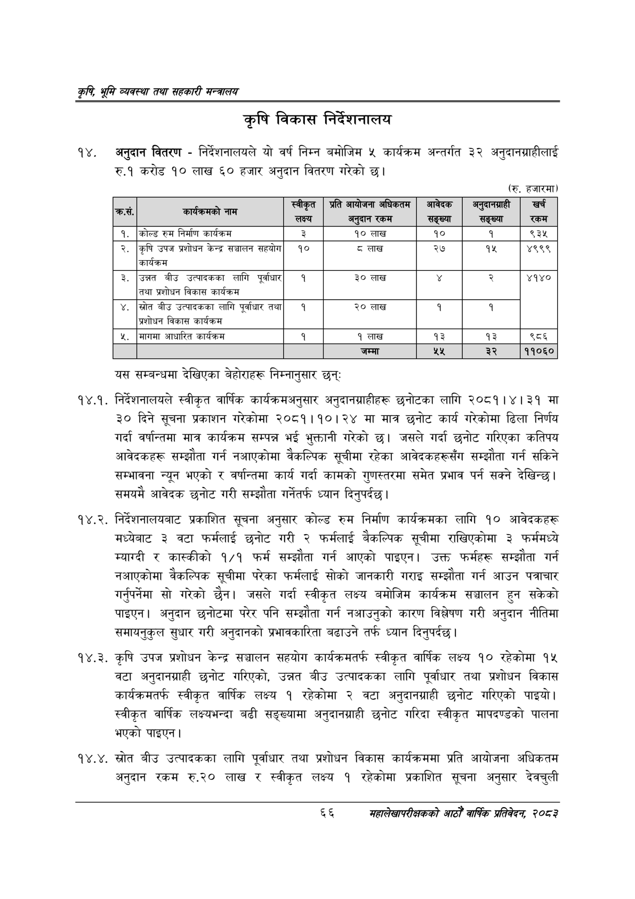

# Page 88 QA

## Rendered page


## Extracted text

```text
कृषि भूमि व्यवस्था तथा सहकारी सन्बालय
।]
कृषि विकास निर्देशनालय
अनुदान वितरण -निर्देशनालयले यो वर्ष निम्न बमोजिम ५ कार्यक्रम अन्तर्गत ३२ अनुदानग्राहीलाई रु.१ करोड १० लाख ६० हजार अनुदान वितरण गरेको छ।
(रु. हजारमा)
टु
यस सम्बन्धमा देखिएका बेहोराहरू निम्नानुसार छन्‌:
१४.१. निर्देशनालयले स्वीकृत वार्षिक कार्यक्रमअनुसार अनुदानग्राहीहरू छनोटका लागि २०८१।४।३१ मा ३० दिने सूचना प्रकाशन गरेकोमा २०८१।१०। २४ मा मात्र छनोट कार्य गरेकोमा ढिला निर्णय गर्दा वर्षान्तमा मात्र कार्यक्रम सम्पन्न भई भुक्तानी गरेको | जसले गर्दा छनोट गरिएका कतिपय आवेदकहरू सम्झौता गर्न नआएकोमा वैकल्पिक सूचीमा रहेका आवेदकहरूसँग सम्झौता गर्न सकिने सम्भावना न्यून भएको र वर्षान्तमा कार्य गर्दा कामको गुणस्तरमा समेत प्रभाव पर्न सक्ने देखिन्छ। समयमै आवेदक छनोट गरी सम्झौता गर्नेतर्फ ध्यान दिनुपर्दछ |
१४.२. निर्देशनालयबाट प्रकाशित सूचना अनुसार कोल्ड रुम निर्माण कार्यक्रमका लागि १० आवेदकहरू मध्येबाट ३ वटा फर्मलाई छनोट गरी २ फर्मलाई बेकल्पिक सूचीमा राखिएकोमा ३ फर्ममध्ये म्याग्दी र कास्कीको १/१ फर्म सम्झौता गर्न आएको पाइएन। उक्त फर्महरू सम्झौता गर्न नआएकोमा वैकल्पिक सूचीमा परेका फर्मलाई सोको जानकारी गराइ सम्झौता गर्न आउन पत्राचार गर्नुपर्नेमा सो गरेको छैन। जसले गर्दा स्वीकृत लक्ष्य बमोजिम कार्यक्रम सञ्चालन हुन सकेको पाइएन। अनुदान छनोटमा परेर पनि सम्झौता गर्न नआउनुको कारण विश्लेषण गरी अनुदान नीतिमा समायनुकुल सुधार गरी अनुदानको प्रभावकारिता बढाउने तर्फ ध्यान दिनुपर्दछ |
१४.३. कृषि उपज प्रशोधन केन्द्र सञ्चालन सहयोग कार्यक्रमतर्फ स्वीकृत वार्षिक लक्ष्य १० रहेकोमा १५ वटा अनुदानग्राही छनोट गरिएको, उन्नत बीउ उत्पादकका लागि पूर्वाधार तथा प्रशोधन विकास कार्यक्रमतर्फ स्वीकृत वार्षिक लक्ष्य १ रहेकोमा २ वटा अनुदानग्राही छनोट गरिएको पाइयो। स्वीकृत वार्षिक लक्ष्यभन्दा बढी सङ्ख्यामा अनुदानग्राही छनोट गरिदा स्वीकृत मापदण्डको पालना भएको पाइएन |
४, स्रोत बीउ उत्पादकका लागि पूर्वाधार तथा प्रशोधन विकास कार्यक्रममा प्रति आयोजना अधिकतम अनुदान रकम रु.२० लाख र स्वीकृत लक्ष्य १ रहेकोमा प्रकाशित सूचना अनुसार देवचुली
जम्मा
६६
महालेखापरीक्षकको आठौ वाषिकि प्रतिवेदन २०८२

| ५ १ १ १ १ २ १५८ २० ४५ ५ ५३.०३२४४८ ०२ ५ १ १ १ १ ३ ३३८ ७ ४७ २३ ९६.७४६२३१ स्वीकृत ५ १ १ १ १ ४ ४०९ ७ २६ १८ ९३.२५८६६७ प्रति ५ १ १ १ १ ५ ४४१ ७ ५३ १८ ३५.५३०६६३ ५ १ १ १ १ ६ ५०४ ७ ५६ १८ १४.९८८०९८ जनिकतनम ५ १ १ १ १ ७ ५९३ ७ ४९ १८ ९१.५१७८१५ आवेदक ५ १ १ १ १ ८ ६७९ ७ ६९ २३ ०.०००००० जुष्चनाही ५ १ १ १ १ ९ ७९० ७ २६ १८ ९३.७२९८८९ खर्च ४ १ १ १ २ ० ७ २५ २३१ १३ -१ ५ १ १ १ २ १ ७ २६ ३६ १२ ७४.१८६६६१ कस. ५ १ १ १ २ २ १३६ २९ ६८ ९ १०.५२८२०२ ५ १ १ १ २ ३ २१२ २५ २६ १३ ९६.६६४८४८ नाम ४ १ १ १ ३ ० ३४० ३० ४८० ३१ -१ ५ १ १ १ ३ १ ३४० ३० ४१ ३१ ७४.७८७२१६ लक्ष्य ५ १ १ १ ३ २ ४४६ ३९ ४४ १७ ९६.४३९०२६ अनुदान ५ १ १ १ ३ ३ ४९५ ३९ ३४ १३ ९५.८५०७८४ रकम ५ १ १ १ ३ ४ ५८९ ३० ५५ ३१ ५१.७५३७२३ सङ्ख्या ५ १ १ १ ३ ५ ६८६ ३० ५५ ३१ ४६.१०९०६६ सङ्ख्या ५ १ १ १ ३ ६ ७८५ ३९ ३५ १३ ८७.१२४४६६ 'रकम ४ १ १ १ ४ ० २० ६२ ७९९ १८ -१ ५ १ १ १ ४ १ २० ६६ १३ १४ ९६.५११२०८ १. ५ १ १ १ ४ २ ५२ ६२ ३७ १७ ९६.८०००६४ कोल्ड ५ १ १ १ ४ ३ ९६ ६७ २३ १३ ९६.६६१३७७ रुम ५ १ १ १ ४ ४ १२६ ६२ ३९ १६ ९३.०१२१०८ निर्माण ५ १ १ १ ४ ५ १७४ ६२ ५१ १६ ५६.३३७८७२ कार्यक्रम ५ १ १ १ ४ ६ ३५८ ६६ ७ १३ ९३.३००५३७ ३ ५ १ १ १ ४ ७ ४५८ ६६ २० १४ ९६.५२३६५९ १० ५ १ १ १ ४ ८ ४८७ ६७ ३० ११ ९६.५५७९२२ लाख ५ १ १ १ ४ ९ ६०६ ६६ २० १४ ९६.९५८२२१ १० ५ १ १ १ ४ १० ७१० ६६ ६ १४ ९४.९८३९०२ १ ५ १ १ १ ४ ११ ७८७ ६६ ३२ १४ ७५.५००७६३ ९३५ ४ १ १ १ ५ ० १९ ९० ८०५ २१ -१ ५ १ १ १ ५ १ १९ ९४ १४ १३ ९५.६२५२४४ २. ५ १ १ १ ५ २ ५२ ९० २७ २१ ९५.९३४०९० कृषि ५ १ १ १ ५ ३ ८७ ९५ ३२ १२ ९६.७५८१९४ उपज ५ १ १ १ ५ ४ १२७ ९० ४६ १७ ९६.३६२५३४ प्रशोधन ५ १ १ १ ५ ५ १८० ९० ३१ १७ ९६.१००८४५ केन्द्र ५ १ १ १ ५ ६ २१९ ९५ ४८ ११ ७३.८०६०३० सञ्चालन ५ १ १ १ ५ ७ २७५ ९० ४५ १७ ९३.३०४४१३ सहयोग ५ १ १ १ ५ ८ ३५२ ९४ २० १४ ९३.३०४४१३ १० ५ १ १ १ ५ ९ ४६२ ९६ १० १० ८५.३६८७२९ ८ ५ १ १ १ ५ १० ४८१ ९५ ३० ११ ९५.८०९६४७ लाख ५ १ १ १ ५ ११ ६०६ ९४ २० १३ ९५.५८८०२० २७ ५ १ १ १ ५ १२ ७०४ ९४ २० १४ ९५.४७३००० १५ ५ १ १ १ ५ १३ ७८० ९४ ४४ १४ ९६.४८३३९८ ४९९९ ४ १ १ १ ६ ० ५४ ११७ ५० १६ -१ ५ १ १ १ ६ १ ५४ ११७ ५० १६ ८५.५७०७५५ कार्यक्रम ४ १ १ १ ७ ० २० १४५ ८०५ २० -१ ५ १ १ १ ७ १ २० १४९ १३ १३ ९६.६४५५६९ ३. ५ १ १ १ ७ २ ५२ १५० ३४ ११ ९३.४००५०५ उन्नत ५ १ १ १ ७ ३ १०० १४५ २७ १६ ९३.०२१९३५ बीउ ५ १ १ १ ७ ४ १४४ १५२ ६८ ९ ९१.४४८०२९ उत्पादकका ५ १ १ १ ७ ५ २२८ १४५ ३२ १६ ९२.६२७०९० लागि ५ १ १ १ ७ ६ २७५ १४५ ४५ २० ७२.४
```

## Flags
- table_page
- low_quality_table
