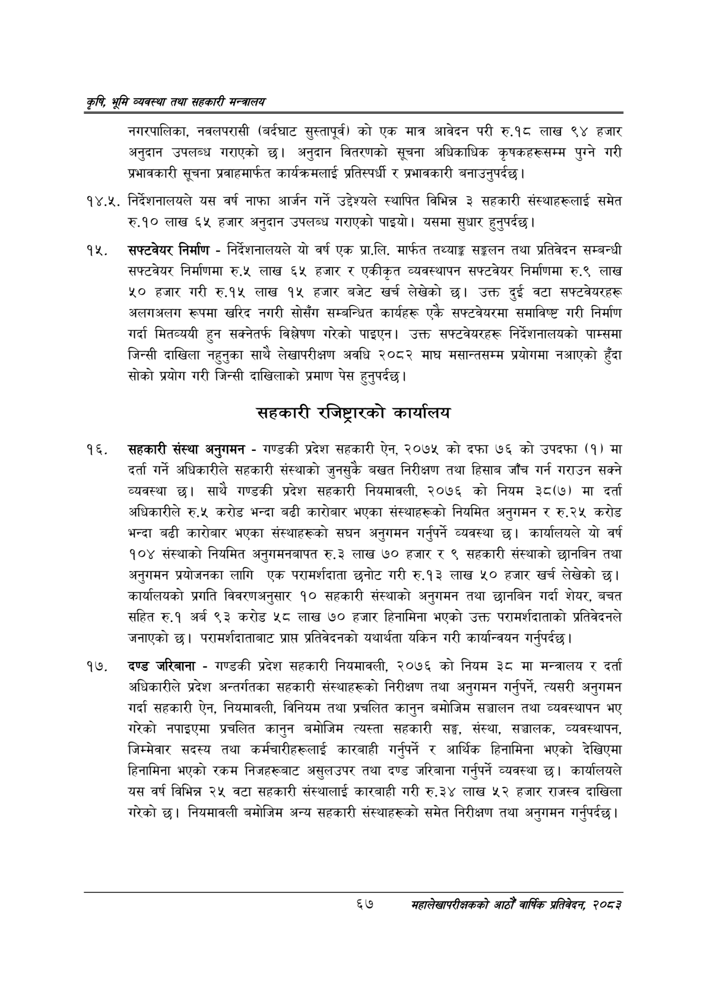

# Page 89 QA

## Rendered page


## Extracted text

```text
कृषि भूमि व्यवस्था तथा सहकारी सन्बालय
नगरपालिका, नवलपरासी (बर्दघाट सुस्तापूर्) को एक मात्र आवेदन परी रु.१८ लाख ९४ हजार अनुदान उपलब्ध गराएको छ। अनुदान वितरणको सूचना अधिकाधिक कृषकहरूसम्म पुग्ने गरी प्रभावकारी सूचना प्रवाहमार्फत कार्यक्रमलाई प्रतिस्पर्धी र प्रभावकारी बनाउनुपर्दछ |
१४.२५. निर्देशनालयले यस वर्ष नाफा आर्जन गर्ने उद्देश्यले स्थापित विभिन्न ३ सहकारी संस्थाहरूलाई समेत रु.१० लाख ६५ हजार अनुदान उपलब्ध गराएको पाइयो। यसमा सुधार हुनुपर्दछ |
सफ्टवेयर निर्माण -निर्देशनालयले यो वर्ष एक प्रा.लि. मार्फत तथ्याङ्क सङ्कलन तथा प्रतिवेदन सम्बन्धी सफ्टवेयर निर्माणमा ४ लाख ६५ हजार र एकीकृत व्यवस्थापन सफ्टवेयर निर्माणमा रु.९ लाख ५० हजार गरी रु.१५ लाख १५ हजार बजेट खर्च लेखेको छ। उक्त दुई वटा सफ्टवेयरहरू अलगअलग रूपमा खरिद नगरी सोसँग सम्बन्धित कार्यहरू एकै सफ्टवेयरमा समाविष्ट गरी निर्माण गर्दा मितव्ययी हुन सक्नेतर्फ विश्लेषण गरेको पाइएन। उक्त सफ्टवेयरहरू निर्देशनालयको पाम्समा जिन्सी दाखिला नहुनुका साथै लेखापरीक्षण अवधि २०८२ माघ मसान्तसम्म प्रयोगमा नआएको हुँदा सोको प्रयोग गरी जिन्सी दाखिलाको प्रमाण पेस हुनुपर्दछ |
सहकारी रजिष्ट्रारको कार्यालय
सहकारी संस्था अनुगमन -गण्डकी प्रदेश सहकारी ऐन, २०७५ को दफा ७६ को उपदफा (१) मा दर्ता गर्ने अधिकारीले सहकारी संस्थाको जुनसुकै बखत निरीक्षण तथा हिसाव जाँच गर्न गराउन सक्ने व्यवस्था छ। साथै गण्डकी प्रदेश सहकारी नियमावली, २०७६ को नियम ३८(७) मा दर्ता अधिकारीले रु.५ करोड भन्दा बढी कारोबार भएका संस्थाहरूको नियमित अनुगमन र रु.२५ करोड भन्दा बढी कारोबार भएका संस्थाहरूको सघन अनुगमन गर्नुपर्ने व्यवस्था | कार्यालयले यो वर्ष १०४ संस्थाको नियमित अनुगमनबापत रु.३ लाख ७० हजार र ९ सहकारी संस्थाको छानबिन तथा अनुगमन प्रयोजनका लागि एक परामर्शदाता छनोट गरी रु.१३ लाख ५० हजार खर्च लेखेको छ। कार्यालयको प्रगति विवरणअनुसार १० सहकारी संस्थाको अनुगमन तथा छानबिन गर्दा शेयर, बचत सहित रु.१ अर्ब ९३ करोड ५८ लाख ७० हजार हिनामिना भएको उक्त परामर्शदाताको प्रतिवेदनले जनाएको छ। परामर्शदाताबाट प्राप्त प्रतिवेदनको यथार्थता यकिन गरी कार्यान्वयन गर्नुपर्दछ |
दण्ड जरिबाना -गण्डकी प्रदेश सहकारी नियमावली, २०७६ को नियम ३८ मा मन्त्रालय र दर्ता अधिकारीले प्रदेश अन्तर्गतका सहकारी संस्थाहरूको निरीक्षण तथा अनुगमन गर्नुपर्ने, त्यसरी अनुगमन गर्दा सहकारी ऐन, नियमावली, विनियम तथा प्रचलित कानुन बमोजिम सञ्चालन तथा व्यवस्थापन भए गरेको नपाइएमा प्रचलित कानुन बमोजिम त्यस्ता सहकारी सङ्ग, संस्था, सञ्चालक, व्यवस्थापन, जिम्मेवार सदस्य तथा कर्मचारीहरूलाई कारबाही गर्नुपर्ने र आर्थिक हिनामिना भएको देखिएमा हिनामिना भएको रकम निजहरूबाट असुलउपर तथा दण्ड जरिबाना गर्नुपर्ने व्यवस्था छ। कार्यालयले यस वर्ष विभिन्न २५ वटा सहकारी संस्थालाई कारबाही गरी रु.३४ लाख ५२ हजार राजस्व दाखिला गरेको छ। नियमावली बमोजिम अन्य सहकारी संस्थाहरूको समेत निरीक्षण तथा अनुगमन गर्नुपर्दछ।
६७
महालेखापरीक्षकको आठौ वाषिकि प्रतिवेदन २०८२
```

## Flags
- None
