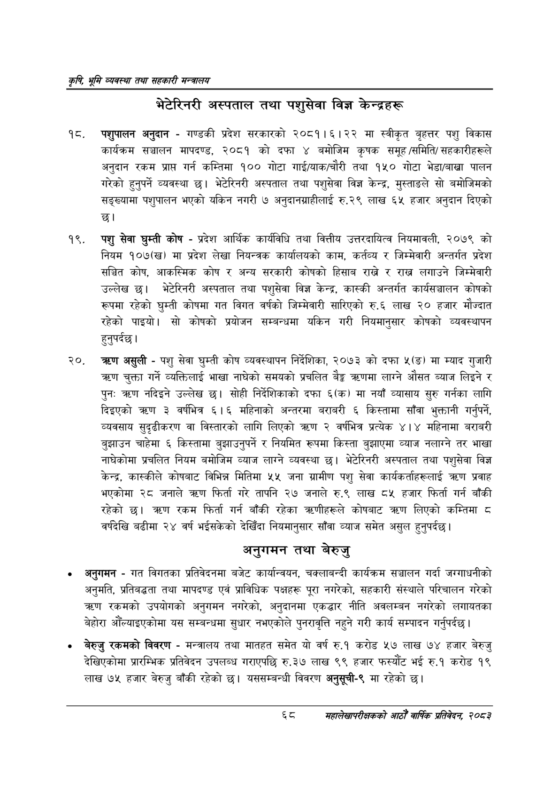

# Page 90 QA

## Rendered page


## Extracted text

```text
कृषि भूमि व्यवस्था तथा सहकारी सन्बालय
भेटेरिनरी अस्पताल तथा पशुसेवा विज्ञ केन्द्रहरू
पशुपालन अनुदान -गण्डकी प्रदेश सरकारको २०८१।६।२२ मा स्वीकृत बृहत्तर पशु विकास कार्यक्रम सञ्चालन मापदण्ड, २०८१ को दफा ४ बमोजिम कृषक समूह /समिति/ सहकारीहरूले अनुदान रकम प्राप्त गर्न कम्तिमा १०० मोटा गाई/याक/चौरी तथा १५० गोटा भेडा/बाखा पालन गरेको हुनुपर्ने व्यवस्था छ। भेटेरिनरी अस्पताल तथा पशुसेवा विज्ञ केन्द्र, मुस्ताङले सो बमोजिमको सङ्ख्यामा पशुपालन भएको यकिन नगरी ७ अनुदानग्राहीलाई रु.२९ लाख ६५ हजार अनुदान दिएको छ।
पशु सेवा घुम्ती कोष -प्रदेश आर्थिक कार्यविधि तथा वित्तीय उत्तरदायित्व नियमावली, २०७९ को नियम १०७(ख) मा प्रदेश लेखा नियन्त्रक कार्यालयको काम, कर्तव्य र जिम्मेवारी अन्तर्गत प्रदेश सञ्चित कोष, आकस्मिक कोष र अन्य सरकारी कोषको हिसाब राख्ने र राख लगाउने जिम्मेवारी उल्लेख छ। भेटेरिनरी अस्पताल तथा पशुसेवा विज्ञ केन्द्र, कास्की अन्तर्गत कार्यसञ्चालन कोषको रूपमा रहेको घुम्ती कोषमा गत विगत वर्षको जिम्मेवारी सारिएको रु.६ लाख २० हजार मौज्दात रहेको पाइयो। सो कोषको प्रयोजन सम्बन्धमा यकिन गरी नियमानुसार कोषको व्यवस्थापन हुनुपर्दछ |
असुली -पशु सेवा घुम्ती कोष व्यवस्थापन निर्देशिका, २०७३ को दफा ५(ङ) मा म्याद गुजारी चुक्ता गर्ने व्यक्तिलाई भाखा नाघेको समयको प्रचलित बेङ्ग त्रहणमा लाग्ने औसत व्याज लिइने र पुनः त्रहण नदिइने उल्लेख छ। सोही निर्देशिकाको दफा ६(क) मा नयाँ व्यासाय सुरु गर्नका लागि दिइएको त्रण ३ वर्षभित्र € | महिनाको अन्तरमा बराबरी ६ किस्तामा साँवा भुक्तानी गर्नुपर्ने, व्यवसाय सुदृढीकरण वा विस्तारको लागि लिएको क्रहण २ वर्षभित्र प्रत्यक ४।४ महिनामा बराबरी बुझाउन चाहेमा ६ किस्तामा बुझाउनुपर्ने र नियमित रूपमा किस्ता बुझाएमा व्याज नलाग्ने तर भाखा नाघेकोमा प्रचलित नियम बमोजिम व्याज लाग्ने व्यवस्था छ। भेटेरिनरी अस्पताल तथा पशुसेवा विज्ञ केन्द्र, कास्कीले कोषबाट विभिन्न मितिमा ५५ जना ग्रामीण पशु सेवा कार्यकर्ताहरूलाई =० प्रवाह भएकोमा २८ जनाले त्रहण फिर्ता गरे तापनि २७ जनाले रु.९ लाख ८५ हजार फिर्ता गर्न बाँकी रहेको छ। त्रहण रकम फिर्ता गर्न बाँकी रहेका त्रहणीहरूले कोषबाट लिएको कम्तिमा ८ वर्षदेखि बढीमा २४ वर्ष भईसकेको देखिँदा नियमानुसार साँवा व्याज समेत असुल हुनुपर्दछ |
अनुगमन तथा बेरुजु
अनुगमन -गत विगतका प्रतिवेदनमा बजेट कार्यान्वयन, चक्लाबन्दी कार्यक्रम सञ्चालन गर्दा जग्गाधनीको अनुमति, प्रतिबद्धता तथा मापदण्ड एवं प्राविधिक पक्षहरू पूरा नगरेको, सहकारी संस्थाले परिचालन गरेको रकमको उपयोगको अनुगमन नगरेको, अनुदानमा एकद्वार नीति अवलम्बन नगरेको लगायतका बेहोरा औँल्याइएकोमा यस सम्बन्धमा सुधार नभएकोले पुनरावृत्ति नहुने गरी कार्य सम्पादन गर्नुपर्दछ |
बेरुजु रकमको विवरण -मन्त्रालय तथा मातहत समेत यो वर्ष रु.१ करोड ५७ लाख ७४ हजार बेरुजु देखिएकोमा प्रारम्भिक प्रतिवेदन उपलब्ध गराएपछि रु.३७ लाख ९९ हजार फस्यौट भई रु.१ करोड १९ लाख ७५ हजार बेरुजु बाँकी रहेको छ। यससम्बन्धी विवरण अनुसूची-९ मा रहेको |
६८
महालेखापरीक्षकको आठौ वाषिकि प्रतिवेदन २०८२
```

## Flags
- None
