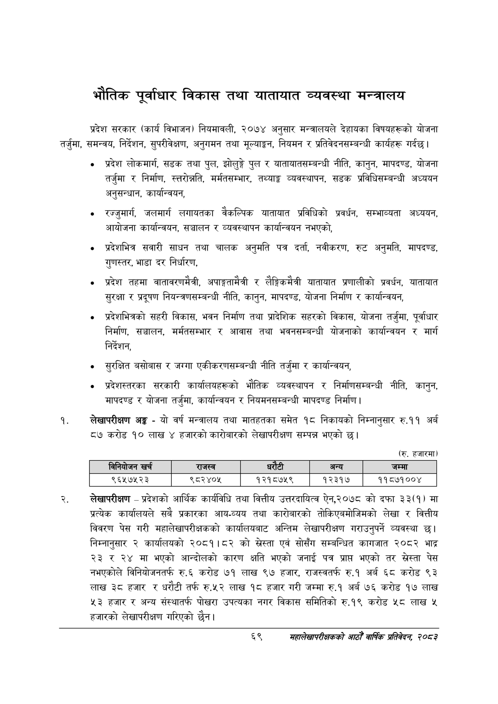

# Page 91 QA

## Rendered page


## Extracted text

```text
भौतिक पूर्वाधार विकास तथा यातायात व्यवस्था मन्त्रालय
प्रदेश सरकार (कार्य विभाजन) नियमावली, २०७४ अनुसार मन्त्रालयले देहायका विषयहरूको योजना तर्जुमा, समन्वय, निर्देशन, सुपरीवेक्षण, अनुगमन तथा मूल्याङ्कन, नियमन र प्रतिवेदनसम्बन्धी कार्यहरू गर्दछ।
प्रदेश लोकमार्ग, सडक तथा पुल, झोलुङ्गे पुल र यातायातसम्बन्धी नीति, कानुन, मापदण्ड, योजना तर्जुमा र निर्माण, स्तरोन्नति, मर्मतसम्भार, तथ्याङ्ग व्यवस्थापन, सडक प्रविधिसम्बन्धी अध्ययन अनुसन्धान, कार्यान्वयन,
रज्जुमार् जलमार्ग लगायतका वैकल्पिक यातायात प्रविधिको प्रवर्धन, सम्भाव्यता अध्ययन, आयोजना कार्यान्वयन, सञ्चालन र व्यवस्थापन कार्यान्वयन नभएको,
प्रदेशभित्र सवारी साधन तथा चालक अनुमति पत्र दर्ता, नवीकरण, रुट अनुमति, मापदण्ड, गुणस्तर, भाडा दर निर्धारण,
प्रदेश तहमा वातावरणमैत्री, अपाङ्गतामैत्री र लैङ्गिकमैत्री यातायात प्रणालीको प्रवर्धन, यातायात सुरक्षा र प्रदूषण नियन्त्रणसम्बन्धी नीति, कानुन, मापदण्ड, योजना निर्माण र कार्यान्वयन,
प्रदेशभित्रको सहरी विकास, भवन निर्माण तथा प्रादेशिक सहरको विकास, योजना तर्जुमा, पूर्वाधार निर्माण, सञ्चालन, मर्मतसम्भार र आवास तथा भवनसम्बन्धी योजनाको कार्यान्वयन र मार्ग निर्देशन,
० सुरक्षित बसोबास र जग्गा एकीकरणसम्बन्धी नीति तर्जुमा र कार्यान्वयन,
० प्रदेशस्तरका सरकारी कार्यालयहरूको भौतिक व्यवस्थापन र निर्माणसम्बन्धी नीति, कानुन, मापदण्ड र योजना तर्जुमा, कार्यान्वयन र नियमनसम्बन्धी मापदण्ड निर्माण।
लेखापरीक्षण अङ्ग -यो वर्ष मन्त्रालय तथा मातहतका समेत १८ निकायको निम्नानुसार रु.११ अर्ब ८७ करोड १० लाख ४ हजारको कारोबारको लेखापरीक्षण सम्पन्न भएको छ।
लेखापरीक्षण -प्रदेशको आर्थिक कार्यविधि तथा वित्तीय उत्तरदायित्व ऐन,२०७८ को दफा ३३(१) मा प्रत्यक कार्यालयले सबै प्रकारका आय-व्यय तथा कारोबारको तोकिएबमोजिमको लेखा र वित्तीय विवरण पेस गरी महालेखापरीक्षकको कार्यालयबाट अन्तिम लेखापरीक्षण गराउनुपर्ने व्यवस्था छ। निम्नानुसार २ कार्यालयको २०८१।८२ को स्रेस्ता एवं सोसँग सम्बन्धित कागजात २०८२ भाद्र २३ र २४ मा भएको आन्दोलको कारण क्षति भएको जनाई पत्र प्राप भएको तर खस्रेस्ता पेस नभएकोले विनियोजनतर्फ रु.६ करोड ७१ लाख ९७ हजार, राजस्वतर्फ रु.१ अर्ब ६८ करोड ९३ लाख ३८ हजार र धरौटी तर्फ रु.५२ लाख १८ हजार गरी जम्मा रु.१ अर्ब ७६ करोड १७ लाख ४३ हजार र अन्य संस्थातर्फ पोखरा उपत्यका नगर विकास समितिको रु.१९ करोड ५८ लाख ५ हजारको लेखापरीक्षण गरिएको छैन।
(रु. हजारमा)
६९
महालेखापरीक्षकको आठौ वाषिकि प्रतिवेदन २०८२

|  |  | नानेबोजन |  | राजस्व |  |  | अन्य | जम्मा |
| --- | --- | --- | --- | --- | --- | --- | --- | --- |
|  |  | ९६५७५२३ |  | ९८२४०५ | १२१८७५९ |  | १२३१७ | ११८७१००४ |
```

## Flags
- table_page
- medium_quality_table
