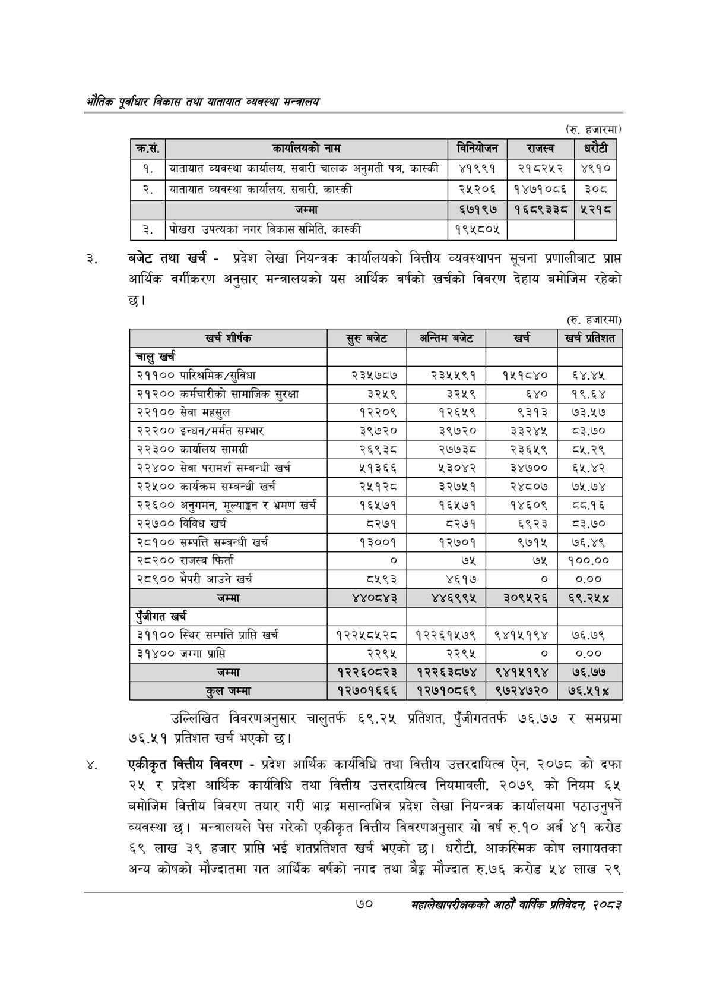

# Page 92 QA

## Rendered page


## Extracted text

```text
एवधार विकास तथा यातायात व्यवस्था
(रु. हजारमा)
बजेट तथा खर्च -प्रदेश लेखा नियन्त्रक कार्यालयको वित्तीय व्यवस्थापन सूचना प्रणालीबाट प्राप्त आर्थिक वर्गीकरण अनुसार मन्त्रालयको यस आर्थिक वर्षको खर्चको विवरण देहाय बमोजिम रहेको छ।
(रु. हजारमा)
उल्लिखित विवरणअनुसार चालुतर्फ ६९.२५ प्रतिशत, पुँजीगततर्फ ७६.७७ र समग्रमा ७६.५१ प्रतिशत खर्च भएको छ।
एकीकृत वित्तीय विवरण -प्रदेश आर्थिक कार्यविधि तथा वित्तीय उत्तरदायित्व ऐन, २०७८ को दफा २५ र प्रदेश आर्थिक कार्यविधि तथा वित्तीय उत्तरदायित्व नियमावली, २०७९ को नियम ६४ बमोजिम वित्तीय विवरण तयार गरी भाद्र मसान्तभित्र प्रदेश लेखा नियन्त्रक कार्यालयमा पठाउनुपर्ने व्यवस्था | मन्त्रालयले पेस गरेको एकीकृत वित्तीय विवरणअनुसार यो वर्ष रु.१० अर्ब ४१ करोड ६९ लाख ३९ हजार प्राप्ति भ शतप्रतिशत खर्च भएको छ। धरौटी, आकस्मिक कोष लगायतका अन्य कोषको मौज्दातमा गत आर्थिक वर्षको नगद तथा बैङ्क मौज्दात रु.७६ करोड ५४ लाख २९
७०
महालेखापरीक्षकको आठौ वाषिकि प्रतिवेदन २०८२

| क्रस, | कार्णषको नाम | 'बानिबोणन | राजस्व | धरेटी |
| --- | --- | --- | --- | --- |
| १. | बाताबात व्यवस्था कार्यालय, सवारी चालक अनुमती पत्र, कास्की | ४१९९१ | २१८२५२ | ४९१० |
| २. | व्यवस्था कार्यालय, सवारी, कास्की | २५२०६ | १४७१०८६ | ३०८ |
|  | जम्मा | ६७१९७ | १६८९३३८० | ५२१८ |
| ३. | पोखरा ३५त५क। नगर विकास समिति, कास्की | १९५८०५ |  |  |

| खर्च शीर्षक | सुरु बजेट | अन्तिम बजेट | खर्च | खर्च प्रतिशत |
| --- | --- | --- | --- | --- |
| चालु खर्च |  |  |  |  |
| २११०० पारिश्रमिक/सुविधा | २३५७८७ | २३५५९१ | १५१८४० | ६४.४५ |
| २१२०० कर्यचारीको सामाजिक सुरक्षा | ३२५९ | ३२५९ | ६४० | १९.६४ |
| २२१०० सेवा महसुल | १२२०९ | १२६५९ | ९३१३ | ७३.५७ |
| २२२०० इन्धन/मर्मत सम्भार | ३९७२० | ३९७२० | ३३२४५ | ८३.७० |
| २२३०० कार्यालय सामग्री | २६९३८ | २७७३८ | २३६५९ | ०८५.२९ |
| २२४०० सेवा परामर्श सम्बन्धी खर्च | ५१३६६ | ५३०४२ | ३४७०० | ६५.४२ |
| २२५०० कार्यक्रम सम्बन्धी खर्च | २४५१२८ | ३२७५१ | २४८०७ | ७५.७४ |
| २२६०० अनुगमन, मूल्याङ्कन र भ्रमण खर्च | १६५७१ | १६५७१ | १४६०९ | वव.१६ |
| २२७०० विविध खर्च | ८२७१ | ८२७१ | ६९२३ | ८३.७० |
| २८१०० सम्पत्ति सम्बन्धी खर्च | १३००१ | १२७०१ | ९७१५ | ७६.४९ |
| २८२०० राजस्व फिर्ता |  | ७५ | ७५ | १००.०० |
| २८९०० भैपरी आउने खर्च | ८५९३ | ४६१७ |  | ०.०० |
| जम्मा | ४४०८४३ | ४४६९९५ | २०९५२६ | ६९.२५% |
| एंजीगत खर्च |  |  |  |  |
| ३११०० स्थिर सम्पत्ति प्राप्ति खर्च | १२२५८५२८ | १२२६१५७९ | ९४१५१९४ | ७६.७९ |
| ३१४०० जग्गा प्राप्ति | २२९५ | २२९४ | ० | ०.०० |
| जम्मा | १२२६०८२३ | १२२६३८७४ | ९४१५१९४ | ७६.७७ |
| कुल जम्मा | १२७०१६६६ | १२७१०८६९ | ९७२४७२० | ७६.५१% |
```

## Flags
- table_page
- medium_quality_table
