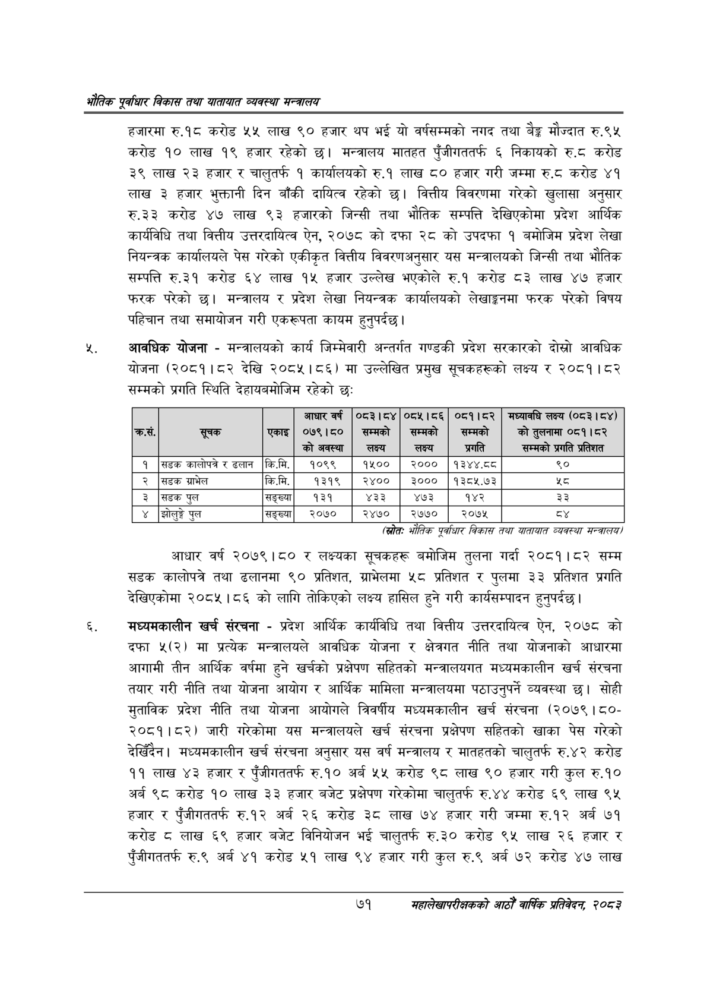

# Page 93 QA

## Rendered page


## Extracted text

```text
एवधार विकास तथा यातायात व्यवस्था
हजारमा रु.१८ करोड ५५ लाख ९० हजार थप भई यो वर्षसम्मको नगद तथा बैङ्क मौज्दात रु.९५ करोड ९० लाख १९ हजार रहेको | मन्त्रालय मातहत पुँजीगततर्फ ६ निकायको रु.८ करोड ३९ लाख २३ हजार र चालुतर्फ १ कार्यालयको रु.१ लाख ८० हजार गरी जम्मा रु.८ करोड ४१ लाख ३ हजार भुक्तानी दिन बाँकी दायित्व रहेको छ। वित्तीय विवरणमा गरेको खुलासा अनुसार रु.३३ करोड ४७ लाख ९३ हजारको जिन्सी तथा भौतिक सम्पत्ति देखिएकोमा प्रदेश आर्थिक कार्यविधि तथा वित्तीय उत्तरदायित्व ऐन, २०७८ को दफा २८ को उपदफा १ बमोजिम प्रदेश लेखा नियन्त्रक कार्यालयले पेस गरेको एकीकृत वित्तीय विवरणअनुसार यस मन्त्रालयको जिन्सी तथा भौतिक सम्पत्ति रु.३१ करोड लाख १५ हजार उल्लेख भएकोले रु.१ करोड ८३ लाख ४७ हजार फरक परेको छ। मन्त्रालय र प्रदेश लेखा नियन्त्रक कार्यालयको लेखाङ्गनमा फरक परेको विषय पहिचान तथा समायोजन गरी एकरूपता कायम हुनुपर्दछ |
आवधिक योजना -मन्त्रालयको कार्य जिम्मेवारी अन्तर्गत गण्डकी प्रदेश सरकारको दोस्रो आवधिक योजना (२०८१।८२ देखि २०८५।८६) मा उल्लेखित प्रमुख सूचकहरूको लक्ष्य र २०८१।८२ सम्मको प्रगति स्थिति देहायबमोजिम रहेको छः:
(स्रोतः भोतिक पूर्वाधार विकास तथा यातायात व्यवस्था सन्तरालय/
आधार वर्ष २०७९।८० र लक्ष्यका सूचकहरू बमोजिम तुलना गर्दा २०८१।८२ सम्म सडक कालोपत्रै तथा ढलानमा ९० प्रतिशत, ग्राभेलमा ५८ प्रतिशत र पुलमा ३३ प्रतिशत प्रगति देखिएकोमा २०८५।८६ को लागि तोकिएको लक्ष्य हासिल हुने गरी कार्यसम्पादन हुनुपर्दछ |
मंध्यमकालीन खर्च संरचना -प्रदेश आर्थिक कार्यविधि तथा वित्तीय उत्तरदायित्व ऐन, २०७८ को दफा ५(२) मा प्रत्येक मन्त्रालयले आवधिक योजना र क्षेत्रगत नीति तथा योजनाको आधारमा आगामी तीन आर्थिक वर्षमा हुने खर्चको प्रक्षेपण सहितको मन्त्रालयगत मध्यमकालीन खर्च संरचना तयार गरी नीति तथा योजना आयोग र आर्थिक मामिला मन्त्रालयमा पठाउनुपर्ने व्यवस्था छ। सोही मुताविक प्रदेश नीति तथा योजना आयोगले त्रिवर्षीय मध्यमकालीन खर्च संरचना (२०७९। ८०२०८१।८२) जारी गरेकोमा यस मन्त्रालयले खर्च संरचना प्रक्षेपण सहितको खाका पेस गरेको देखिँदैन। मध्यमकालीन खर्च संरचना अनुसार यस वर्ष मन्त्रालय र मातहतको चालुतर्फ रु.४२ करोड ११ लाख ४३ हजार र पुँजीगततर्फ रु.१० अर्ब ५५ करोड ९८ लाख ९० हजार गरी कुल रु.१० अर्ब ९८ करोड १० लाख ३३ हजार बजेट प्रक्षेपण गरेकोमा चालुतर्फ रु.४४ करोड ६९ लाख ९५ हजार र पुँजीगततर्फ रु.१२ अर्ब २६ करोड ३८ लाख ७४ हजार गरी जम्मा रु.१२ अर्ब ७१ करोड © लाख ६९ हजार बजेट विनियोजन भई चालुतर्फ रु.३० करोड ९५ लाख २६ हजार र पुँजीगततर्फ रु.९ अर्ब ४१ करोड ५२१ लाख ९४ हजार गरी कुल रु.९ अर्ब ७२ करोड ४७ लाख
७१
महालेखापरीक्षकको आठौ वाषिकि प्रतिवेदन २०८२

| क्रस. | 'सूचक | एकाइ | आधार वर्ष ०७९।८० 'को अवस्था | ०८३।८४ सम्मको लक्ष्य | ०८५।८६ सम्मको लक्ष्य | ०८१।८२ सम्मको प्रगति | भन्पानमि लक्ष्य (०८३।८४) को तुलनामा ०८१।८२ सम्मको प्रगति प्रतिशत |
| --- | --- | --- | --- | --- | --- | --- | --- |
| १ | सडक कालोपत्रे र ढलान | कि.मि. | १०९९ | १५०० | २००० | १३४४.८८ | ९० |
| २ | सडक ग्राभेल | कि.मि. | १३१९ | २४०० | ३००० | १३८५.७३ | %५ |
| ३ | सडक पुल | सङ्ख्या | १३१ | ४३३ | ४७३ | १४२ | ३३ |
| ४ | झोलुङ्गे पुल | सङ्ख्या | २०७० | २४७० | २७७० | २०७५ |  |
```

## Flags
- table_page
- medium_quality_table
