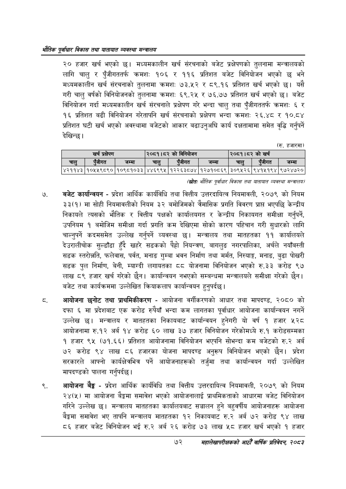

# Page 94 QA

## Rendered page


## Extracted text

```text
एवधार विकास तथा यातायात व्यवस्था
२० हजार खर्च भएको छ। मध्यमकालीन खर्च संरचनाको बजेट प्रक्षेपणको तुलनामा मन्त्रालयको लागि चालु र पुँजीगततर्फ क्रमशः १०६ र ११६ प्रतिशत बजेट विनियोजन भएको छ भने मध्यमकालीन खर्च संरचनाको तुलनामा क्रमशः ७३.५२ र ८९.१६ प्रतिशत खर्च भएको यसै गरी चालु वर्षको विनियोजनको तुलनामा क्रमशः ६९.२५ र ७६.७७ प्रतिशत खर्च भएको छ। बजेट विनियोजन गर्दा मध्यमकालीन खर्च संरचनाले प्रक्षेपण गरे भन्दा चालु तथा पुँजीगततर्फ क्रमश: ६ र १६ प्रतिशत बढी विनियोजन गरेतापनि खर्च संरचनाको प्रक्षेपण भन्दा क्रमशः २६.४८ र १०.८४ प्रतिशत घटी खर्च भएको अवस्थामा बजेटको आकार बढाउनुअघि कार्य दक्षतामामा समेत वृद्धि गर्नुपर्ने देखिन्छ।
(रु. हजारमा)
(स्रोतः भौतिक एवधार विकास तथा यातायात व्यवस्था सन्चरालय/
बजेट कार्यान्वयन -प्रदेश आर्थिक कार्यविधि तथा वित्तीय उत्तरदायित्व नियमावली, २०७९ को नियम ३३(१) मा सोही नियमावलीको नियम ३२ बमोजिमको त्रैमासिक प्रगति विवरण प्राप्त भएपछि केन्द्रीय निकायले त्यसको भौतिक र वित्तीय पक्षको कार्यालयगत र केन्द्रीय निकायगत समीक्षा गर्नुपर्ने, उपनियम १ बमोजिम समीक्षा गर्दा प्रगति कम देखिएमा सोको कारण पहिचान गरी सुधारको लागि चाल्नुपर्ने कदमसमेत उल्लेख गर्नुपर्ने व्यवस्था | मन्त्रालय तथा मातहतका ११ कार्यालयले देउरालीचोक सुल्डाँडा सडकको नियन्त्रण, बागलुङ नगरपालिका, अर्चले नयाँबस्ती सडक स्तरोत्नति, फलेवास, पर्वत, मनाङ गुम्बा भवन निर्माण तथा मर्मत, निस्याङ्ग, मनाङ, बुढा पोखरी सडक पुल निर्माण, बेनी, म्याग्दी लगायतका ८८ योजनामा विनियोजन भएको रु.३३ करोड ९७ लाख ८९ हजार खर्च गरेको छैन। कार्यान्वयन नभएको सम्बन्धमा मन्त्रालयले समीक्षा गरेको छैन। बजेट तथा कार्यक्रममा उल्लेखित क्रियाकलाप कार्यान्वयन हुनुपर्दछ |
आयोजना छनोट तथा प्राथमिकीकरण -आयोजना वर्गीकरणको आधार तथा मापदण्ड, २०८० को दफा ६ मा प्रदेशबाट एक करोड रुपैयाँ भन्दा कम लागतका पूर्वाधार आयोजना कार्यान्वयन नगर्ने उल्लेख छ। मन्त्रालय र मातहतका निकायबाट कार्यान्वयन हुनेगरी यो वर्ष १ हजार ५२८ आयोजनामा रु.१२ अर्ब १४ करोड ६० लाख ३७ हजार विनियोजन गरेकोमध्ये रु.१ करोडसम्मका १ हजार ९५ (७१.६६) प्रतिशत आयोजनामा विनियोजन भएपनि सोभन्दा कम बजेटको रु.२ अर्ब ७२ करोड ९४ लाख ८६ हजारका योजना मापदण्ड अनुरूप विनियोजन भएको छैन। प्रदेश सरकारले आफ्नो कार्यक्षेत्रभित्र पर्ने आयोजनाहरूको तर्जुमा तथा कार्यान्वयन गर्दा उल्लेखित मापदण्डको पालना गर्नुपर्दछ।
९, आयोजना बैङ्क -प्रदेश आर्थिक कार्यविधि तथा वित्तीय उत्तरदायित्व नियमावली, २०७९ को नियम २४(५) मा आयोजना समावेश भएको आयोजनालाई प्राथमिकताको आधारमा बजेट विनियोजन गरिने उल्लेख छ। मन्त्रालय मातहतका कार्यालयबाट सञ्चालन हुने बहुवर्षीय आयोजनाहरू आयोजना बेङ्गमा समावेश भए तापनि मन्त्रालय मातहतका १२ निकायबाट रु.२ अर्ब ७२ करोड ९४ लाख ८६ हजार बजेट विनियोजन भई रु.२ अर्ब २६ करोड ७३ लाख ५८ हजार खर्च भएको १ हजार
७२
महालेखापरीक्षकको आठौ वाषिकि प्रतिवेदन २०८२

|  |  | खर्च प्रक्षेपण |  | २०८१।८२ | को | (ननिकोजन |  | २०८१।८२ | को | खर्च |  |
| --- | --- | --- | --- | --- | --- | --- | --- | --- | --- | --- | --- |
| चालु |  | रंजीगत | जम्मा | चालु |  | रंजीगत | जम्मा | चालु |  | एजीगत | जम्मा |
| ४२११४३ |  | १०५५९८९० | १०९८१०३३ | ४४६९९५ |  | १२२६३८७४ | १२७१०८६९ | ३०९५२६ |  | ९४१५१९४ | ९७२४७२० |
```

## Flags
- table_page
- medium_quality_table
