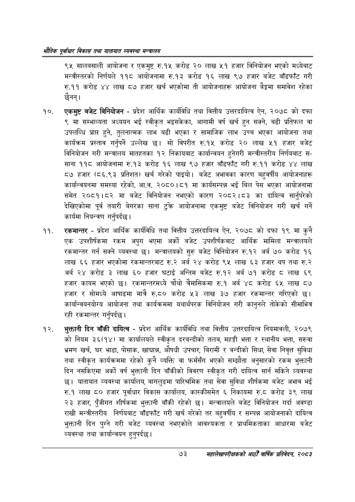

# Page 95 QA

## Rendered page


## Extracted text

```text
एवधार विकास तथा यातायात व्यवस्था
९५ सालबसाली आयोजना र एकमुष्ट रु.१५ करोड २० लाख ५१ हजार विनियोजन भएको मध्येबाट मन्त्रीस्तरको निर्णयले ११८ आयोजनामा रु.१३ करोड १६ लाख ९७ हजार बजेट बाँडफाँट गरी रु.११ करोड ४४ लाख ८७ हजार खर्च भएकोमा ती आयोजनाहरू आयोजना बैङ्कमा समावेश रहेका छैनन्‌।
एकमुष्ट बजेट विनियोजन -प्रदेश आर्थिक कार्यविधि तथा वित्तीय उत्तरदायित्व ऐन, २०७८ को दफा ९ मा सम्भाव्यता अध्ययन भई स्वीकृत भइसकेका, आगामी वर्ष खर्च हुन सक्ने, बढी प्रतिफल वा उपलब्धि प्राप्त हुने, तुलनात्मक लाभ बढी भएका र सामाजिक लाभ उच्च भएका आयोजना तथा कार्यक्रम प्रस्ताव गर्नुपर्ने उल्लेख सो विपरीत रु.१५ करोड २० लाख ५१ हजार बजेट विनियोजन गरी मन्त्रालय मातहतका १२ निकायबाट कार्यान्वयन हुनेगरी मन्त्रीस्तरीय निर्णयबाट ससाना ११८ आयोजनामा रु.१३ करोड १६ लाख ९७ हजार बाँडफाँट गरी रु.११ करोड ४४ लाख ८७ हजार (८६.९३ प्रतिशत) खर्च गरेको पाइयो। बजेट अभावका कारण बहुवर्षीय आयोजनाहरू कार्यान्वयनमा समस्या रहेको, आ.व. २०८०।८१ मा कार्यसम्पन्न भई बिल पेस भएका आयोजनामा समेत २०८१।८२ मा बजेट विनियोजन नभएको कारण २०८२।८३ का दायित्व सार्नुपरेको देखिएकोमा पूर्व तयारी बेगरका साना टुक्र आयोजनामा एकमुष्ट बजेट विनियोजन गरी खर्च गर्ने कार्यमा नियन्त्रण गर्नुपर्दछ |
रकमान्तर -प्रदेश आर्थिक कार्यविधि तथा वित्तीय उत्तरदायित्व ऐन, २०७८ को दफा १९ मा कुनै एक उपशीर्षकमा रकम अपुग भएमा अर्को बजेट उपशीर्षकबाट आर्थिक मामिला मन्त्रालयले रकमान्तर गर्न सक्ने व्यवस्था छ। मन्त्रालयको सुरु बजेट विनियोजन रु.१२ अर्ब ७० करोड १६ लाख ६६ हजार भएकोमा रकमान्तरबाट रु.२ अर्ब २४ करोड ९५ लाख ६३ हजार थप तथा रु.२ अर्ब २४ करोड ३ लाख ६० हजार घटाई अन्तिम बजेट रु.१२ अर्ब ७१ करोड ८ लाख ६९ हजार कायम भएको | रकमान्तरमध्ये चौथो त्रैमासिकमा रु.१ अर्ब ४८ करोड ६५ लाख ८७ हजार र सोमध्ये आषाढमा मात्रै रु.८० करोड ५३ लाख ३७ हजार रकमान्तर गरिएको छ। कार्यान्वयनयोग्य आयोजना तथा कार्यक्रममा यथार्थपरक विनियोजन गरी कानुनले तोकेको सीमाभित्र रही रकमान्तर गर्नुपर्दछ |
भुक्तानी दिन बाँकी दायित्व -प्रदेश आर्थिक कार्यविधि तथा वित्तीय उत्तरदायित्व नियमावली, २०७९ को नियम ३६(१४) मा कार्यालयले स्वीकृत दरबन्दीको तलब, महङ्गी भत्ता र स्थानीय भत्ता, सरुवा भ्रमण खर्च, घर भाडा, पोसाक, खाद्यान्न, औषधी उपचार, बिरामी र बन्दीको सिधा, सेवा निवृत्त सुविधा तथा स्वीकृत कार्यक्रममा रहेको कुनै व्यक्ति वा फर्मसँग भएको सम्झौता अनुसारको रकम भुक्तानी दिन नसकिएमा अर्को वर्ष भुक्तानी दिन बाँकीको विवरण स्वीकृत गरी दायित्व सार्न सकिने व्यवस्था छ। यातायात व्यवस्था कार्यालय, बागलुङमा पारिश्रमिक तथा सेवा सुविधा शीर्षकमा बजेट अभाव भई रु.१ लाख ८० हजार पूर्वाधार विकास कार्यालय, कास्कीसमेत ६ निकायमा रु.८ट करोड ३९ लाख २३ हजार, पुँजीगत शीर्षकमा भुक्तानी बाँकी रहेको छ। मन्त्रालयले बजेट विनियोजन गर्दा अवण्डा राखी मन्त्रीस्तरीय निर्णयबाट बाँडफाँट गरी खर्च गरेको तर बहुवर्षीय र सम्पन्न आयोजनाको दायित्व भुक्तानी दिन पुग्ने गरी बजेट व्यवस्था नभएकोले आवश्यकता र प्राथमिकताका आधारमा बजेट व्यवस्था तथा कार्यान्वयन हुनुपर्दछ |
७३
महालेखापरीक्षकको आठौ वाषिकि प्रतिवेदन २०८२
```

## Flags
- None
