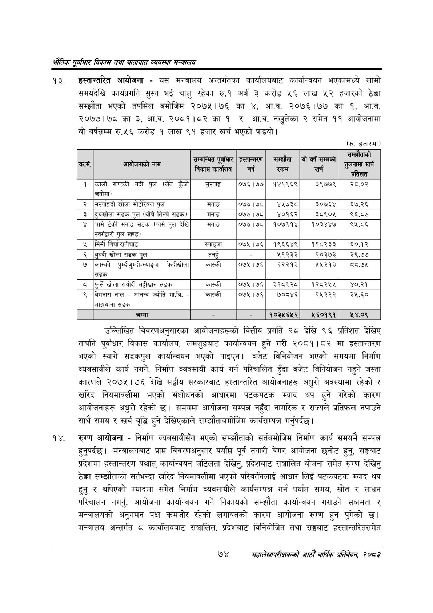

# Page 96 QA

## Rendered page


## Extracted text

```text
एवधार विकास तथा यातायात व्यवस्था
हस्तान्तरित आयोजना -यस मन्त्रालय अन्तर्गतका कार्यालयबाट कार्यान्वयन भएकामध्ये लामो समयदेखि कार्यप्रगति सुस्त भई चालु रहेका रु.१ अर्ब ३ करोड ५६ लाख ५२ हजारको ठेक्का सम्झौता भएको तपसिल बमोजिम २०७५।७६ का , आ.व. २०७६।७७ का ९, आ.व. २०७७।७८ का ३, आ.व. २०८१।८२ का १ र आ.व. नखुलेका २ समेत ११ आयोजनामा यो वर्षसम्म रु.५६ करोड १ लाख ९१ हजार खर्च भएको पाइयो।
(रु. हजारमा)
उल्लिखित विवरणअनुसारका आयोजनाहरूको वित्तीय प्रगति २८ देखि ९६ प्रतिशत देखिए तापनि पूर्वाधार विकास कार्यालय, लमजुङबाट कार्यान्वयन हुने गरी २०८१।८२ मा हस्तान्तरण भएको स्यागे सडकपुल कार्यान्वयन भएको पाइएन। बजेट विनियोजन भएको समयमा निर्माण व्यवसायीले कार्य नगर्ने, निर्माण व्यवसायी कार्य गर्न परिचालित हुँदा बजेट विनियोजन नहुने जस्ता कारणले २०७५।७६ देखि सङ्घीय सरकारबाट हस्तान्तरित आयोजनाहरू अधुरो अवस्थामा रहेको र खरिद नियमावलीमा भएको संशोधनको आधारमा पटकपटक म्याद थप हुने गरेको कारण आयोजनाहरू अधुरो रहेको छ। समयमा आयोजना सम्पन्न नहुँदा नागरिक र राज्यले प्रतिफल नपाउने साथै समय र खर्च वृद्धि हुने देखिएकाले सम्झौतावमोजिम कार्यसम्पन्न गर्नुपर्दछ |
रुग्ण आयोजना -निर्माण व्यवसायीसँग भएको सम्झौताको सर्तबमोजिम निर्माण कार्य समयमै सम्पन्न हुनुपर्दछ। मन्त्रालयबाट प्राप्त विवरणअनुसार पर्याप्त पूर्व तयारी बेगर आयोजना छनोट हुनु, सङ्घबाट प्रदेशमा हस्तान्तरण पश्चात्‌ कार्यान्वयन जटिलता देखिनु, प्रदेशबाट सञ्चालित योजना समेत रुग्ण देखिनु ठेक्का सम्झौताको सर्तभन्दा खरिद नियमावलीमा भएको परिवर्तनलाई आधार लिई पटकपटक म्याद थप हुनु र थपिएको म्यादमा समेत निर्माण व्यवसायीले कार्यसम्पन्न गर्न पर्यास समय, स्रोत र साधन परिचालन नगर्नु, आयोजना कार्यान्वयन गर्ने निकायको सम्झौता कार्यान्वयन गराउने सक्षमता र मन्त्रालयको अनुगमन पक्ष कमजोर रहेको लगायतको कारण आयोजना रुग्ण हुन पुगेको छ। मन्त्रालय अन्तर्गत ८ कार्यालयबाट सञ्चालित, प्रदेशबाट विनियोजित तथा सङ्घबाट हस्तान्तरितसमेत
७४
महालेखापरीक्षकको आठौ वाषिकि प्रतिवेदन २०८२

|  | आयोजनाको नाम | ~ बिकास कार्षालप | वर्ष | सम्झौता 'रकम | यो वर्ष सम्मको खर्च | ताको प्रतिशत |
| --- | --- | --- | --- | --- | --- | --- |
| १ | काली गण्डकी नदी पुल (लेते कुँजो ) | मुस्ताङ्ग | ०७६।७७ | १४१९६९ | ३९७७९ | २८.०२ |
| २ | खोला भोटारजल पुल | मनाङ | ०७७।७८ | ४४१५७३८ | ३०७६४ | ६७.२६ |
| ३ | दुघखोला सडक पुल (थोँचे तिल्चे सडक) | मनाङ | ०७७।७८ | ४०१६२ | ३८९०५ | ९६.८७ |
| ४ | चामे टंकी मनाङ सडक (चामे पुल देखि स्वर्गद्वारी पुल खण्ड) | मनाङ | ०७७।७८ | १०७९१४ | १०३४४७ | ९१५.८६ |
| ५ | मिर्मी विर्घा रानीघाट | स्याङ्जा | ०७५।७६ | १९६६४९ | ११८२३३ | ०.९% |
| ६ | बुल्दी खोला सडक पुल | तनहुँ |  | ५१२३३ | २०३७३ | ३९.७७ |
| ७ | कास्की पुम्दीभुम्दी-स्याङ्जा फेदीखोला सडक | कास्की | ०७५।७६ | ५२२१३ | २५५२१३ | द्य.७४५ |
| ८ | फुर्से खोला रायोदी मट्टीबान सडक | कास्की | ०७५।७६ | ३१८९२८० | १२८२५५ | ४०.२१ |
| ९ | बेगनास ताल - आनन्द ज्योति मा.वि. - मज्ञयाना सडक | कास्की | ०७५।७६ | ७०८४६ | २५२२२ | ३५.६० |
| १० | जम्मा |  |  | १०३५६५२ | २५६०१९१ | २५४.०९ |
```

## Flags
- table_page
- medium_quality_table
