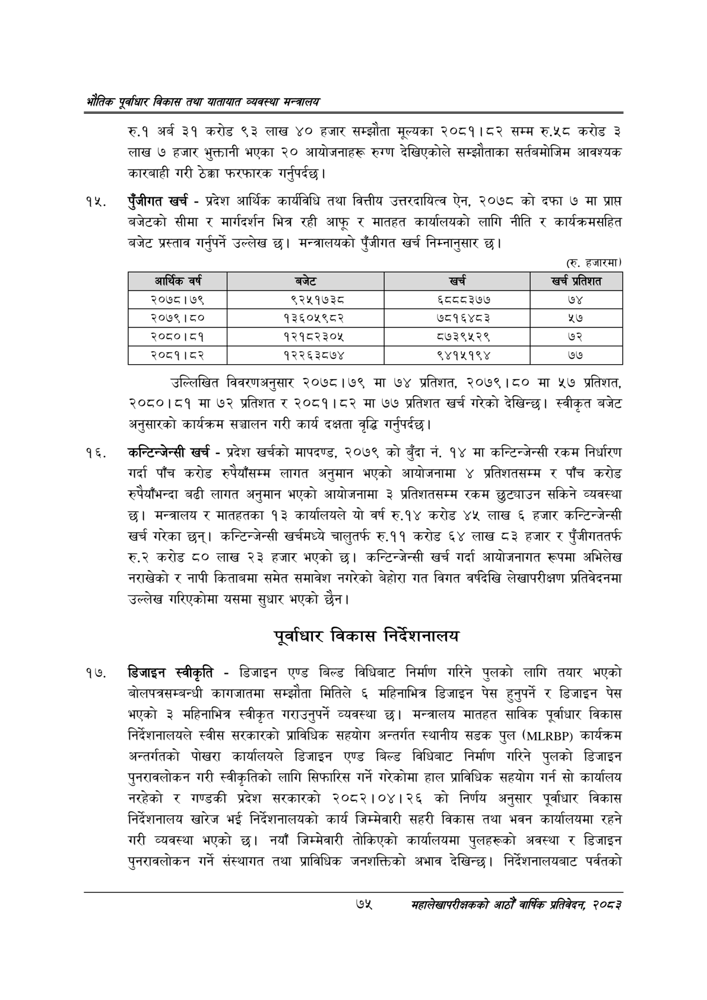

# Page 97 QA

## Rendered page


## Extracted text

```text
एवधार विकास तथा यातायात व्यवस्था
रु.१ अर्ब ३९ करोड ९३ लाख ४० हजार सम्झौता मूल्यका २०८१।८२ सम्म रु.५८ करोड ३ लाख ७ हजार भुक्तानी भएका ० आयोजनाहरू रुग्ण देखिएकोले सम्झौताका सर्तवमोजिम आवश्यक कारबाही गरी ठेक्का फरफारक गर्नुपर्दछ |
पुँजीगत खर्च -प्रदेश आर्थिक कार्यविधि तथा वित्तीय उत्तरदायित्व ऐन, २०७८ को दफा ७ मा प्राप्त बजेटको सीमा र मार्गदर्शन भित्र रही आफू र मातहत कार्यालयको लागि नीति र कार्यक्रमसहित बजेट प्रस्ताव गर्नुपर्ने उल्लेख छ। मन्त्रालयको पुँजीगत खर्च निम्नानुसार छ।
(रु. हजारमा)
उल्लिखित विवरणअनुसार २०७८।७९ मा ७४ प्रतिशत, २०७९।८० मा ५७ प्रतिशत, २०८०।८१ मा ७२ प्रतिशत र २०८१।८२ मा ७७ प्रतिशत खर्च गरेको देखिन्छ। स्वीकृत बजेट अनुसारको कार्यक्रम सञ्चालन गरी कार्य दक्षता वृद्धि गर्नुपर्दछ |
'कन्टिन्जेन्सी खर्च -प्रदेश खर्चको मापदण्ड, २०७९ को बुँदा नं. १४ मा कन्टिन्जेन्सी रकम निर्धारण गर्दा पाँच करोड रुपैयाँसम्म लागत अनुमान भएको आयोजनामा ४ प्रतिशतसम्म र पाँच करोड रुपैयाँभन्दा बढी लागत अनुमान भएको आयोजनामा ३ प्रतिशतसम्म रकम छुट्याउन सकिने व्यवस्था छ। मन्त्रालय र मातहतका १३ कार्यालयले यो वर्ष रु.१४ करोड ४५ लाख ६ हजार कन्टिन्जेन्सी खर्च गरेका छन्‌। कन्टिन्जेन्सी खर्चमध्ये चालुतर्फ रु.११ करोड ६४ लाख ८३ हजार र पुँजीगततर्फ रु.२ करोड ८० लाख ३ हजार भएको | कन्टिन्जेन्सी खर्च गर्दा आयोजनागत रूपमा अभिलेख नराखेको र नापी किताबमा समेत समावेश नगरेको बेहोरा गत विगत वर्षदेखि लेखापरीक्षण प्रतिवेदनमा उल्लेख गरिएकोमा यसमा सुधार भएको छैन।
पूर्वाधार विकास निर्देशनालय
डिजाइन स्वीकृति -डिजाइन एण्ड बिल्ड विधिबाट निर्माण गरिने पुलको लागि तयार भएको बोलपत्रसम्बन्धी कागजातमा सम्झौता मितिले ६ महिनाभित्र डिजाइन पेस हुनुपर्ने र डिजाइन पेस भएको ३ महिनाभित्र स्वीकृत गराउनुपर्ने व्यवस्था छ। मन्त्रालय मातहत साविक पूर्वाधार विकास निर्देशनालयले स्वीस सरकारको प्राविधिक सहयोग अन्तर्गत स्थानीय सडक पुल () कार्यक्रम अन्तर्गतको पोखरा कार्यालयले डिजाइन एण्ड बिल्ड विधिबाट निर्माण गरिने पुलको डिजाइन पुनरावलोकन गरी स्वीकृतिको लागि सिफारिस गर्ने गरेकोमा हाल प्राविधिक सहयोग गर्न सो कार्यालय नरहेको र गण्डकी प्रदेश सरकारको २०८२।०४।२६ को निर्णय अनुसार पूर्वाधार विकास निर्देशनालय खारेज भई निर्देशनालयको कार्य जिम्मेवारी सहरी विकास तथा भवन कार्यालयमा रहने गरी व्यवस्था भएको छ। नयाँ जिम्मेवारी तोकिएको कार्यालयमा पुलहरूको अवस्था र डिजाइन पुनरावलोकन गर्ने संस्थागत तथा प्राविधिक जनशक्तिको अभाव देखिन्छ। निर्देशनालयबाट पर्वतको
७५
महालेखापरीक्षकको आठौ वाषिकि प्रतिवेदन २०८२

| आर्थिक वर्ष | बजेट | खर्च | खर्च प्रतिशत |
| --- | --- | --- | --- |
| २०७८।७९ | ९२५१७३८ | ६ददद३७७ | ७४ |
| २०७९।८० | १३६०५९८२ | ७८१६४८३ | ५७ |
| २०८०।८१ | १२१८२३०४५ | ८७३९५२९ | ७२ |
| २०८१।८२ | १२२६३८७४ | ९४१५१९४ | ७७ |
```

## Flags
- table_page
- medium_quality_table
