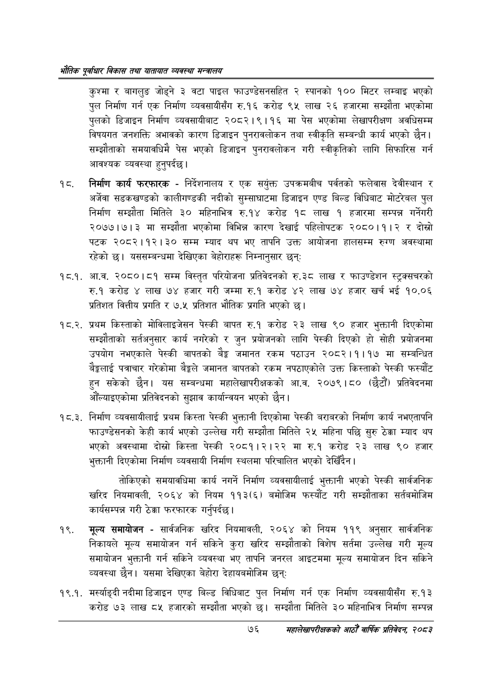

# Page 98 QA

## Rendered page


## Extracted text

```text
एवधार विकास तथा यातायात व्यवस्था
कुश्मा र बागलुङ जोड्ने ३ वटा पाइल फाउण्डेसनसहित २ स्पानको १०० मिटर लम्बाइ भएको पुल निर्माण गर्न एक निर्माण व्यवसायीसँग रु.१६ करोड ९५ लाख २६ हजारमा सम्झौता भएकोमा पुलको डिजाइन निर्माण व्यवसायीबाट २०८२।९।१६ मा पेस भएकोमा लेखापरीक्षण अवधिसम्म विषयगत जनशक्ति अभावको कारण डिजाइन पुनरावलोकन तथा स्वीकृति सम्बन्धी कार्य भएको छैन। सम्झौताको समयावधिमै पेस भएको डिजाइन पुनरावलोकन गरी स्वीकृतिको लागि सिफारिस गर्न आवश्यक व्यवस्था |
हुनुपर्दछ
निर्माण कार्य फरफारक -निर्देशनालय र एक संयुक्त उपक्रमबीच पर्वतको फलेवास देवीस्थान र अर्जेवा सडकखण्डको कालीगण्डकी नदीको सुम्साघाटमा डिजाइन एण्ड बिल्ड विधिबाट मोटरेबल पुल निर्माण सम्झौता मितिले ३० महिनाभित्र रु.१४ करोड १८ लाख १ हजारमा सम्पन्न गर्नेगरी २०७७।७। ३ मा सम्झौता भएकोमा विभिन्न कारण देखाई पहिलोपटक २०८०।१।२ र दोस्रो पटक २०८२।१२।३० सम्म म्याद थप भए तापनि उक्त आयोजना हालसम्म रुग्ण अवस्थामा रहेको | यससम्बन्धमा देखिएका बेहोराहरू निम्नानुसार छन्‌
१८.१. आ.व. २०८०।८१ सम्म विस्तृत परियोजना प्रतिवेदनको रु.३८ लाख र फाउण्डेशन स्ट्रक्सचरको रु.१ करोड ४ लाख ७४ हजार गरी जम्मा रु.१ करोड ४२ लाख ७४ हजार खर्च भई १०.०६ प्रतिशत वित्तीय प्रगति र ७.५ प्रतिशत भौतिक प्रगति भएको छ।
१८.२. प्रथम किस्ताको मोविलाइजेसन पेस्की बापत रु.१ करोड २३ लाख ९० हजार भुक्तानी दिएकोमा सम्झौताको सर्तअनुसार कार्य नगरेको र जुन प्रयोजनको लागि पेस्की दिएको हो सोही प्रयोजनमा उपयोग नभएकाले पेस्की बापतको बैङ्क जमानत रकम पठाउन २०८२।१।१७ मा सम्बन्धित बेङ्गलाई पत्राचार गरेकोमा बेङ्गले जमानत बापतको रकम नपठाएकोले उक्त किस्ताको पेस्की फस्यौट हुन सकेको छैन। यस सम्बन्धमा महालेखापरीक्षकको आ.व. २०७९।८० (छैटौं) प्रतिवेदनमा औंल्याइएकोमा प्रतिवेदनको सुझाव कार्यान्वयन भएको छैन |
१८.३. निर्माण व्यवसायीलाई प्रथम किस्ता पेस्की भुक्तानी दिएकोमा पेस्की बराबरको निर्माण कार्य नभएतापनि फाउण्डेसनको केही कार्य भएको उल्लेख गरी सम्झौता मितिले २५ महिना पछि सुरु ठेक्का म्याद थप भएको अवस्थामा दोस्रो किस्ता पेस्की २०८१।२।२२ मा रु.१ करोड २३ लाख ० हजार भुक्तानी दिएकोमा निर्माण व्यवसायी निर्माण स्थलमा परिचालित भएको देखिँदैन |
तोकिएको समयावधिमा कार्य नगर्ने निर्माण व्यवसायीलाई भुक्तानी भएको पेस्की सार्वजनिक खरिद नियमावली, २०६४ को नियम ११३(६) बमोजिम फस्यौट गरी सम्झौताका सर्तबमोजिम कार्यसम्पन्न गरी ठेक्का फरफारक गर्नुपर्दछ |
१९, मूल्य समायोजन -सार्वजनिक खरिद नियमावली, २०६४ को नियम ११९ अनुसार सार्वजनिक निकायले मूल्य समायोजन गर्न सकिने कुरा खरिद सम्झौताको विशेष सर्तमा उल्लेख गरी मूल्य समायोजन भुक्तानी गर्न सकिने व्यवस्था भए तापनि जनरल आइटममा मूल्य समायोजन दिन सकिने व्यवस्था छैन। यसमा देखिएका बेहोरा देहायबमोजिम छन्‌ः
१९.१. मर्स्याङ्दी नदीमा डिजाइन एण्ड बिल्ड विधिबाट पुल निर्माण गर्न एक निर्माण व्यवसायीसँग रु.१३ करोड ७३ लाख ८५ हजारको सम्झौता भएको छ। सम्झौता मितिले ३० महिनाभित्र निर्माण सम्पन्न
७६
महालेखापरीक्षकको आठौ वाषिकि प्रतिवेदन २०८२
```

## Flags
- None
