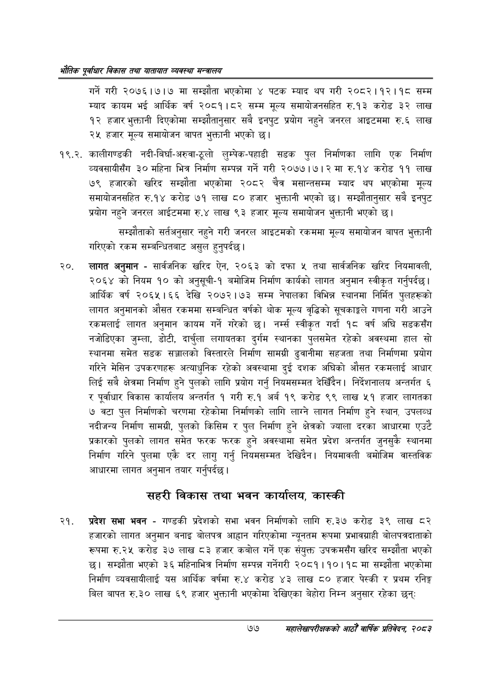

# Page 99 QA

## Rendered page


## Extracted text

```text
एवधार विकास तथा यातायात व्यवस्था
गर्ने गरी २०७६।७।७ मा सम्झौता भएकोमा ४ पटक म्याद थप गरी २०८२।१२।१८ सम्म म्याद कायम भई आर्थिक वर्ष २०८१।८२ सम्म मूल्य समायोजनसहित रु.१३ करोड ३२ लाख १२ हजार भुक्तानी दिएकोमा सम्झौतानुसार सबै इनपुट प्रयोग नहुने जनरल आइटममा रु.६ लाख २५ हजार मूल्य समायोजन बापत भुक्तानी भएको छ।
१९.२. कालीगण्डकी नदी-बिर्घा-अरुवा-ठूलो लुम्पेक-पहाडी सडक पुल निर्माणका लागि एक निर्माण व्यवसायीसँग ३० महिना भित्र निर्माण सम्पन्न गर्ने गरी २०७७।७। २ मा रु.१४ करोड ११ लाख ७९ हजारको खरिद सम्झौता भएकोमा २०८२ चैत्र मसान्तसम्म म्याद थप भएकोमा मूल्य समायोजनसहित रु.१४ करोड ७१ लाख ८० हजार भुक्तानी भएको छ। सम्झौतानुसार सबै इनपुट प्रयोग नहुने जनरल आईटममा रु.४ लाख ९३ हजार मूल्य समायोजन भुक्तानी भएको छ।
सम्झौताको सर्तअनुसार नहुने गरी जनरल आइटमको रकममा मूल्य समायोजन बापत भुक्तानी गरिएको रकम सम्बन्धितबाट असुल हुनुपर्दछ।
२०, लागत अनुमान -सार्वजनिक खरिद ऐन, २०६३ को दफा ५ तथा सार्वजनिक खरिद नियमावली, २०६४ को नियम १० को अनुसूची-१ बमोजिम निर्माण कार्यको लागत अनुमान स्वीकृत गर्नुपर्दछ। आर्थिक वर्ष २०६५।६६ देखि २०७२।७३ सम्म नेपालका विभिन्न स्थानमा निर्मित पुलहरूको लागत अनुमानको औसत रकममा सम्बन्धित वर्षको थोक मूल्य वृद्धिको सूचकाङ्गले गणना गरी आउने रकमलाई लागत अनुमान कायम गर्ने गरेको छ। नर्म्स स्वीकृत गर्दा १८ वर्ष अघि सडकसँग नजोडिएका जुम्ला, डोटी, दार्चुला लगायतका दुर्गम स्थानका पुलसमेत रहेको अवस्थमा हाल सो स्थानमा समेत सडक सञ्जालको विस्तारले निर्माण सामग्री ढुवानीमा सहजता तथा निर्माणमा प्रयोग गरिने मेसिन उपकरणहरू अत्याधुनिक रहेको अवस्थामा दुई दशक अघिको औसत रकमलाई आधार लिई सबै क्षेत्रमा निर्माण हुने पुलको लागि प्रयोग गर्नु नियमसम्मत देखिँदैन। निर्देशनालय अन्तर्गत ६ र पूर्वाधार विकास कार्यालय अन्तर्गत १ गरी रु.१ अर्ब १९ करोड ९९ लाख ५१ हजार लागतका ७ वटा पुल निर्माणको चरणमा रहेकोमा निर्माणको लागि लाग्ने लागत निर्माण हुने स्थान, उपलव्ध नदीजन्य निर्माण सामग्री, पुलको किसिम र पुल निर्माण हुने क्षेत्रको ज्याला दरका आधारमा एउटै प्रकारको पुलको लागत समेत फरक फरक हुने अवस्थामा समेत प्रदेश अन्तर्गत जुनसुकै स्थानमा निर्माण गरिने पुलमा एकै दर लागु गर्नु नियमसम्मत देखिदैन। नियमावली बमोजिम वास्तविक आधारमा लागत अनुमान तयार गर्नुपर्दछ |
सहरी विकास तथा भवन कार्यालय, कास्की
प्रदेश सभा भवन -गण्डकी प्रदेशको सभा भवन निर्माणको लागि रु.३७ करोड ३९ लाख ८२ हजारको लागत अनुमान बनाइ बोलपत्र आह्वान गरिएकोमा न्यूनतम रूपमा प्रभावग्राही बोलपत्रदाताको रूपमा रु.२५ करोड ३७ लाख ८३ हजार कबोल गर्ने एक संयुक्त उपक्रमसँग खरिद सम्झौता भएको छ। सम्झौता भएको ३६ महिनाभित्र निर्माण सम्पन्न गर्नेगरी २०८१।१०।१८ मा सम्झौता भएकोमा निर्माण व्यवसायीलाई यस आर्थिक वर्षमा रु.४ करोड ४३ लाख ८० हजार पेस्की र प्रथम रनिङ्ग बिल बापत रु.३० लाख ६९ हजार भुक्तानी भएकोमा देखिएका बेहोरा निम्न अनुसार रहेका छन्‌ः
७७
महालेखापरीक्षकको आठौ वाषिकि प्रतिवेदन २०८२
```

## Flags
- None
