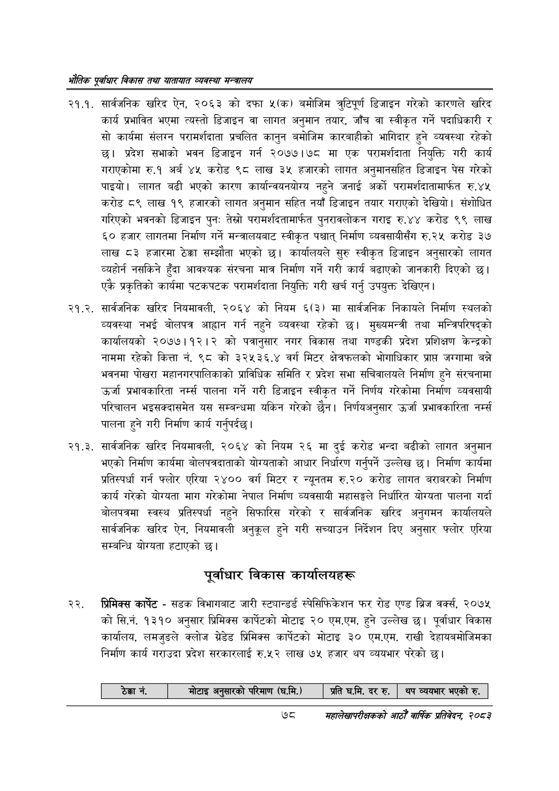

# Page 100 QA

## Rendered page


## Extracted text

```text
एवधार विकास तथा यातायात व्यवस्था
२१.१. सार्वजनिक खरिद ऐन, २०६३ को दफा ५(क) बमोजिम त्रुटिपूर्ण डिजाइन गरेको कारणले खरिद कार्य प्रभावित भएमा त्यस्तो डिजाइन वा लागत अनुमान तयार, जाँच वा स्वीकृत गर्ने पदाधिकारी र सो कार्यमा संलग्न परामर्शदाता प्रचलित कानुन बमोजिम कारबाहीको भागिदार हुने व्यवस्था रहेको छ। प्रदेश सभाको भवन डिजाइन गर्न २०७७।७८ मा एक परामर्शदाता नियुक्ति गरी कार्य गराएकोमा रु.१ अर्ब ४५ करोड ९८ लाख ३५ हजारको लागत अनुमानसहित डिजाइन पेस गरेको पाइयो। लागत बढी भएको कारण कार्यान्वयनयोग्य नहुने जनाई अर्को परामर्शदातामार्फत रु.४५ करोड ८९ लाख १९ हजारको लागत अनुमान सहित नयाँ डिजाइन तयार गराएको देखियो। संशोधित गरिएको भवनको डिजाइन पुनः तेस्रो परामर्शदतामार्फत पुनरावलोकन गराइ रु.४४ करोड ९९ लाख ६० हजार लागतमा निर्माण गर्ने मन्त्रालयबाट स्वीकृत पश्चात्‌ निर्माण व्यवसायीसँग रु.२५ करोड ३७ लाख ८३ हजारमा ठेक्का सम्झौता भएको छ। कार्यालयले सुरु स्वीकृत डिजाइन अनुसारको लागत व्यहोर्न नसकिने हुँदा आवश्यक संरचना मात्र निर्माण गर्ने गरी कार्य बढाएको जानकारी दिएको छ। एकै प्रकृतिको कार्यमा पटकपटक परामर्शदाता नियुक्ति गरी खर्च गर्नु उपयुक्त देखिएन |
. सार्वजनिक खरिद नियमावली, २०६४ को नियम ६(३) मा सार्वजनिक निकायले निर्माण स्थलको व्यवस्था नभई बोलपत्र आह्वान गर्न नहुने व्यवस्था रहेको छ। मुख्यमन्त्री तथा मन्त्रिपरिषद्को कार्यालयको २०७७।१२।२ को पत्रानुसार नगर विकास तथा गण्डकी प्रदेश प्रशिक्षण केन्द्रको नाममा रहेको कित्ता नं. ९८ को ३२५३६.४ वर्ग मिटर क्षेत्रफलको भोगाधिकार प्रापत जग्गामा बन्ने भवनमा पोखरा महानगरपालिकाको प्राविधिक समिति र प्रदेश सभा सचिवालयले निर्माण हुने संरचनामा उर्जा प्रभावकारिता पालना गर्ने गरी डिजाइन स्वीकृत गर्ने निर्णय गरेकोमा निर्माण व्यवसायी परिचालन भइसक्दासमेत यस सम्बन्धमा यकिन गरेको छैन। निर्णयअनुसार उर्जा प्रभावकारिता नर्म्स पालना हुने गरी निर्माण कार्य गर्नुपर्दछ |
. सार्वजनिक खरिद नियमावली, २०६४ को नियम २६ मा दुई करोड भन्दा बढीको लागत अनुमान भएको निर्माण कार्यमा बोलपत्रदाताको योग्यताको आधार निर्धारण गर्नुपर्ने उल्लेख छ। निर्माण कार्यमा प्रतिस्पर्धा गर्न फ्लोर एरिया २४०० वर्ग मिटर र न्यूनतम रु.२० करोड लागत बराबरको निर्माण कार्य गरेको योग्यता माग गरेकोमा नेपाल निर्माण व्यवसायी महासङ्घले निर्धारित योग्यता पालना गर्दा बोलपत्रमा स्वस्थ प्रतिस्पर्धा नहुने सिफारिस गरेको र सार्वजनिक खरिद अनुगमन कार्यालयले सार्वजनिक खरिद ऐन, नियमावली अनुकूल हुने गरी सच्याउन निर्देशन दिए अनुसार फ्लोर एरिया सम्बन्धि योग्यता हटाएको छ।
पूर्वाधार विकास कार्यालयहरू
प्रिमिक्स कार्पेट -सडक विभागबाट जारी स्ट्यान्डर्ड स्पेसिफिकेशन फर रोड एण्ड ब्रिज वर्क्स, २०७५ कोसि.नं. १३१० अनुसार प्रिमिक्स कार्पटको मोटाइ २० एम.एम. हुने उल्लेख | पूर्वाधार विकास कार्यालय, लमजुङले क्लोज ग्रेडेड प्रिमिक्स कार्पेटको मोटाइ ३० एम.एम. राखी देहायबमोजिमका निर्माण कार्य गराउदा प्रदेश सरकारलाई रु.५२ लाख ७५ हजार थप व्ययभार परेको छ।
७८
महालेखापरीक्षकको आठौ वाषिकि प्रतिवेदन २०८२

| ठेक्का न.   | मोटाइ अनुसारको परिमाण (घ.मि.)   | ] प्रति घ.मि. दर रु. &#124;   | थप व्ययभार भएको रु.   |
|-------------|---------------------------------|-------------------------------|-----------------------|
```

## Flags
- table_page
