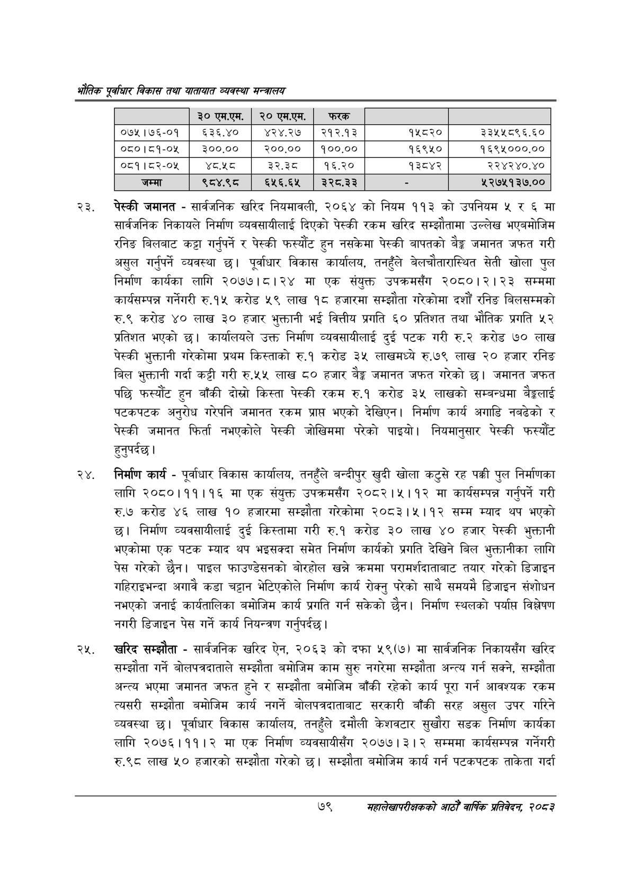

# Page 101 QA

## Rendered page


## Extracted text

```text
एवधार विकास तथा यातायात व्यवस्था
पेस्की जमानत -सार्वजनिक खरिद नियमावली, २०६४ को नियम ११३ को उपनियम ५ र ६ मा सार्वजनिक निकायले निर्माण व्यवसायीलाई दिएको पेस्की रकम खरिद सम्झौतामा उल्लेख भएबमोजिम रनिङ बिलबाट कट्टा गर्नुपर्ने र पेस्की फस्यौट हुन नसकेमा पेस्की बापतको बैङ्क जमानत जफत गरी असुल गर्नुपर्ने व्यवस्था छ। पूर्वाधार विकास कार्यालय, तनहुँले बेलचौतारास्थित सेती खोला पुल निर्माण कार्यका लागि २०७७।८।२४ मा एक संयुक्त उपक्रमसँग २०८०।२।२३ सम्ममा कार्यसम्पन्न गर्नेगरी रु.१५ करोड ५९ लाख १८ हजारमा सम्झौता गरेकोमा दशौं रनिङ बिलसम्मको रु.९ करोड ४० लाख ३० हजार भुक्तानी भई वित्तीय प्रगति ६० प्रतिशत तथा भौतिक प्रगति ५२ प्रतिशत भएको छ। कार्यालयले उक्त निर्माण व्यवसायीलाई दुई पटक गरी रु.२ करोड ७० लाख पेस्की भुक्तानी गरेकोमा प्रथम किस्ताको रु.१ करोड ३५ लाखमध्ये रु.७९ लाख २० हजार रनिङ बिल भुक्तानी गर्दा कट्टी गरी रु.५५ लाख ८० हजार बेङ्ग जमानत जफत गरेको | जमानत जफत पछि फस्यौट हुन बाँकी दोस्रो किस्ता पेस्की रकम रु.१ करोड ३५ लाखको सम्बन्धमा बेङ्कलाई पटकपटक अनुरोध गरेपनि जमानत रकम प्राप्त भएको देखिएन। निर्माण कार्य अगाडि नबढेको र पेस्की जमानत फिर्ता नभएकोले पेस्की जोखिममा परेको पाइयो। नियमानुसार पेस्की फस्यौट हुनुपर्दछ।
निर्माण कार्य -पूर्वाधार विकास कार्यालय, तनहुँले बन्दीपुर खुदी खोला कटुसे रह पक्की पुल निर्माणका लागि २०८०।११।१६ मा एक संयुक्त उपक्रमसँग २०८२।५।१२ मा कार्यसम्पन्न गर्नुपर्ने गरी रु.७ करोड ४६ लाख १० हजारमा सम्झौता गरेकोमा २०८३।५।१२ सम्म म्याद थप भएको छ। निर्माण व्यवसायीलाई दुई किस्तामा गरी रु.१ करोड ३० लाख ४० हजार पेस्की भुक्तानी भएकोमा एक पटक म्याद थप भइसक्दा समेत निर्माण कार्यको प्रगति देखिने बिल भुक्तानीका लागि पेस गरेको छैन। पाइल फाउण्डेसनको बोरहोल खन्ने क्रममा परामर्शदाताबाट तयार गरेको डिजाइन गहिराइभन्दा अगावै कडा चट्टान भेटिएकोले निर्माण कार्य रोक्नु परेको साथै समयमै डिजाइन संशोधन नभएको जनाई कार्यतालिका बमोजिम कार्य प्रगति गर्न सकेको छैन। निर्माण स्थलको पर्या विश्लेषण नगरी डिजाइन पेस गर्ने कार्य नियन्त्रण गर्नुपर्दछ |
खरिद सम्झौता -सार्वजनिक खरिद ऐन, २०६३ को दफा ५९(७) मा सार्वजनिक निकायसँग खरिद सम्झौता गर्ने बोलपत्रदाताले सम्झौता बमोजिम काम सुरु नगरेमा सम्झौता अन्त्य गर्न सक्ने, सम्झौता अन्त्य भएमा जमानत जफत हुने र सम्झौता बमोजिम बाँकी रहेको कार्य पूरा गर्न आवश्यक रकम त्यसरी सम्झौता बमोजिम कार्य नगर्ने बोलपत्रदाताबाट सरकारी बाँकी सरह असुल उपर गरिने व्यवस्था छ। पूर्वाधार विकास कार्यालय, तनहुँले दमौली केशवटार सुखौरा सडक निर्माण कार्यका लागि २०७६।११।२ मा एक निर्माण व्यवसायीसँग २०७७। ३। २ सम्ममा कार्यसम्पन्न गर्नेगरी रु.९८ लाख ५० हजारको सम्झौता गरेको छ। सम्झौता बमोजिम कार्य गर्न पटकपटक ताकेता गर्दा
७९
महालेखापरीक्षकको आठौ वाषिकि प्रतिवेदन २०८२

|  | ० एम.एम. | २० एम.एम. | फरक |  |  |
| --- | --- | --- | --- | --- | --- |
| ०७५।७६-०१ | ६३६.४० | ४२४.२७ | २१२.१३ | १५८२० | ३३५४५८९६.६० |
| ०८०।८१-०५ | ३००.०० | २००.०० | १००.०० | १६९५० | १६९५०००.०० |
| ०८१।८२-०४५ | अ्टश्ठ | ३२.३८ | १६.२० | १३८४२ | २२४२४०.४० |
| जम्मा | ९८४.९८ | ६५६.६५ | २२८.३३ |  | ५२७५१३७.०० |
```

## Flags
- table_page
- medium_quality_table
