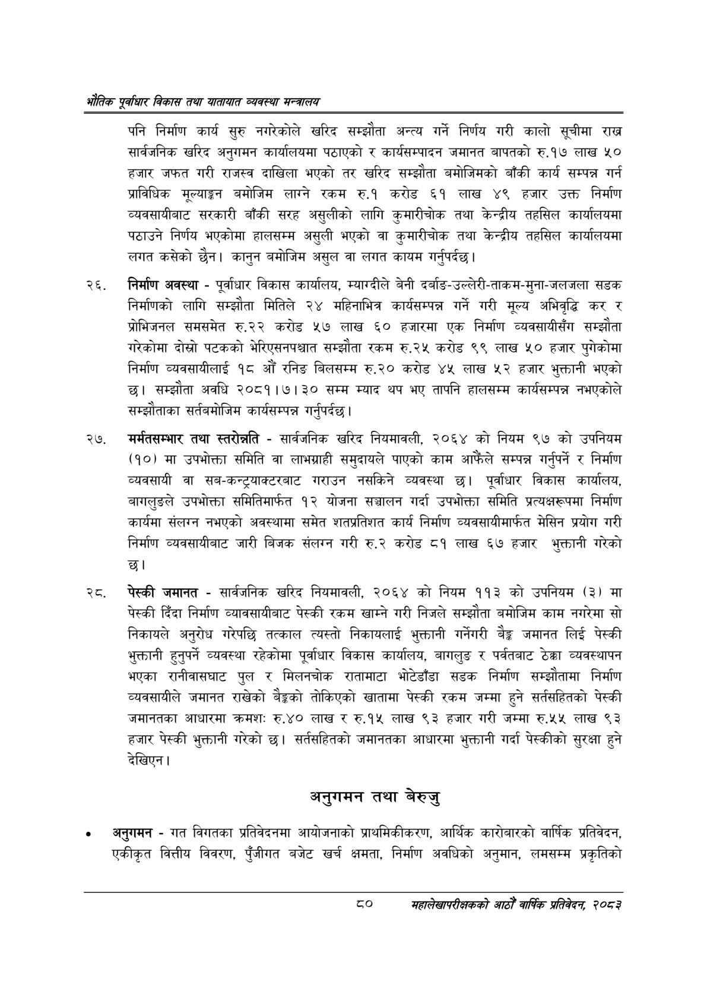

# Page 102 QA

## Rendered page


## Extracted text

```text
एवधार विकास तथा यातायात व्यवस्था
पनि निर्माण कार्य सुरु नगरेकोले खरिद सम्झौता अन्त्य गर्ने निर्णय गरी कालो सूचीमा राख सार्वजनिक खरिद अनुगमन कार्यालयमा पठाएको र कार्यसम्पादन जमानत बापतको रु.१७ लाख ५० हजार जफत गरी राजस्व दाखिला भएको तर खरिद सम्झौता बमोजिमको बाँकी कार्य सम्पन्न गर्न प्राविधिक मूल्याङ्गग बमोजिम लाग्ने रकम रु.१ करोड ६१ लाख ४९ हजार उक्त निर्माण व्यवसायीबाट सरकारी बाँकी सरह असुलीको लागि कुमारीचोक तथा केन्द्रीय तहसिल कार्यालयमा पठाउने निर्णय भएकोमा हालसम्म असुली भएको वा कुमारीचोक तथा केन्द्रीय तहसिल कार्यालयमा लगत कसेको छैन। कानुन बमोजिम असुल वा लगत कायम गर्नुपर्दछ।
निर्माण अवस्था -पूर्वाधार विकास कार्यालय, म्याग्दीले बेनी दर्बाङ-उल्लेरी-ताकम-मुना-जलजला सडक निर्माणको लागि सम्झौता मितिले २४ महिनाभित्र कार्यसम्पन्न गर्ने गरी मूल्य अभिवृद्धि कर र प्रोभिनल समसमेत रु.२२ करोड ५७ लाख ६० हजारमा एक निर्माण व्यवसायीसँग सम्झौता गरेकोमा दोस्रो पटकको भेरिएसनपश्चात सम्झौता रकम रु.२५ करोड ९९ लाख ५० हजार पुगेकोमा निर्माण व्यवसायीलाई १८ औं रनिङ बिलसम्म रु.२० करोड ४५ लाख ५२ हजार भुक्तानी भएको छ। सम्झौता अवधि २०८१।७।३० सम्म म्याद थप भए तापनि हालसम्म कार्यसम्पन्न नभएकोले सम्झौताका सर्तवमोजिम कार्यसम्पन्न गर्नुपर्दछ |
मर्मतसम्भार तथा स्तरोन्नति -सार्वजनिक खरिद नियमावली, २०६४ को नियम ९७ को उपनियम (१०) मा उपभोक्ता समिति वा लाभग्राही समुदायले पाएको काम आफैंले सम्पन्न गर्नुपर्ने र निर्माण व्यवसायी वा सब-कन्ट्रयाक्टरबाट गराउन नसकिने व्यवस्था पूर्वाधार विकास कार्यालय, बागलुङले उपभोक्ता समितिमार्फत १२ योजना सञ्चालन गर्दा उपभोक्ता समिति प्रत्यक्षरूपमा निर्माण कार्यमा संलगन नभएको अवस्थामा समेत शतप्रतिशत कार्य निर्माण व्यवसायीमार्फत मेसिन प्रयोग गरी निर्माण व्यवसायीबाट जारी बिजक संलग्न गरी रु.२ करोड ८१ लाख ६७ हजार भुक्तानी गरेको छ।
पेस्की जमानत -सार्वजनिक खरिद नियमावली, २०६४ को नियम ११३ को उपनियम (३) मा पेस्की दिँदा निर्माण व्यावसायीबाट पेस्की रकम खाम्ने गरी निजले सम्झौता बमोजिम काम नगरेमा सो निकायले अनुरोध गरेपछि तत्काल त्यस्तो निकायलाई भुक्तानी गर्नेगरी ९३ जमानत लिई पेस्की भुक्तानी हुनुपर्ने व्यवस्था रहेकोमा पूर्वाधार विकास कार्यालय, बागलुङ र पर्वतबाट ठेक्का व्यवस्थापन भएका रानीवासघाट पुल र मिलनचोक रातामाटा भोटेडाँडा सडक निर्माण सम्झौतामा निर्माण व्यवसायीले जमानत राखेको बैङ्कको तोकिएको खातामा पेस्की रकम जम्मा हुने सर्तसहितको पेस्की जमानतका आधारमा क्रमशः रु.४० लाख र रु.१५ लाख ९३ हजार गरी जम्मा रु.५५ लाख ९३ हजार पेस्की भुक्तानी गरेको छ। सर्तसहितको जमानतका आधारमा भुक्तानी गर्दा पेस्कीको सुरक्षा हुने देखिएन।
अनुगमन तथा बेरुजु
अनुगमन -गत विगतका प्रतिवेदनमा आयोजनाको प्राथमिकीकरण, आर्थिक कारोबारको वार्षिक प्रतिवेदन, एकीकृत वित्तीय विवरण, पुँजीगत बजेट खर्च क्षमता, निर्माण अवधिको अनुमान, लमसम्म प्रकृतिको
८०
महालेखापरीक्षकको आठौ वाषिकि प्रतिवेदन २०८२
```

## Flags
- None
