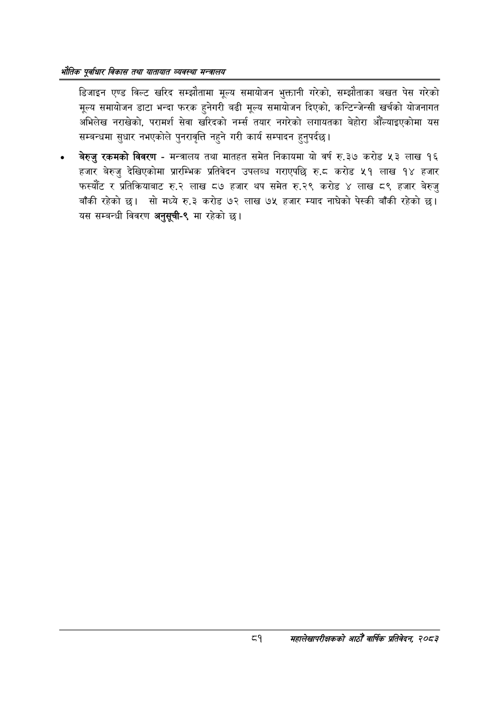

# Page 103 QA

## Rendered page


## Extracted text

```text
एवधार विकास तथा यातायात व्यवस्था
डिजाइन एण्ड विल्ट खरिद सम्झौतामा मूल्य समायोजन भुक्तानी गरेको, सम्झौताका बखत पेस गरेको मूल्य समायोजन डाटा भन्दा फरक हुनेगरी बढी मूल्य समायोजन दिएको, कन्टिन्जेन्सी खर्चको योजनागत अभिलेख नराखेको, परामर्श सेवा खरिदको नर्म्स तयार नगरेको लगायतका बेहोरा आँल्याइएकोमा यस सम्बन्धमा सुधार नभएकोले पुनरावृत्ति नहुने गरी कार्य सम्पादन हुनुपर्दछ |
बेरुजु रकमको विवरण -मन्त्रालय तथा मातहत समेत निकायमा यो वर्ष रु.३७ करोड ५३ लाख १६ हजार बेरुजु देखिएकोमा प्रारम्भिक प्रतिवेदन उपलब्ध गराएपछि €६ करोड ५१ लाख १४ हजार फस्यौंट र प्रतिक्रियाबाट रु.२ लाख ८७ हजार थप समेत रु.२९ करोड लाख ८९ हजार बेरुजु बाँकी रहेको छ। सो मध्ये रु.३ करोड ७२ लाख ७५ हजार म्याद नाघेको पेस्की बाँकी रहेको छ। यस सम्बन्धी विवरण अनुसूची-९ मा रहेको
८१ महालेखापरीक्षकको आठौ वाषिकि प्रतिवेदन २०८२
```

## Flags
- None
