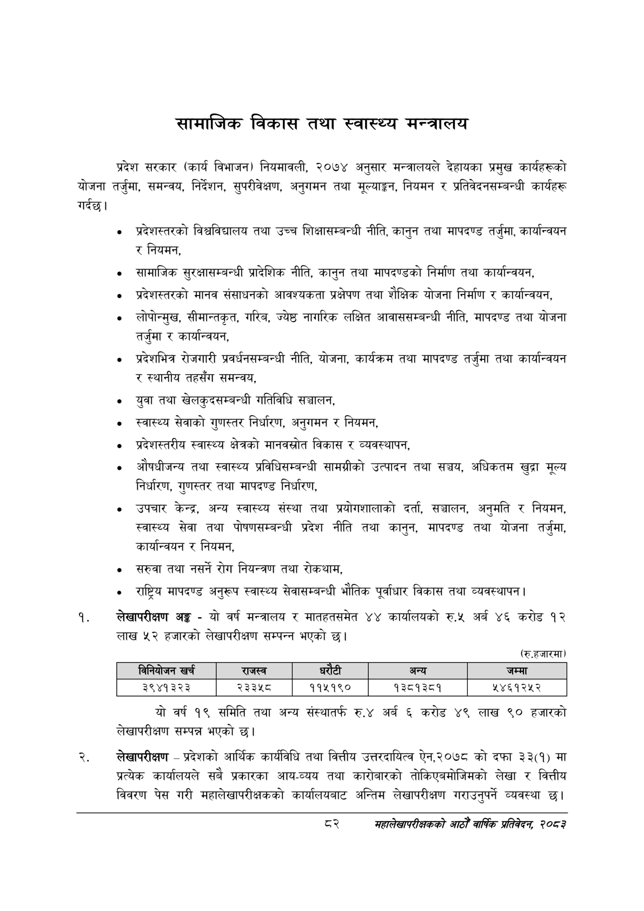

# Page 104 QA

## Rendered page


## Extracted text

```text
सामाजिक विकास तथा स्वास्थ्य मन्त्रालय
गर्दछ। प्रदेश सरकार (कार्य विभाजन) नियमावली, २०७४ अनुसार मन्त्रालयले देहायका प्रमुख कार्यहरूको योजना तर्जुमा, समन्वय, निर्देशन, सुपरीवेक्षण, अनुगमन तथा मूल्याङ्कन, नियमन र प्रतिवेदनसम्बन्धी कार्यहरू
प्रदेशस्तरको विश्वविद्यालय तथा उच्च शिक्षासम्बन्धी नीति, कानुन तथा मापदण्ड तर्जुमा, कार्यान्वयन र नियमन,
सामाजिक सुरक्षासम्बन्धी प्रादेशिक नीति, कानुन तथा मापदण्डको निर्माण तथा कार्यान्वयन,
प्रदेशस्तरको मानव संसाधनको आवश्यकता प्रक्षेपण तथा शैक्षिक योजना निर्माण र कार्यान्वयन,
लोपोन्मुख, सीमान्तकृत, गरिब, ज्येष्ठ नागरिक लक्षित आवाससम्बन्धी नीति, मापदण्ड तथा योजना तर्जुमा र कार्यान्वयन,
प्रदेशभित्र रोजगारी प्रवर्धनसम्बन्धी नीति, योजना, कार्यक्रम तथा मापदण्ड तर्जुमा तथा कार्यान्वयन र स्थानीय तहसँग समन्वय,
युवा तथा खेलकुदसम्बन्धी गतिविधि सञ्चालन,
स्वास्थ्य सेवाको गुणस्तर निर्धारण, अनुगमन र नियमन,
प्रदेशस्तरीय स्वास्थ्य क्षेत्रको मानवस्रोत विकास र व्यवस्थापन,
औषधीजन्य तथा स्वास्थ्य प्रविधिसम्बन्धी सामग्रीको उत्पादन तथा सञ्जय, अधिकतम खुद्रा मूल्य निर्धारण, गुणस्तर तथा मापदण्ड निर्धारण,
उपचार केन्द्र, अन्य स्वास्थ्य संस्था तथा प्रयोगशालाको दर्ता, सञ्चालन, अनुमति र नियमन, स्वास्थ्य सेवा तथा पोषणसम्बन्धी प्रदेश नीति तथा कानुन, मापदण्ड तथा योजना तर्जुमा, कार्यान्वयन र नियमन,
सरुवा तथा नसर्ने रोग नियन्त्रण तथा रोकथाम,
राष्ट्रिय मापदण्ड अनुरूप स्वास्थ्य सेवासम्बन्धी भौतिक पूर्वाधार विकास तथा व्यवस्थापन |
लेखापरीक्षण अङ्ग -यो वर्ष मन्त्रालय र मातहतसमेत ४४ कार्यालयको रु.५ अर्ब ४६ करोड १२ लाख ५२ हजारको लेखापरीक्षण सम्पन्न भएको छ।
(रु.हजारमा)
यो वर्ष १९ समिति तथा अन्य संस्थातर्फ रु.४ अर्ब ६ करोड ४९ लाख ९० हजारको लेखापरीक्षण सम्पन्न भएको छ।
लेखापरीक्षण -प्रदेशको आर्थिक कार्यविधि तथा वित्तीय उत्तरदायित्व ऐन,२०७८ को दफा ३३(१) मा प्रत्येक कार्यालयले सबै प्रकारका आय-व्यय तथा कारोबारको तोकिएबमोजिमको लेखा र वित्तीय विवरण पेस गरी महालेखापरीक्षकको कार्यालयबाट अन्तिम लेखापरीक्षण गराउनुपर्ने व्यवस्था छ।
दर
महालेखापरीक्षकको आठौ वाषिकि प्रतिवेदन २०८२

|  |  | 'ननबोजन खर्च | राजस्व | धरटी |  | अन्य | जम्मा |
| --- | --- | --- | --- | --- | --- | --- | --- |
|  |  | ३९४१३२३ | २३३५८ | ११५१९० |  | १३८१३८१ | ५४६१२५२ |
```

## Flags
- table_page
- medium_quality_table
