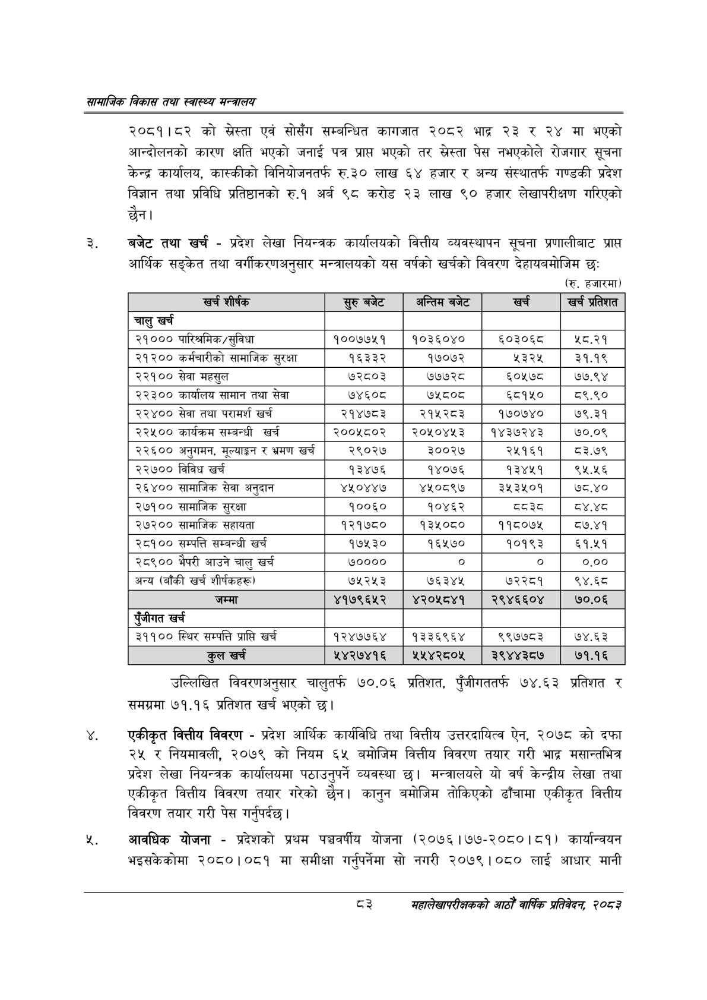

# Page 105 QA

## Rendered page


## Extracted text

```text
सायाजिक विकास तथा स्वास्थ्य मन्त्रालय
२०८१।८२ को स्रेस्ता एवं सोसँग सम्बन्धित कागजात २०८२ भाद्र २३ र २४ मा भएको आन्दोलनको कारण क्षति भएको जनाई पत्र प्रापत भएको तर स्रेस्ता पेस नभएकोले रोजगार सूचना केन्द्र कार्यालय, कास्कीको विनियोजनतर्फ रु.३० लाख ६४ हजार र अन्य संस्थातर्फ गण्डकी प्रदेश विज्ञान तथा प्रविधि प्रतिष्ठानको रु.१ अर्ब ९८ करोड २३ लाख ९० हजार लेखापरीक्षण गरिएको छैन।
बजेट तथा खर्च -प्रदेश लेखा नियन्त्रक कार्यालयको वित्तीय व्यवस्थापन सूचना प्रणालीबाट प्राप्त आर्थिक सङ्केत तथा वर्गीकरणअनुसार मन्त्रालयको यस वर्षको खर्चको विवरण देहायबमोजिम छः
(रु. हजारमा)
उल्लिखित विवरणअनुसार चालुतर्फ ७०.०६ प्रतिशत, पुँजीगततर्फ ७४.६३ प्रतिशत र समग्रमा ७१.१६ प्रतिशत खर्च भएको छ।
एकीकृत वित्तीय विवरण -प्रदेश आर्थिक कार्यविधि तथा वित्तीय उत्तरदायित्व ऐन, २०७८ को दफा २४ र नियमावली, २०७९ को नियम ६५ बमोजिम वित्तीय विवरण तयार गरी भाद्र मसान्तभित्र प्रदेश लेखा नियन्त्रक कार्यालयमा पठाउनुपर्ने व्यवस्था छ। मन्त्रालयले यो वर्ष केन्द्रीय लेखा तथा एकीकृत वित्तीय विवरण तयार गरेको छैन। कानुन बमोजिम तोकिएको ढाँचामा एकीकृत वित्तीय विवरण तयार गरी पेस गर्नुपर्दछ |
आवधिक योजना -प्रदेशको प्रथम पञ्चवर्षीय योजना (२०७६।७७-२०८०। ८१) कार्यान्वयन भइसकेकोमा २०८०।०८१ मा समीक्षा गर्नुपर्नेमा सो नगरी २०७९।०८० लाई आधार मानी
३
महालेखापरीक्षकको आठौ वाषिकि प्रतिवेदन २०८२

| खर्च शीर्षक | सुरु बबेट | अन्तिम बजेट | खर्च | खर्च प्रतिशत |
| --- | --- | --- | --- | --- |
| चालु खर्च |  |  |  |  |
| २१००० पारिश्रमिक /सुविधा | १००७७५१ | १०३६०४० | ६०३०६८ | ५८.२१ |
| २१२०० कर्मचारीको सामाजिक सुरक्षा | १६३३२ | १७०७२ | ५३२५ | ३१.१९ |
| २२१०० सेवा महसुल | ७२८०३ | ७७७२८ | ६०५७८ | ७७.९४ |
| २२३०० कार्यालष सामान तथा सेवा | ७४६०८ | ७५८०८ | ६८१५० | ८९.९० |
| २२४०० सेवा तथा परामर्श खर्च | २१४७८३ | २१५२८३ | १५०७४० | ७९.३१ |
| २२५०० कार्यक्रम सम्बन्धी खर्च | २००५८०२ | २०५०४४५३ | १४३७२४३ | ७०.०९ |
| २२६०० अनुभभन, मूल्याङ्कन र भ्रमण खर्च | २९०२४ | ३००२७ | २५१६१ | ८३.७९ |
| २२७०० विविध खर्च | १३४७६ | १४०७६ | १३४५१ | ९५.४५६ |
| २६४०० सामाजिक सेवा अनुदान | ४५०४४७ | ४५०८९७ | ३५३५०१ | ७८.४० |
| २७१०० सामाजिक सुरक्षा | १००६० | १०४६२ |  | द४.४८ |
| २७२०० सामाजिक सहायता | १२१७८० | १३५०८० | ११८०७५ | ८७.४१ |
| २८१०० सम्पत्ति सम्बन्धी खर्च | १७५३० | १६५७० | १०१९३ | ६१.५१ |
| २८९०० भैपरी आउने चालु खर्च | ७०००० | ० | ० | ०.०० |
| अन्य (बाँकी खर्च २)५:ह७) | ७५२५३ | ७६३४५ | ७२२८१ | ९४.६८ |
| जम्मा | ४१७९६२५२ | ४२०५८४१ | २९४६६०४ | ७०.०६ |
| पुँजीगत खर्च |  |  |  |  |
| ३११०० स्थिर सम्पत्ति प्राप्ति खर्च | १२४७७६४ | १३३६९६४ | ९९७७८३ | ७४.६३ |
| कुल खर्च | ५४२७४१६ | १५४२८०५ | ३९४४३८७ | ७१.१६ |
```

## Flags
- table_page
- medium_quality_table
