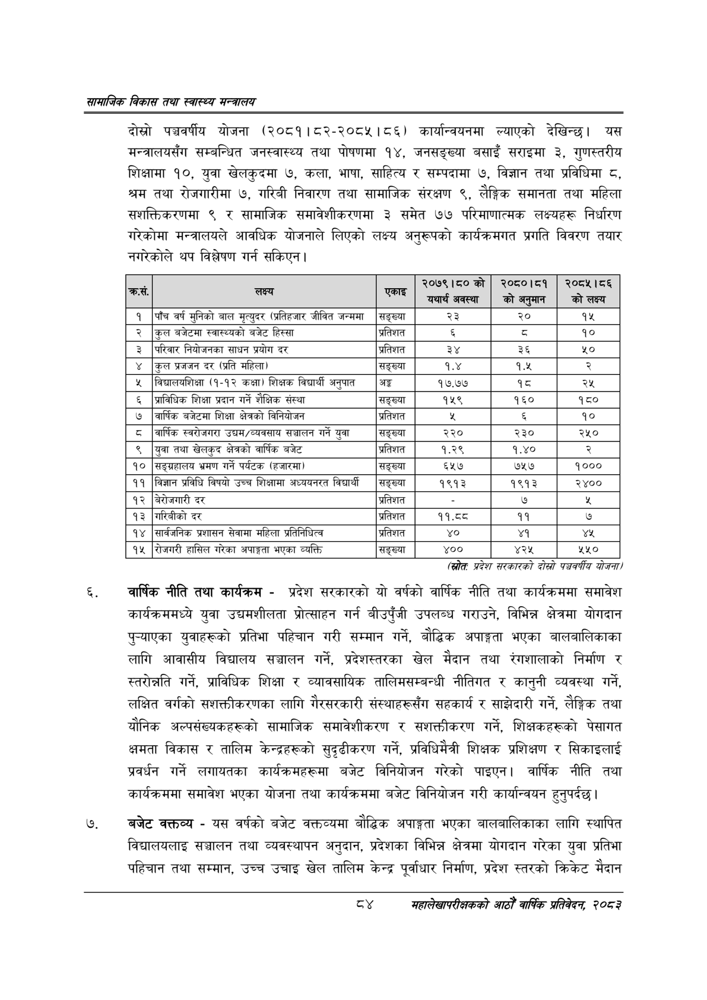

# Page 106 QA

## Rendered page


## Extracted text

```text
सायाजिक विकास तथा स्वास्थ्य मन्त्रालय
दोस्रो पञ्चवर्षीय योजना (२०८१। ८२-२०८५।८६) कार्यान्वयनमा ल्याएको देखिन्छ। यस मन्त्रालयसँग सम्बन्धित जनस्वास्थ्य तथा पोषणमा १४, जनसङ्ख्या बसाइँ सराइमा ३, गुणस्तरीय शिक्षामा १०, युवा खेलकुदमा ७, कला, भाषा, साहित्य र सम्पदामा ७, विज्ञान तथा प्रविधिमा ८, श्रम तथा रोजगारीमा ७, गरिबी निवारण तथा सामाजिक संरक्षण ९, लैङ्गिक समानता तथा महिला सशक्तिकरणमा ९ र सामाजिक समावेशीकरणमा ३ समेत ७७ परिमाणात्मक लक्ष्यहरू निर्धारण गरेकोमा मन्त्रालयले आवधिक योजनाले लिएको लक्ष्य अनुरूपको कार्यक्रमगत प्रगति विवरण तयार नगरेकोले थप विश्लेषण गर्न सकिएन |
(स्रोतः प्रदेश सरकारको दोस्रो पञ्चवर्षीय योजना
वार्षिक नीति तथा कार्यक्रम -प्रदेश सरकारको यो वर्षको वार्षिक नीति तथा कार्यक्रममा समावेश कार्यक्रममध्ये युवा उद्यमशीलता प्रोत्साहन गर्न बीउपुँजी उपलब्ध गराउने, विभिन्न क्षेत्रमा योगदान पुन्याएका युवाहरूको प्रतिभा पहिचान गरी सम्मान गर्ने, बौद्धिक अपाङ्गता भएका बालबालिकाका लागि आवासीय विद्यालय सञ्चालन गर्ने, प्रदेशस्तरका खेल मैदान तथा रंगशालाको निर्माण र स्तरोन्नति गर्ने, प्राविधिक शिक्षा र व्यावसायिक तालिमसम्बन्धी नीतिगत र कानुनी व्यवस्था गर्ने, लक्षित वर्गको सशक्तीकरणका लागि गैरसरकारी संस्थाहरूसँग सहकार्य र साझेदारी गर्ने, लैङ्गिक तथा यौनिक अल्पसंख्यकहरूको सामाजिक समावेशीकरण र सशक्तीकरण गर्ने, शिक्षकहरूको पेसागत क्षमता विकास र तालिम केन्द्रहरूको सुदृढीकरण गर्ने, प्रविधिमैत्री शिक्षक प्रशिक्षण र सिकाइलाई प्रवर्धन गर्ने लगायतका कार्यक्रमहरूमा बजेट विनियोजन गरेको पाइएन। वार्षिक नीति तथा कार्यक्रममा समावेश भएका योजना तथा कार्यक्रममा बजेट विनियोजन गरी कार्यान्वयन हुनुपर्दछ |
बजेट कक्तव्य -यस वर्षको बजेट वक्तव्यमा बौद्धिक अपाङ्गता भएका बालबालिकाका लागि स्थापित विद्यालयलाइ सञ्चालन तथा व्यवस्थापन अनुदान, प्रदेशका विभिन्न क्षेत्रमा योगदान गरेका युवा प्रतिभा पहिचान तथा सम्मान, उच्च उचाइ खेल तालिम केन्द्र पूर्वाधार निर्माण, प्रदेश स्तरको क्रिकेट मैदान
महालेखापरीक्षकको आठौ वाषिकि प्रतिवेदन २०८२

|  | लक्ष्य |  | ०% १५० # यथार्थ अवस्था | २०८०।८१ कोअनुमान | २०८५।८६ को लक्ष्य |
| --- | --- | --- | --- | --- | --- |
| १ | पाँच वर्ष मुनिको बाल मृत्युदर (५६१९ जीवित जन्ममा | सङ्ख्या | २३ | २० | १५ |
| २ | कुल बजेटमा ९्वास्थ्थको बजेट हिस्सा | प्रतिशत |  |  | १० |
| ३ | परिवार निवाणनका साधन प्रयोग दर | प्रतिशत | ३४ | ३६ | ५० |
| ४ | कुल प्रजजन दर (प्रति महिला) | सङ्ख्या | १.४ | १.५ | २ |
| ५ | बिचालबरशिकषा (१-१२ कक्षा) शिक्षक विद्यार्थी अनुपात | अङ्ग | १७.७७ | १८ | २५ |
| ६ | प्राविधिक शिक्षा प्रदान गर्ने शैक्षिक संस्था | सङ्ख्या | १५९ | १६० | १८० |
| ७ | वार्षिक बजेटमा शिक्षा क्षेत्रको विनिवोजन | प्रतिशत | भर |  | १० |
| ८ | बार्षिक ९५०७१९। उच्चयम/व्यवसाय सञ्चालन गर्ने युवा | सङ्ख्या | २२० | २३० | २५० |
| ९ | युवा तथा खेलकुद क्षेत्रको वार्षिक बजेट | प्रतिशत | १.२९ | १.४० |  |
| १० | सङ्भ्रहालष भ्रमण गर्ने पर्यटक (हजारमा) | सङ्ख्या | ६५७ | ७५७ | १००० |
| ११ | विज्ञान प्रविधि विषयो उच्च शिक्षामा अध्ययनरत विद्यार्थी | सङ्ख्या | १९१३ | १९१३ | २४०० |
| १२ | बेरोजगारी दर | प्रतिशत |  | ७ |  |
| १३ | गरिबीको दर | प्रतिशत | ११.व८ | ११ | ७ |
| १४ | सार्वजनिक प्रशासन सेवामा महिला भ्रतिनिषित्व | प्रतिशत | ४० | ४१ | ४ |
| १५ | रोजगरी हासिल गरेका अपाङ्गता भएका व्यक्ति | सङ्ख्या | ४०० | ४२५ | २५० |
```

## Flags
- table_page
- medium_quality_table
