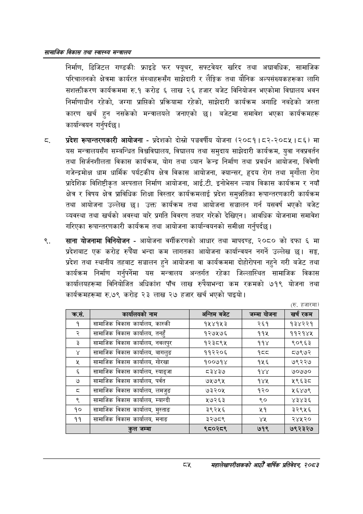

# Page 107 QA

## Rendered page


## Extracted text

```text
सायाजिक विकास तथा स्वास्थ्य मन्त्रालय
निर्माण, डिजिटल गण्डकी: फ्राइडे फर फ्यूचर, सफ्टवेयर खरिद तथा अद्यावधिक, सामाजिक परिचालनको क्षेत्रमा कार्यरत संस्थाहरूसँग साझेदारी र लैङ्गिक तथा यौनिक अल्पसंख्यकहरूका लागि सशक्तीकरण कार्यक्रममा रु.१ करोड ६ लाख २६ हजार बजेट विनियोजन भएकोमा विद्यालय भवन निर्माणाधीन रहेको, जग्गा प्राप्तिको प्रक्रियामा रहेको, साझेदारी कार्यक्रम अगाडि नबढेको जस्ता कारण खर्च हुन नसकेको मन्त्रालयले जनाएको छ। बजेटमा समावेश भएका कार्यक्रमहरू कार्यान्वयन गर्नुपर्दछ |
प्रदेश रूपान्तरणकारी आयोजना -प्रदेशको दोस्रो पञ्चवर्षीय योजना (२०८१।८२-२०८५।८६) मा यस मन्त्रालयसँग सम्बन्धित विश्वविद्यालय, विद्यालय तथा समुदाय साझेदारी कार्यक्रम, युवा नवप्रवर्तन तथा सिर्जनशीलता विकास कार्यक्रम, योग तथा ध्यान केन्द्र निर्माण तथा प्रवर्धन आयोजना, त्रिवेणी गरजेन्द्रमोक्ष धाम धार्मिक पर्यटकीय क्षेत्र विकास आयोजना, क्यान्सर, हृदय रोग तथा मृगौला रोग प्रादेशिक विशिष्टीकृत अस्पताल निर्माण आयोजना, आई.टी. इनोभेसन ल्याब विकास कार्यक्रम र नयाँ क्षेत्र र विषय क्षेत्र प्राविधिक शिक्षा विस्तार कार्यक्रमलाई प्रदेश समुन्नतिका रूपान्तरणकारी कार्यक्रम तथा आयोजना उल्लेख छ। उक्त कार्यक्रम तथा आयोजना सञ्चालन गर्न यसवर्ष भएको बजेट व्यवस्था तथा खर्चको अवस्था बारे प्रगति विवरण तयार गरेको देखिएन। आवधिक योजनामा समावेश गरिएका रूपान्तरणकारी कार्यक्रम तथा आयोजना कार्यान्वयनको समीक्षा गर्नुपर्दछ |
साना योजनामा विनियोजन -आयोजना वर्गीकरणको आधार तथा मापदण्ड, २०८० को दफा ६ मा प्रदेशबाट एक करोड रुपैया भन्दा कम लागतका आयोजना कार्यान्वयन नगर्ने उल्लेख छ। सङ्घ, प्रदेश तथा स्थानीय तहबाट सञ्चालन हुने आयोजना वा कार्यक्रममा दीहोरीपना नहुने गरी बजेट तथा कार्यक्रम निर्माण गर्नुपर्नेमा यस मन्त्रालय अन्तर्गत रहेका जिल्लास्थित सामाजिक विकास कार्यालयहरूमा विनियोजित अधिकांश पाँच लाख रुपैयाभन्दा कम रकमको ७१९ योजना तथा कार्यक्रमहरूमा रु.७९ करोड २३ लाख २७ हजार खर्च भएको पाइयो।
(रू. हजारमा
दश
महालेखापरीक्षकको आठौ वाषिकि प्रतिवेदन २०८२

| क्रस. | कार्षासवको नाम | अन्तिम बजेट | जम्मा योजना | खर्च रकम |
| --- | --- | --- | --- | --- |
| १ | सामाजिक विकास कार्यालय, कास्की | १५४१५३ | २६१ | १३४२२१ |
| २ | तामाजिक विकास कार्यालथ, तनहुँ | १२७५७६ | ११५ | ११२१४५ |
| ३ | लसामाजिक विकास कार्यालय, नवलपुर | १२३८९५ | ११४ | ९०९६३ |
| ४ | सामाजिक विकास कार्यालय, बागलुङ | ११२२०६ | १८ | ८७९७२ |
| ५ | लामाजिक विकास कार्यालय, गोरखा | १००७१४ | १५६ | ३० |
| ६ | तामाजिक विकास कार्यालय, स्याङ्जा | ८३४३७ | १४४ | ७०७७० |
| ७ | सामाजिक विकास कार्षालय, पर्वत | ७५७९५ | १४४५ | ५९६३८ |
| ८ | तामाजिक विकास कार्यालष, लमजुङ | ७३२०५ | १२० | ५६४७९ |
| ९ | विकास कार्यालय, म्याग्दी | ५७२६३ | ९० | ४३४३६ |
| १० | सामाजिक विकास कार्यालय, मुस्ताङ | ३९२५६ | २९ | ३२९५६ |
| ११ | सामाजिक विकास कार्यालय, मनाङ | ३२७८९ | यश | २४४५२० |
| १२ | कुल जम्मा | ९८०२८९ | ७१९ | ७९२३२७ |
```

## Flags
- table_page
- medium_quality_table
