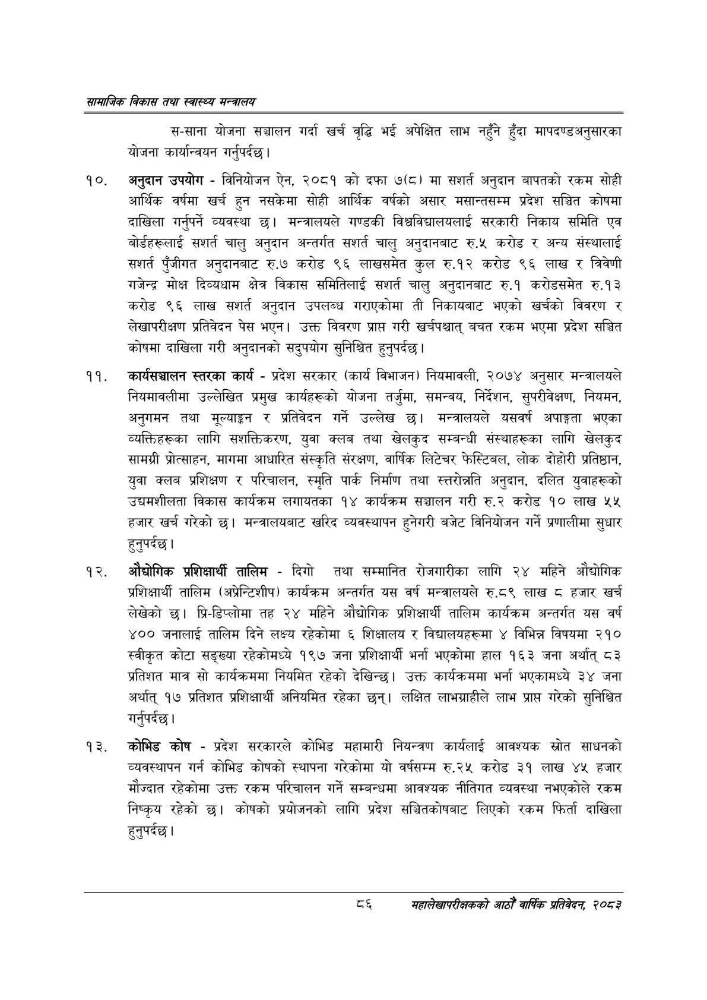

# Page 108 QA

## Rendered page


## Extracted text

```text
सायाजिक विकास तथा स्वास्थ्य मन्त्रालय
स-साना योजना सञ्चालन गर्दा खर्च वृद्धि भई अपेक्षित लाभ नहुँने हुँदा मापदण्डअनुसारका योजना कार्यान्वयन गर्नुपर्दछ |
अनुदान उपयोग -विनियोजन ऐन, २०८१ को दफा ७(८) मा सशर्त अनुदान बापतको रकम सोही आर्थिक वर्षमा खर्च हुन नसकेमा सोही आर्थिक वर्षको असार मसान्तसम्म प्रदेश सञ्चित कोषमा दाखिला गर्नुपर्ने व्यवस्था छ। मन्त्रालयले गण्डकी विश्वविद्यालयलाई सरकारी निकाय समिति एव बोर्डहरूलाई चालु अनुदान अन्तर्गत सशर्त चालु अनुदानबाट रु.५ करोड र अन्य संस्थालाई सशर्त पुँजीगत अनुदानबाट रु.७ करोड ९६ लाखसमेत कुल रु.१२ करोड ९६ लाख र त्रिवेणी गजेन्द्र मोक्ष दिव्यधाम क्षेत्र विकास समितिलाई सशर्त चालु अनुदानबाट रु.१ करोडसमेत रु.१३ करोड ९६ लाख सशर्त अनुदान उपलब्ध गराएकोमा ती निकायबाट भएको खर्चको विवरण र लेखापरीक्षण प्रतिवेदन पेस भएन। उक्त विवरण प्राप्त गरी खर्चपश्चात्‌ बचत रकम भएमा प्रदेश सञ्चित कोषमा दाखिला गरी अनुदानको सदुपयोग सुनिश्चित हुनुपर्दछ |
कार्यसञ्चालन स्तरका कार्य -प्रदेश सरकार (कार्य विभाजन) नियमावली, २०७४ अनुसार मन्त्रालयले नियमावलीमा उल्लेखित प्रमुख कार्यहरूको योजना तर्जुमा, समन्वय, निर्देशन, सुपरीवेक्षण, नियमन, अनुगमन तथा मूल्याङ्गन र प्रतिवेदन गर्ने उल्लेख छ। मन्त्रालयले यसवर्ष अपाङ्गता भएका व्यक्तिहरूका लागि सशक्तिकरण, युवा क्लब तथा खेलकुद सम्बन्धी संस्थाहरूका लागि खेलकुद सामग्री प्रोत्साहन, मागमा आधारित संस्कृति संरक्षण, वार्षिक लिटेचर फेस्टिबल, लोक दोहोरी प्रतिष्ठान, युवा क्लब प्रशिक्षण र परिचालन, स्मृति पार्क निर्माण तथा स्तरोन्नति अनुदान, दलित युवाहरूको उद्यमशीलता विकास कार्यक्रम लगायतका १४ कार्यक्रम सञ्चालन गरी रु.२ करोड ९० लाख ४५ हजार खर्च गरेको | मन्त्रालयबाट खरिद व्यवस्थापन हुनेगरी बजेट विनियोजन गर्ने प्रणालीमा सुधार हुनुपर्दछ |
औद्योगिक प्रशिक्षार्थी तालिम -दिगो तथा सम्मानित रोजगारीका लागि २४ महिने औद्योगिक प्रशिक्षार्थी तालिम (अप्रेन्टिशीप) कार्यक्रम अन्तर्गत यस वर्ष मन्त्रालयले €.६% लाख ८ हजार खर्च लेखेको छ। प्रि-डिप्लोमा तह २४ महिने औद्योगिक प्रशिक्षार्थी तालिम कार्यक्रम अन्तर्गत यस वर्ष ४०० जनालाई तालिम दिने लक्ष्य रहेकोमा ६ शिक्षालय र विद्यालयहरूमा ४ विभिन्न विषयमा २१० स्वीकृत कोटा सङ्ख्या रहेकोमध्ये १९७ जना प्रशिक्षार्थी भर्ना भएकोमा हाल १६३ जना अर्थात्‌ ८३ प्रतिशत मात्र सो कार्यक्रममा नियमित रहेको देखिन्छ। उक्त कार्यक्रममा भर्ना भएकामध्ये ३४ जना अर्थात्‌ १७ प्रतिशत प्रशिक्षार्थी अनियमित रहेका छन्‌। लक्षित लाभग्राहीले लाभ प्राप्त गरेको सुनिश्चित गर्नुपर्दछ |
कोभिड कोष -प्रदेश सरकारले कोभिड महामारी नियन्त्रण कार्यलाई आवश्यक स्रोत साधनको व्यवस्थापन गर्न कोभिड कोषको स्थापना गरेकोमा यो वर्षसम्म रु.२५ करोड ३१ लाख ४५ हजार मौज्दात रहेकोमा उक्त रकम परिचालन गर्ने सम्बन्धमा आवश्यक नीतिगत व्यवस्था नभएकोले रकम निष्कृय रहेको | कोषको प्रयोजनको लागि प्रदेश सञ्चितकोषबाट लिएको रकम फिर्ता दाखिला हुनुपर्दछ |
४३
महालेखापरीक्षकको आठौ वाषिकि प्रतिवेदन २०८२
```

## Flags
- None
