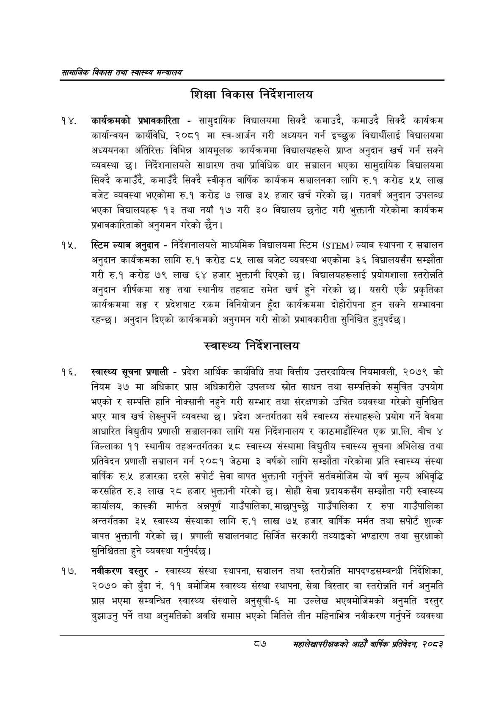

# Page 109 QA

## Rendered page


## Extracted text

```text
सायाजिक विकास तथा स्वास्थ्य मन्त्रालय
शिक्षा विकास निर्देशनालय
कार्यक्रमको प्रभावकारिता -सामुदायिक विद्यालयमा सिक्दै कमाउदै, कमाउदै सिक्दै कार्यक्रम कार्यान्वयन कार्यविधि, २०८१ मा स्व-आर्जन गरी अध्ययन गर्न इच्छुक विद्यार्थीलाई विद्यालयमा अध्ययनका अतिरिक्त विभिन्न आयमूलक कार्यक्रममा विद्यालयहरूले प्राप्त अनुदान खर्च गर्न सक्ने व्यवस्था छ। निर्देशनालयले साधारण तथा प्राविधिक धार सञ्चालन भएका सामुदायिक विद्यालयमा सिक्दै कमाउँदै, कमाउँदै सिक्दै स्वीकृत वार्षिक कार्यक्रम सञ्चालनका लागि रु.१ करोड ५५ लाख बजेट व्यवस्था भएकोमा रु.१ करोड ७ लाख ३५ हजार खर्च गरेको छ। गतवर्ष अनुदान उपलब्ध भएका विद्यालयहरू १३ तथा नयाँ १७ गरी ३० विद्यालय छनोट गरी भुक्तानी गरेकोमा कार्यक्रम प्रभावकारिताको अनुगमन गरेको छैन |
स्टिम ल्याब अनुदान -निर्देशनालयले माध्यमिक विद्यालयमा स्टिम () ल्याब स्थापना र सञ्चालन अनुदान कार्यक्रमका लागि रु.१ करोड ८५ लाख बजेट व्यवस्था भएकोमा ३६ विद्यालयसँग सम्झौता गरी रु.१ करोड ७९ लाख ६४ हजार भुक्तानी दिएको छ। विद्यालयहरूलाई प्रयोगशाला स्तरोन्नति अनुदान शीर्षकमा सङ्ग तथा स्थानीय तहबाट समेत खर्च हुने गरेको छ। यसरी एकै प्रकृतिका कार्यक्रममा सङ्घ र प्रदेशबाट रकम विनियोजन हुँदा कार्यक्रममा दोहोरोपना हुन सक्ने सम्भावना रहन्छ। अनुदान दिएको कार्यक्रमको अनुगमन गरी सोको प्रभावकारीता सुनिश्चित हुनुपर्दछ |
स्वास्थ्य निर्देशनालय
स्वास्थ्य सूचना प्रणाली -प्रदेश आर्थिक कार्यविधि तथा वित्तीय उत्तरदायित्व नियमावली, २०७९ को नियम ३७ मा अधिकार प्राप्त अधिकारीले उपलब्ध स्रोत साधन तथा सम्पत्तिको समुचित उपयोग भएको र सम्पत्ति हानि नोक्सानी नहुने गरी सम्भार तथा संरक्षणको उचित व्यवस्था गरेको सुनिश्चित भएर मात्र खर्च लेख्नुपर्ने व्यवस्था | प्रदेश अन्तर्गतका सबै स्वास्थ्य संस्थाहरूले प्रयोग गर्ने वेबमा आधारित विद्युतीय प्रणाली सञ्चालनका लागि यस निर्देशनालय र काठमाडौंस्थित एक प्रा.लि. बीच ४ जिल्लाका ११ स्थानीय तहअन्तर्गतका ५८ स्वास्थ्य संस्थामा विद्युतीय स्वास्थ्य सूचना अभिलेख तथा प्रतिवेदन प्रणाली सञ्चालन गर्न २०८१ जेठमा ३ वर्षको लागि सम्झौता गरेकोमा प्रति स्वास्थ्य संस्था वार्षिक रु.५ हजारका दरले सपोर्ट सेवा बापत भुक्तानी गर्नुपर्ने सर्तवमोजिम यो वर्ष मूल्य अभिवृद्धि करसहित रु.३ लाख २८ हजार भुक्तानी गरेको छ। सोही सेवा प्रदायकसँग सम्झौता गरी स्वास्थ्य कार्यालय, कास्की मार्फत अन्नपूर्ण गाउँपालिका, माछापुच्छु गाउँपालिका र रुपा गाउँपालिका अन्तर्गतका ३५ स्वास्थ्य संस्थाका लागि रु.१ लाख ७५ हजार वार्षिक मर्मत तथा सपोर्ट शुल्क बापत भुक्तानी गरेको छ। प्रणाली सञ्चालनबाट सिर्जित सरकारी तथ्याङ्कको भण्डारण तथा सुरक्षाको सुनिश्चितता हुने व्यवस्था गर्नुपर्दछ |
नवीकरण दस्तुर -स्वास्थ्य संस्था स्थापना, सञ्चालन तथा स्तरोन्नति मापदण्डसम्बन्धी निर्देशिका, २०७० को बुँदा नं. ११ बमोजिम स्वास्थ्य संस्था स्थापना, सेवा विस्तार वा स्तरोन्नति गर्न अनुमति भएमा सम्बन्धित स्वास्थ्य संस्थाले अनुसूची-६ मा उल्लेख भएबमोजिमको अनुमति दस्तुर बुझाउनु पर्ने तथा अनुमतिको अवधि समाप्त भएको मितिले तीन महिनाभित्र नवीकरण गर्नुपर्ने व्यवस्था
८७
महालेखापरीक्षकको आठौ वाषिकि प्रतिवेदन २०८२
```

## Flags
- None
