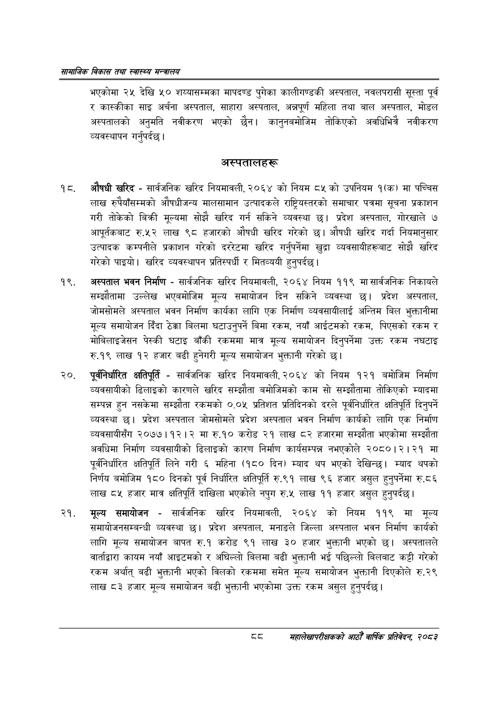

# Page 110 QA

## Rendered page


## Extracted text

```text
सायाजिक विकास तथा स्वास्थ्य मन्त्रालय
भएकोमा २५ देखि ५० शय्यासम्मका मापदण्ड पुगेका कालीगण्डकी अस्पताल, नवलपरासी सूस्ता पूर्व र कास्कीका साइ अर्चना अस्पताल, साहारा अस्पताल, अन्नपूर्ण महिला तथा बाल अस्पताल, मोडल अस्पतालको अनुमति नवीकरण भएको छैन। कानुनबमोजिम तोकिएको अवधिभित्रै नवीकरण व्यवस्थापन गर्नुपर्दछ |
अस्पतालहरू
औषधी खरिद -सार्वजनिक खरिद नियमावली, २०६४ को नियम ८५ को उपनियम १(क) मा पच्चिस लाख रुपैयाँसम्मको औषधीजन्य मालसामान उत्पादकले राष्ट्रियस्तरको समाचार पत्रमा सूचना प्रकाशन गरी तोकेको बिक्री मूल्यमा सोझै खरिद गर्न सकिने व्यवस्था छ। प्रदेश अस्पताल, गोरखाले ७ आपूर्तकबाट रु.५२ लाख ९८ हजारको औषधी खरिद गरेको छ। औषधी खरिद गर्दा नियमानुसार उत्पादक कम्पनीले प्रकाशन गरेको दररेटमा खरिद गर्नुपर्नेमा खुद्रा व्यवसायीहरूबाट सोझै खरिद गरेको पाइयो। खरिद व्यवस्थापन प्रतिस्पर्धी र मितव्ययी हुनुपर्दछ |
अस्पताल भवन निर्माण -सार्वजनिक खरिद नियमावली, २०६४ नियम ११९ मासार्वजनिक निकायले सम्झौतामा उल्लेख भएबमोजिम मूल्य समायोजन दिन सकिने व्यवस्था छ। प्रदेश अस्पताल, जोमसोमले अस्पताल भवन निर्माण कार्यका लागि एक निर्माण व्यवसायीलाई अन्तिम बिल भुक्तानीमा मूल्य समायोजन दिँदा ठेक्का बिलमा घटाउनुपर्ने बिमा रकम, नयाँ आईटमको रकम, पिएसको रकम र मोबिलाइजेसन पेस्की घटाइ बाँकी रकममा मात्र मूल्य समायोजन दिनुपर्नेमा उक्त रकम नघटाइ रु.१९ लाख १२ हजार बढी हुनेगरी मूल्य समायोजन भुक्तानी गरेको छ।
पूर्वनिर्धारित क्षतिपूर्ति -सार्वजनिक खरिद नियमावली, २०६४ को नियम १२१ बमोजिम निर्माण व्यवसायीको ढिलाइको कारणले खरिद सम्झौता बमोजिमको काम सो सम्झौतामा तोकिएको म्यादमा सम्पन्न हुन नसकेमा सम्झौता रकमको ०.०५ प्रतिशत प्रतिदिनको दरले पूर्वनिर्धारित क्षतिपूर्ति दिनुपर्ने व्यवस्था छ। प्रदेश अस्पताल जोमसोमले प्रदेश अस्पताल भवन निर्माण कार्यको लागि एक निर्माण व्यवसायीसँग २०७७।१२।२ मा रु.१० करोड २१ लाख ८२ हजारमा सम्झौता भएकोमा सम्झौता अवधिमा निर्माण व्यवसायीको ढिलाइको कारण निर्माण कार्यसम्पन्न नभएकोले २०८०।२।२१ मा पूर्वनिर्धारित क्षतिपूर्ति लिने गरी ६ महिना (१८० दिन) म्याद थप भएको देखिन्छ। म्याद थपको निर्णय बमोजिम १८० दिनको पूर्व निर्धारित क्षतिपूर्ति रु.९१ लाख ९६ हजार असुल हुनुपर्नेमा रु.८६ लाख ८५ हजार मात्र क्षतिपूर्ति दाखिला भएकोले नपुग रु.५ लाख ११ हजार असुल हुनुपर्दछ |
मूल्य समायोजन -सार्वजनिक खरिद नियमावली, २०६४ को नियम ११९ मा मूल्य समायोजनसम्बन्धी व्यवस्था छ। प्रदेश अस्पताल, मनाङले जिल्ला अस्पताल भवन निर्माण कार्यको लागि मूल्य समायोजन बापत रु.१ करोड ९१ लाख ३० हजार भुक्तानी भएको छ। अस्पतालले वार्ताद्वारा कायम नयाँ आइटमको र अघिल्लो बिलमा बढी भुक्तानी भई पछिल्लो बिलबाट कट्टी गरेको रकम अर्थात्‌ बढी भुक्तानी भएको विलको रकममा समेत मूल्य समायोजन भुक्तानी दिएकोले रु.२९ लाख ८३ हजार मूल्य समायोजन बढी भुक्तानी भएकोमा उक्त रकम असुल हुनुपर्दछ |
द्द
महालेखापरीक्षकको आठौ वाषिकि प्रतिवेदन २०८२
```

## Flags
- None
