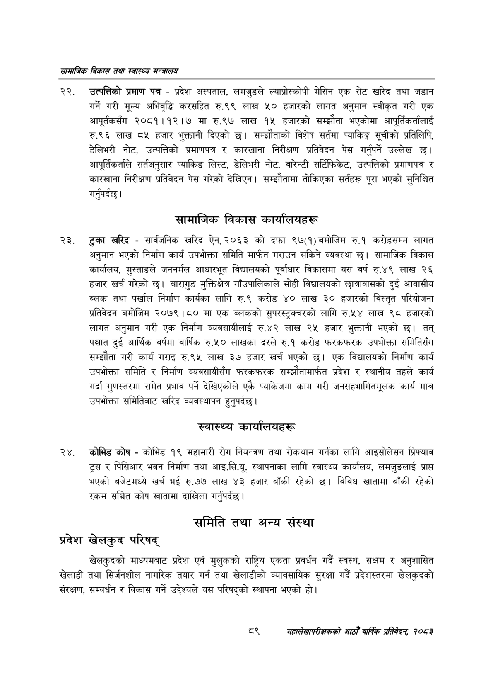

# Page 111 QA

## Rendered page


## Extracted text

```text
सायाजिक विकास तथा स्वास्थ्य मन्त्रालय
उत्पत्तिको प्रमाण पत्र -प्रदेश अस्पताल, लमजुङले ल्याप्रोस्कोपी मेसिन एक सेट खरिद तथा जडान गर्ने गरी मूल्य अभिवृद्धि करसहित रु.९९ लाख ५० हजारको लागत अनुमान स्वीकृत गरी एक आपूर्तकसँग २०८१।१२।७ मा रु.९७ लाख १५ हजारको सम्झौता भएकोमा आपूर्तिकर्तालाई रु.९६ लाख ८५ हजार भुक्तानी दिएको छ। सम्झौताको विशेष सर्तमा प्याकिङ्ग सूचीको प्रतिलिपि, डेलिभरी नोट, उत्पत्तिको प्रमाणपत्र र कारखाना निरीक्षण प्रतिवेदन पेस गर्नुपर्ने उल्लेख छ। आपूर्तिकर्ताले सर्तअनुसार प्याकिङ लिस्ट, डेलिभरी नोट, वारेन्टी सर्टिफिकेट, उत्पत्तिको प्रमाणपत्र र कारखाना निरीक्षण प्रतिवेदन पेस गरेको देखिएन। सम्झौतामा तोकिएका सर्तहरू पूरा भएको सुनिश्चित गर्नुपर्दछ |
सामाजिक विकास कार्यालयहरू
टुक्रा खरिद -सार्वजनिक खरिद ऐन, २०६३ को दफा ९७(१) बमोजिम रु.१ करोडसम्म लागत अनुमान भएको निर्माण कार्य उपभोक्ता समिति मार्फत गराउन सकिने व्यवस्था छ। सामाजिक विकास कार्यालय, मुस्ताङले जननर्मल आधारभूत विद्यालयको पूर्वाधार विकासमा यस वर्ष रु.४९ लाख २६ हजार खर्च गरेको छ। बारागुङ मुक्तिक्षेत्र गाँउपालिकाले सोही विद्यालयको छात्रावासको दुई आवासीय ब्लक तथा पर्खाल निर्माण कार्यका लागि रु.९ करोड ४० लाख ३० हजारको विस्तृत परियोजना प्रतिवेदन बमोजिम २०७९।८० मा एक ब्लकको सुपरस्ट्रक्वरको लागि रु.५४ लाख ९८ हजारको लागत अनुमान गरी एक निर्माण व्यवसायीलाई रु.४२ लाख २५ हजार भुक्तानी भएको छ। तत्‌ पश्चात दुई आर्थिक वर्षमा वार्षिक रु.५० लाखका दरले रु.१ करोड फरकफरक उपभोक्ता समितिसँग सम्झौता गरी कार्य गराइ रु.९५ लाख ३७ हजार खर्च भएको | एक विद्यालयको निर्माण कार्य उपभोक्ता समिति र निर्माण व्यवसायीसँग फरकफरक सम्झौतामार्फत प्रदेश र स्थानीय तहले कार्य गर्दा गुणस्तरमा समेत प्रभाव पर्ने देखिएकोले एकै प्याकेजमा काम गरी जनसहभागितमूलक कार्य मात्र उपभोक्ता समितिबाट खरिद व्यवस्थापन हुनुपर्दछ |
स्वास्थ्य कार्यालयहरू
कोभिड कोष -कोभिड १९ महामारी रोग नियन्त्रण तथा रोकथाम गर्नका लागि आइसोलेसन प्रिफ्याव ट्रस र पिसिआर भवन निर्माण तथा आइ.सि.यू. स्थापनाका लागि स्वास्थ्य कार्यालय, लमजुङलाई प्राप्त भएको बजेटमध्ये खर्च भई रु.७७ लाख ४३ हजार बाँकी रहेको छ। विविध खातामा बाँकी रहेको रकम सञ्चित कोष खातामा दाखिला गर्नुपर्दछ |
समिति तथा अन्य संस्था
प्रदेश खेलकुद परिषद्‌
खेलकुदको माध्यमबाट प्रदेश एवं मुलुकको राष्ट्रिय एकता प्रवर्धन गर्दै स्वस्थ, सक्षम र अनुशासित खेलाडी तथा सिर्जनशील नागरिक तयार गर्न तथा खेलाडीको व्यावसायिक सुरक्षा गर्दै प्रदेशस्तरमा खेलकुदको संरक्षण, सम्वर्धन र विकास गर्ने उद्देश्यले यस परिषद्को स्थापना भएको हो।
३
महालेखापरीक्षकको आठौ वाषिकि प्रतिवेदन २०८२
```

## Flags
- None
