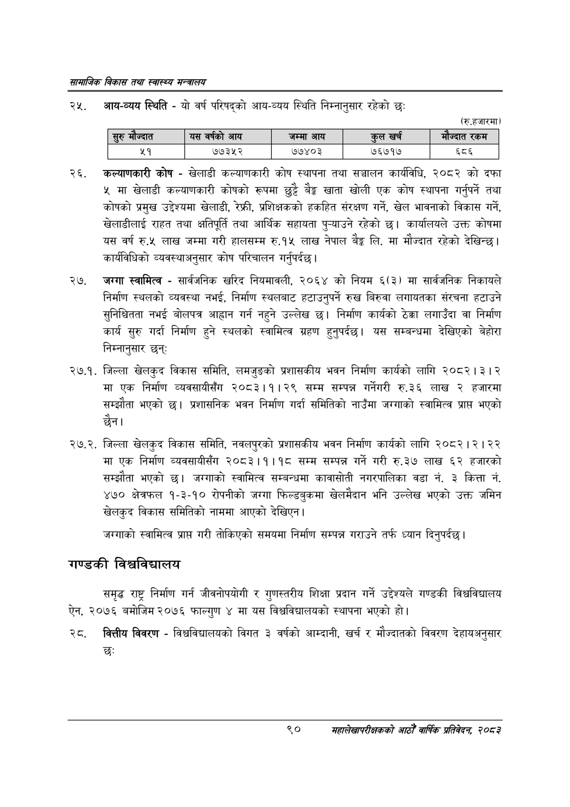

# Page 112 QA

## Rendered page


## Extracted text

```text
सायाजिक विकास तथा स्वास्थ्य मन्त्रालय
आयनव्यय स्थिति -यो वर्ष परिषद्को आय-व्यय स्थिति निम्नानुसार रहेको छः
(रु.हजारमा)
कल्याणकारी कोष -खेलाडी कल्याणकारी कोष स्थापना तथा सञ्चालन कार्यविधि, २०८२ को दफा ५ मा खेलाडी कल्याणकारी कोषको रूपमा छुट्टै बैङ्क खाता खोली एक कोष स्थापना गर्नुपर्ने तथा कोषको प्रमुख उद्देश्यमा खेलाडी, रेफ्री, प्रशिक्षकको हकहित संरक्षण गर्ने, खेल भावनाको विकास गर्ने, खेलाडीलाई राहत तथा क्षतिपूर्ति तथा आर्थिक सहायता पुन्याउने रहेको छ। कार्यालयले उक्त कोषमा यस वर्ष रु.५ लाख जम्मा गरी हालसम्म रु.१५ लाख नेपाल बेङ्ग लि. मा मौज्दात रहेको देखिन्छ। कार्यविधिको व्यवस्थाअनुसार कोष परिचालन गर्नुपर्दछ |
जग्गा स्वामित्व -सार्वजनिक खरिद नियमावली, २०६४ को नियम ६(३) मा सार्वजनिक निकायले निर्माण स्थलको व्यवस्था नभई, निर्माण स्थलबाट हटाउनुपर्ने रुख बिरुवा लगायतका संरचना हटाउने सुनिश्चितता नभई बोलपत्र आह्वान गर्न नहुने उल्लेख छ। निर्माण कार्यको ठेक्का लगाउँदा वा निर्माण कार्य सुरु गर्दा निर्माण हुने स्थलको स्वामित्व ग्रहण हुनुपर्दछ। यस सम्बन्धमा देखिएको बेहोरा निम्नानुसार छन्‌ः
२७.१. जिल्ला खेलकुद विकास समिति, लमजुङको प्रशासकीय भवन निर्माण कार्यको लागि २०८२।३।२ मा एक निर्माण व्यवसायीसँग २०८३।१।२९ सम्म सम्पन्न गर्नेगरी रु.३६ लाख २ हजारमा सम्झौता भएको | प्रशासनिक भवन निर्माण गर्दा समितिको नाउँमा जग्गाको स्वामित्व प्रापत भएको छैन।
२७.२. जिल्ला खेलकुद विकास समिति, नवलपुरको प्रशासकीय भवन निर्माण कार्यको लागि २०८२।२। २२ मा एक निर्माण व्यवसायीसँग २०८३।१।१८ सम्म सम्पन्न गर्ने गरी रु.३७ लाख ६२ हजारको सम्झौता भएको छ। जग्गाको स्वामित्व सम्बन्धमा कावासोती नगरपालिका वडा नं. ३ कित्ता नं. ४७० क्षेत्रफल १-३-१० रोपनीको जग्गा फिल्डबुकमा खेलमैदान भनि उल्लेख भएको उक्त जमिन खेलकुद विकास समितिको नाममा आएको देखिएन |
जग्गाको स्वामित्व प्राप्त गरी तोकिएको समयमा निर्माण सम्पन्न गराउने तर्फ ध्यान दिनुपर्दछ |
गण्डकी विश्वविद्यालय
समृद्ध राष्ट्र निर्माण गर्न जीवनोपयोगी र गुणस्तरीय शिक्षा प्रदान गर्ने उद्देश्यले गण्डकी विश्वविद्यालय ऐन, २०७६ बमोजिम २०७६ फाल्गुण ४ मा यस विश्वविद्यालयको स्थापना भएको हो।
वित्तीय विवरण -विश्वविद्यालयको विगत ३ वर्षको आम्दानी, खर्च र मौज्दातको विवरण देहायअनुसार छः
९०
महालेखापरीक्षकको आठौ वाषिकि प्रतिवेदन २०८२

|  | ङ्रुभणज्यात |  | यस वर्षको आय | जम्मा आय |  | हल खर्च | ने | ज्पात रकम |
| --- | --- | --- | --- | --- | --- | --- | --- | --- |
```

## Flags
- table_page
- medium_quality_table
