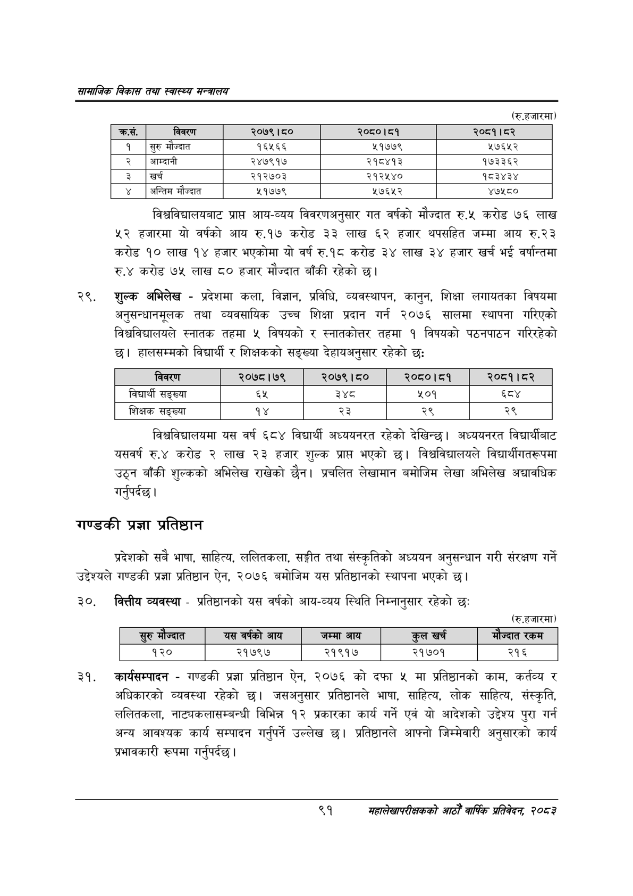

# Page 113 QA

## Rendered page


## Extracted text

```text
सायाजिक विकास तथा स्वास्थ्य मन्त्रालय
(रु.हजारमा)
विश्वविद्यालयबाट प्राप्त आय-व्यय विवरणअनुसार गत वर्षको मौज्दात रु.५ करोड ७६ लाख हजारमा यो वर्षको आय रु.१७ करोड ३३ लाख ६२ हजार थपसहित जम्मा आय रु.२३ करोड १० लाख १४ हजार भएकोमा यो वर्ष रु.१८ करोड ३४ लाख ३४ हजार खर्च भई वर्षान्तमा रु.४ करोड ७५ लाख ८० हजार मौज्दात बाँकी रहेको छ।
शुल्क अभिलेख -प्रदेशमा कला, विज्ञान, प्रविधि, व्यवस्थापन, कानुन, शिक्षा लगायतका विषयमा अनुसन्धानमूलक तथा व्यवसायिक उच्च शिक्षा प्रदान गर्न २०७६ सालमा स्थापना गरिएको विश्वविद्यालयले स्नातक तहमा ५ विषयको र स्नातकोत्तर तहमा १ विषयको पठनपाठन गरिरहेको छ। हालसम्मको विद्यार्थी र शिक्षकको सङ्ख्या देहायअनुसार रहेको छः
विश्वविद्यालयमा यस वर्ष ६८४ विद्यार्थी अध्ययनरत रहेको देखिन्छ। अध्ययनरत विद्यार्थीबाट यसवर्ष रु.४ करोड २ लाख ३ हजार शुल्क प्राप्त भएको छ। विश्वविद्यालयले विद्यार्थीगतरूपमा उठ्न बाँकी शुल्कको अभिलेख राखेको छैन। प्रचलित लेखामान बमोजिम लेखा अभिलेख अद्यावधिक गर्नुपर्दछ |
गण्डकी प्रज्ञा प्रतिष्ठान
प्रदेशको सबै भाषा, साहित्य, ललितकला, सङ्गीत तथा संस्कृतिको अध्ययन अनुसन्धान गरी संरक्षण गर्ने उद्देश्यले गण्डकी प्रज्ञा प्रतिष्ठान ऐन, २०७६ बमोजिम यस प्रतिष्ठानको स्थापना भएको छ।
क्त्तीय व्यवस्था -प्रतिष्ठानको यस वर्षको आय-व्यय स्थिति निम्नानुसार रहेको छः
(रु.हजारमा)
कार्यसम्पादन -गण्डकी प्रज्ञा प्रतिष्ठान ऐन, २०७६ को दफा ५ मा प्रतिष्ठानको काम, कर्तव्य र अधिकारको व्यवस्था रहेको | जसअनुसार प्रतिष्ठानले भाषा, साहित्य, लोक साहित्य, संस्कृति, ललितकला, नाट्यकलासम्बन्धी विभिन्न १२ प्रकारका कार्य गर्ने एवं यो आदेशको उद्देश्य पुरा गर्न अन्य आवश्यक कार्य सम्पादन गर्नुपर्ने उल्लेख छ। प्रतिष्ठानले आफ्नो जिम्मेवारी अनुसारको कार्य प्रभावकारी रूपमा गर्नुपर्दछ |
९१
महालेखापरीक्षकको आठौ वाषिकि प्रतिवेदन २०८२

| क्रस. | विवरण | २०७९।८० | २०८०।८१ | २०८१।८२ |
| --- | --- | --- | --- | --- |
| १ | सुरु मौज्दात | १६५६६ | ११७७९ | ५७६५२ |
| २ | अआम्दानी | २४७९१७ | २१८४१३ | १७३३६२ |
| ३ | खर्च | २१२७०३ | २१२५४० | १८३४३४ |
| ४ | अन्तिम मौज्दात | ११७७९ | ५७६५२ | ४७५८० |

| विवरण | २०७८।७९ | २०७९।८० | २०८०।८१ | २०८१।८२ |
| --- | --- | --- | --- | --- |
| विद्यार्थी सङ्ख्या |  | ३४८ | ५०१ | हद |
| शिक्षक सङ्ख्या | १४ | २३ | २९ | २९ |

|   सुरु मौज्दात |   यस वर्षको आय | जम्मा आय   |   कुल खर्च |   मौज्दात रकम |
|----------------|----------------|------------|------------|---------------|
|            १२० |          २१७९७ | _२१९१७     |      २१७०१ |           २१६ |
```

## Flags
- table_page
- medium_quality_table
