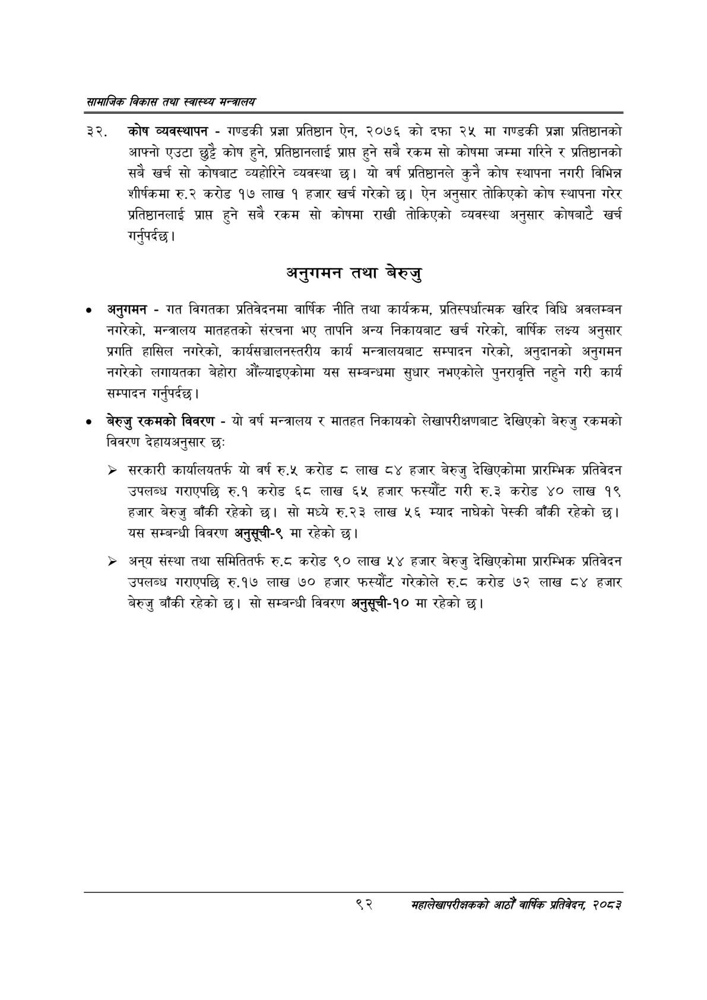

# Page 114 QA

## Rendered page


## Extracted text

```text
सायाजिक विकास तथा स्वास्थ्य मन्त्रालय
कोष व्यवस्थापन -गण्डकी प्रज्ञा प्रतिष्ठान ऐन, २०७६ को दफा २४ मा गण्डकी प्रज्ञा प्रतिष्ठानको आफ्नो एउटा छुट्टै कोष हुने, प्रतिष्ठानलाई प्राप्त हुने सबै रकम सो कोषमा जम्मा गरिने र प्रतिष्ठानको सबै खर्च सो कोषबाट व्यहोरिने व्यवस्था छ। यो वर्ष प्रतिष्ठानले कुनै कोष स्थापना नगरी विभिन्न शीर्षकमा रु.२ करोड १७ लाख १ हजार खर्च गरेको | ऐन अनुसार तोकिएको कोष स्थापना गरेर प्रतिष्ठानलाई प्राप्त हुने सबै रकम सो कोषमा राखी तोकिएको व्यवस्था अनुसार कोषबाटे खर्च गर्नुपर्दछ |
अनुगमन तथा बेरुजु
अनुगमन -गत विगतका प्रतिवेदनमा वार्षिक नीति तथा कार्यक्रम, प्रतिस्पर्धात्मक खरिद विधि अवलम्बन नगरेको, मन्त्रालय मातहतको संरचना भए तापनि अन्य निकायबाट खर्च गरेको, वार्षिक लक्ष्य अनुसार प्रगति हासिल नगरेको, कार्यसञ्चालनस्तरीय कार्य मन्त्रालयबाट सम्पादन गरेको, अनुदानको अनुगमन नगरेको लगायतका बेहोरा औँल्याइएकोमा यस सम्बन्धमा सुधार नभएकोले पुनरावृत्ति नहुने गरी कार्य सम्पादन गर्नुपर्दछ |
«० बेरुजु रकमको विवरण -यो वर्ष मन्त्रालय र मातहत निकायको लेखापरीक्षणबाट देखिएको बेरुजु रकमको विवरण देहायअनुसार छः
> सरकारी कार्यालयतर्फ यो वर्ष रु.५ करोड ८ लाख ८४ हजार बेरुजु देखिएकोमा प्रारम्भिक प्रतिवेदन उपलब्ध गराएपछि €. करोड ६८ लाख ६५ हजार फस्यौट गरी रु.३ करोड ४० लाख १९ हजार बेरुजु बाँकी रहेको छ। सो मध्ये रु.२३ लाख ५६ म्याद नाघेको पेस्की बाँकी रहेको छ। यस सम्बन्धी विवरण अनुसूची-९ मा रहेको |
> संस्था तथा समितितर्फ रु.ट करोड ९० लाख ५४ हजार बेरुजु देखिएकोमा प्रारम्भिक प्रतिवेदन उपलब्ध गराएपछि रु.१७ लाख ७० हजार फस्यौट गरेकोले रु.ट करोड ७२ लाख ८४ हजार बेरुजु बाँकी रहेको छ। सो सम्बन्धी विवरण अनुसूची-१० मा रहेको छ।
९२
महालेखापरीक्षकको आठौ वाषिकि प्रतिवेदन २०८२
```

## Flags
- None
