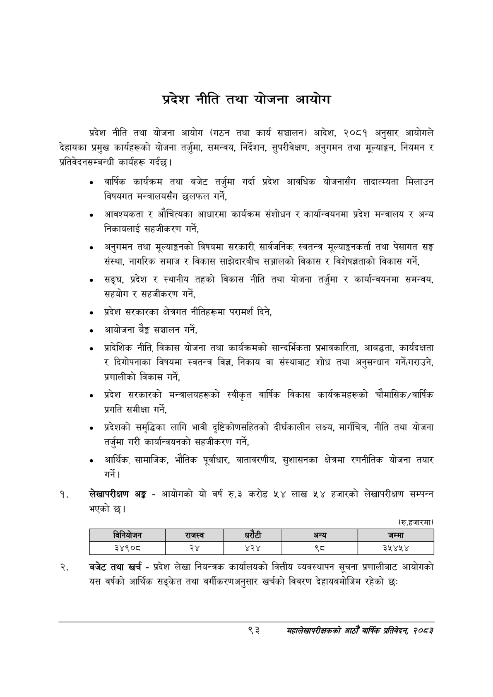

# Page 115 QA

## Rendered page


## Extracted text

```text
प्रदेश नीति तथा योजना आयोग
प्रदेश नीति तथा योजना आयोग (गठन तथा कार्य सञ्चालन) आदेश, २०८१ अनुसार आयोगले देहायका प्रमुख कार्यहरूको योजना तर्जुमा, समन्वय, निर्देशन, सुपरीवेक्षण, अनुगमन तथा मूल्याङ्कन, नियमन र प्रतिवेदनसम्बन्धी कार्यहरू गर्दछ।
वार्षिक कार्यक्रम तथा बजेट तर्जुमा गर्दा प्रदेश आवधिक योजनासँग तादात्म्यता मिलाउन विषयगत मन्त्रालयसँग छलफल गर्ने,
आवश्यकता र औचित्यका आधारमा कार्यक्रम संशोधन र कार्यान्वयनमा प्रदेश मन्त्रालय र अन्य निकायलाई सहजीकरण गर्ने,
अनुगमन तथा मूल्याङ्कनको विषयमा सरकारी, सार्वजनिक, स्वतन्त्र मूल्याङ्गनकर्ता तथा पेसागत सङ्ग संस्था, नागरिक समाज र विकास साझेदारबीच सञ्जालको विकास र विशेषज्ञताको विकास गर्ने,
सङ्घ, प्रदेश र स्थानीय तहको विकास नीति तथा योजना तर्जुमा र कार्यान्वयनमा समन्वय, सहयोग र सहजीकरण गर्ने,
प्रदेश सरकारका क्षेत्रगत नीतिहरूमा परामर्श दिने,
आयोजना बैङ्क सञ्चालन गर्ने,
प्रादेशिक नीति, विकास योजना तथा कार्यक्रमको सान्दर्भिकता प्रभावकारिता, आबद्धता, कार्यदक्षता र दिगोपनाका विषयमा स्वतन्त्र विज्ञ, निकाय वा संस्थाबाट शोध तथा अनुसन्धान गर्ने(गराउने, प्रणालीको विकास गर्ने,
प्रदेश सरकारको मन्त्रालयहरूको स्वीकृत वार्षिक विकास कार्यक्रमहरूको चौमासिक/वार्षिक प्रगति समीक्षा गर्ने,
प्रदेशको समृद्धिका लागि भावी दृष्टिकोणसहितको दीर्घकालीन लक्ष्य, मार्गचित्र, नीति तथा योजना तर्जुमा गरी कार्यान्वयनको सहजीकरण गर्ने,
आर्थिक, सामाजिक, भौतिक पूर्वाधार, वातावरणीय, सुशासनका क्षेत्रमा रणनीतिक योजना तयार
लेखापरीक्षण अङ्ग -आयोगको यो वर्ष ६.३ करोड ५४ लाख ५४ हजारको लेखापरीक्षण सम्पन्न भएको छ।
(रु.हजारमा)
बजेट तथा खर्च -प्रदेश लेखा नियन्त्रक कार्यालयको वित्तीय व्यवस्थापन सूचना प्रणालीबाट आयोगको यस वर्षको आर्थिक सङ्केत तथा वर्गीकरणअनुसार खर्चको विवरण देहायबमोजिम रहेको छः
९३
महालेखापरीक्षकको आठौ वाषिकि प्रतिवेदन २०८२

|  | िनिकोजन | राजस्व |  |  | अन्य | जम्मा |
| --- | --- | --- | --- | --- | --- | --- |
|  | ३४९०८ | २४ | ४२४ |  |  | ३५४५४ |
```

## Flags
- table_page
- medium_quality_table
