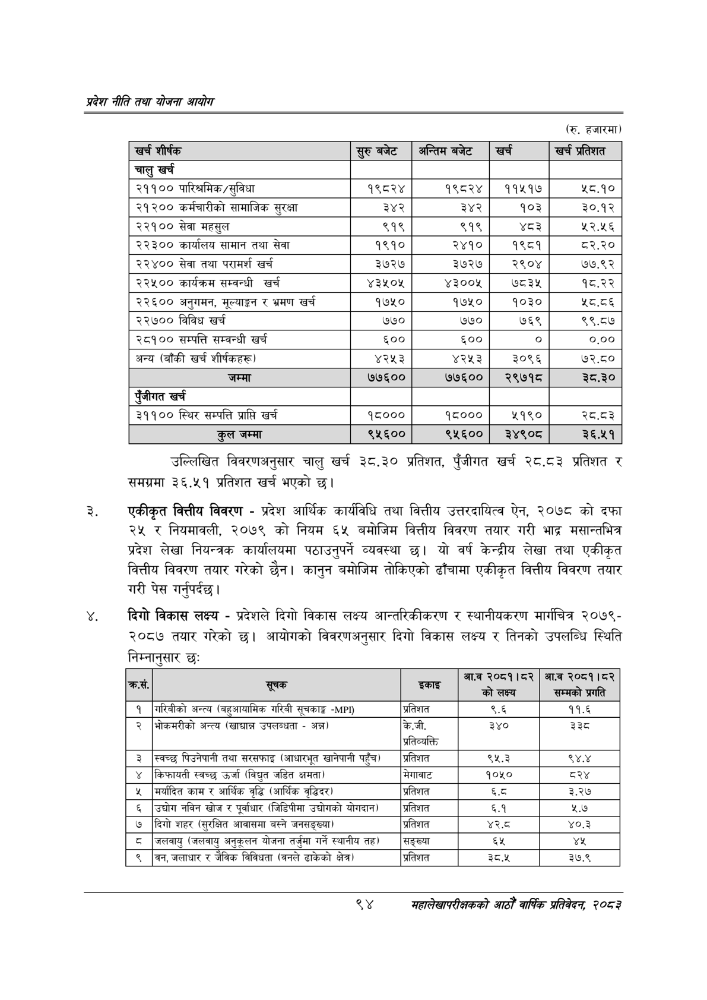

# Page 116 QA

## Rendered page


## Extracted text

```text
प्रदेश नीति तथा योजना आयोग
(रु. हजारमा)
उल्लिखित विवरणअनुसार चालु खर्च ३८.३० प्रतिशत, पुँजीगत खर्च २८.८३ प्रतिशत र समग्रमा ३६.५१ प्रतिशत खर्च भएको छ।
एकीकृत वित्तीय विवरण -प्रदेश आर्थिक कार्यविधि तथा वित्तीय उत्तरदायित्व ऐन, २०७८ को दफा २४ र नियमावली, २०७९ को नियम ६५ बमोजिम वित्तीय विवरण तयार गरी भाद्र मसान्तभित्र प्रदेश लेखा नियन्त्रक कार्यालयमा पठाउनुपर्ने व्यवस्था यो वर्ष केन्द्रीय लेखा तथा एकीकृत वित्तीय विवरण तयार गरेको छैन। कानुन बमोजिम तोकिएको ढाँचामा एकीकृत वित्तीय विवरण तयार गरी पेस गर्नुपर्दछ |
दिगो विकास लक्ष्य -प्रदेशले दिगो विकास लक्ष्य आन्तरिकीकरण र स्थानीयकरण मार्गचित्र २०७९२०८७ तयार गरेको | आयोगको विवरणअनुसार दिगो विकास लक्ष्य र तिनको उपलब्धि स्थिति निम्नानुसार छः
९४
महालेखापरीक्षकको आठौ वाषिकि प्रतिवेदन २०८२

| = शीर्षक | सुरु बबेट | अन्तिम बबेट | खर्च | खर्च प्रतिशत |
| --- | --- | --- | --- | --- |
| चालु खर्च |  |  |  |  |
| २११०० पारिश्रमिक/सुविधा | १९८२४ | १९८२४ | ११४५१७ | १८.१० |
| २१२०० कर्मचारीको सामाजिक सुरक्षा | ३४२ | ३४२ | १०३ | ३०.१२ |
| २२१०० सेवा महसुल | ९१९ | ९१९ | श्द३ | २२.५६ |
| २२३०० कार्यालय सामान तथा सेवा | १९१० | २४१० | १९८१ | ८२.२० |
| २२४०० सेवा तथा परामर्श खर्च | ३७२७ | ३७२७ | २९०४ | ७७.९२ |
| २२५०० कार्यक्रम सम्बन्धी खर्च | ४३५०५ | ४३००४५ | ७८३४ | १८.२२ |
| २२६०० अनुगमन, भूल्याङ्गन र भ्रमण खर्च | १७५० | १७५० | १०३० | श८.८६ |
| २२७०० विविध खर्च | ७७० | ७७० | ७६९ | ९९.८७ |
| २८१०० सम्पत्ति सम्वन्धी खर्च | ६०० | ६०० | ० | ०.०० |
| अन्य (बाँकी खर्च २र्षकह) | ४२५३ | ४२५३ | ३०९६ | ७२.८० |
| जम्मा | ७७६०० | ७७६०० | २९७१८ | ३८.३० |
| खर्च |  |  |  |  |
| ३११०० स्थिर सम्पत्ति प्राप्ति खर्च | १८००० | १८००० | ५१९० | स्८.द३ |
| जम्मा | ९५६०० | ९५६०० | ३४९०८ | ३६.५१ |

|  | सूचक | इकाइ | आ.व २०८१।८२ को लक्ष्य | आ.व २०८१।८२ सम्मको प्रगति |
| --- | --- | --- | --- | --- |
| १ | नरिबीको अन्त्य (बहुआवामिक गरिबी सूचकाङ्क -) | प्रतिशत | ९.६ | ११.६ |
| २ | भोकमरीको अन्त्य (खाद्यान्न उपलब्धता - अन्न) | के.जी. अ्रतिव्वत्ति | ३४० | २३० |
| ३ | स्वच्छु पिउनेपानी तथा सरसफाइ (आधारभूत खानेपानी पहुँच) | प्रतिशत | ९५.३ | ९४.४ |
| ४ | किफाबती स्वच्छ उर्जा (विद्युत जडित क्षमता) | मेगावाट | १०५० |  |
| ५ | मर्यादित काम र आर्थिक वृद्धि (आर्थिक वृद्धिदर) | प्रतिशत | ५ | ३.२७ |
| ६ | उद्योग नविन खोज र पूर्वाधार (जडिपीमा उच्चोगको योगदान) | प्रतिशत | ६.१ | ५.७ |
| ७ | दिगो शहर (सुरक्षित आवासमा बस्ने जनसङ्ख्या) | प्रतिशत | ४२.८ | ४०.३ |
| ८ | जलवायु (जलवायु अनुकूलन योजना तर्जुमा गर्ने स्थानीय तह) | सङ्ख्या | ६५ | ४५ |
| ९ | बन, जलाधार र जैविक विविधता (वनले ढाकेको क्षेत्र) | प्रतिशत | ३८.५ | ३७.९ |
```

## Flags
- table_page
- medium_quality_table
