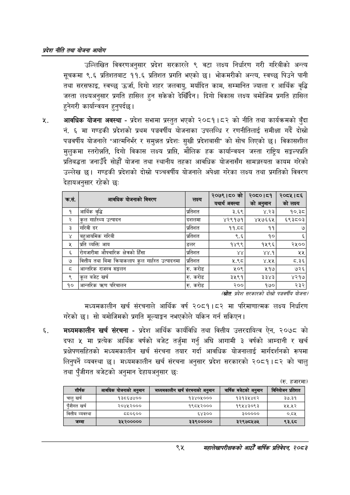

# Page 117 QA

## Rendered page


## Extracted text

```text
प्रदेश नीति तथा योजना आयोग
उल्लिखित विवरणअनुसार प्रदेश सरकारले ९ वटा लक्ष्य निर्धारण गरी गरिबीको अन्त्य सूचकमा ९.६ प्रतिशतबाट ११.६ प्रतिशत प्रगति भएको छ। भोकमरीको अन्त्य, स्वच्छ पिउने पानी तथा सरसफाइ, स्वच्छ उर्जा, दिगो शहर जलवायु, मर्यादित काम, सम्मानित ज्याला र आर्थिक वृद्धि जस्ता लक्ष्यअनुसार प्रगति हासिल हुन सकेको देखिँदैन। दिगो विकास लक्ष्य बमोजिम प्रगति हासिल हुनेगरी कार्यान्वयन हुनुपर्दछ।
आवधिक योजना अवस्था -प्रदेश सभामा प्रस्तुत भएको २०८१।८२ को नीति तथा कार्यक्रमको बुँदा नं. ६ मा गण्डकी प्रदेशको प्रथम पञ्चवर्षीय योजनाका उपलब्धि र रणनीतिलाई समीक्षा गर्दै दोस्रो पञ्चवर्षीय योजनाले "आत्मनिर्भर र समुन्नत प्रदेश: सुखी प्रदेशबासी" को सोच लिएको छ। विकासशील मुलुकमा स्तरोच्नति, दिगो विकास लक्ष्य प्राप्ति, मौलिक हक कार्यान्वयन जस्ता राष्ट्रिय सङ्कल्पप्रति प्रतिबद्धता जनाउँदै सोह्रौं योजना तथा स्थानीय तहका आवधिक योजनासँग सामञ्जस्यता कायम गरेको उल्लेख छ। गण्डकी प्रदेशको दोस्रो पञ्चवर्षीय योजनाले अपेक्षा गरेका लक्ष्य तथा प्रगतिको विवरण देहायअनुसार रहेको छः
(स्रोतः प्रदेश सरकारको दोस्रो पञ्चवर्षीय योजना
मध्यमकालीन खर्च संरचनाले आर्थिक वर्ष २०८१।८२ मा परिमाणात्मक लक्ष्य निर्धारण गरेको | सो बमोजिमको प्रगति मूल्याङ्गग नभएकोले यकिन गर्न सकिएन |
मंध्यमकालीन खर्च संरचना -प्रदेश आर्थिक कार्यविधि तथा वित्तीय उत्तरदायित्व ऐन, २०७८ को दफा ५ मा प्रत्येक आर्थिक वर्षको बजेट तर्जुमा गर्नु अघि आगामी ३ वर्षको आम्दानी र खर्च प्रक्षेपणसहितको मध्यमकालीन खर्च संरचना तयार गर्दा आवधिक योजनालाई मार्गदर्शनको रूपमा लिनुपर्ने व्यवस्था छ। मध्यमकालीन खर्च संरचना अनुसार प्रदेश सरकारको २०८१।८२ को चालु तथा पुँजीगत बजेटको अनुमान देहायअनुसार छः
(रु. हजारमा)
महालेखापरीक्षकको आठौ वाषिकि प्रतिवेदन २०८२

| . क्रस. | आवधिक धाजनाको विवरण | छदा | २०७९।८०को ( | २०८०।८१ \| छो अट्मान | २०८५।८६ को लक्ष्य |
| --- | --- | --- | --- | --- | --- |
| १ | आर्थिक वृद्धि | प्रतिशत | ३.६९ | ४.२३ | १०.३८ |
| २ | कृल गाहहस्थ्य उत्पादन | दशलमा | ४२९१७१ | ४५७६६५ | ६९३८०३ |
| ३ | गरिवी दर | प्रतिशत | ११.द८ | ११ | ७ |
| ४ | बहुआवमिक गरिवी | प्रतिशत | ९.६ | १० | ६ |
| ५ | प्रति व्यक्ति आय | डलर | १४९९ | १५९६ | २५०० |
| ६ | सेमजारीमा ओष्चारिक क्षेत्रको हिँसा | प्रतिशत |  | ४४.१ | [१ |
| ७ | वित्तीय तथा बिमा /्रःबाकलाप कुल गा्हस्त उत्पादनमा | प्रतिशत | ५.९८ | ४.२५ | ८.३६ |
| ८ | अन्तरिक राजस्व सङ्कलन | रु. करोड | १०९ | ५१७ | ७२६ |
| ९ | कूल बजेट खर्च | रु. करोड | ३५९१ | ३३४३ | ४२१७ |
| १० | आन्तरिक त्रण परिचालन | रु. करोड | २०० | १७० | २३२ |

| शीर्षक | आवधिक योजनाको अनुमान | जनान्पनकासोन खर्च सर्नगाका अनुमान | वार्षिक बजेटको अनुमान | ।कानघाजन प्रतिशत |
| --- | --- | --- | --- | --- |
| चालु खर्च | १३८६७४०० | १३४०४५००० | १३१३४५४८२ | ३७.३१ |
| पुँजीगत खर्च | २०४५२००० | १९८५२००० | १९५४३०९३ | २५.४५२ |
| वित्तीय व्यवस्था | द८०६०० | ६४३०० | ३००००० | ०.५ |
| जम्मा | ३५२००००० | ३३९००००० | ३२९७८५७४५ | ९३.६८ |
```

## Flags
- table_page
- medium_quality_table
