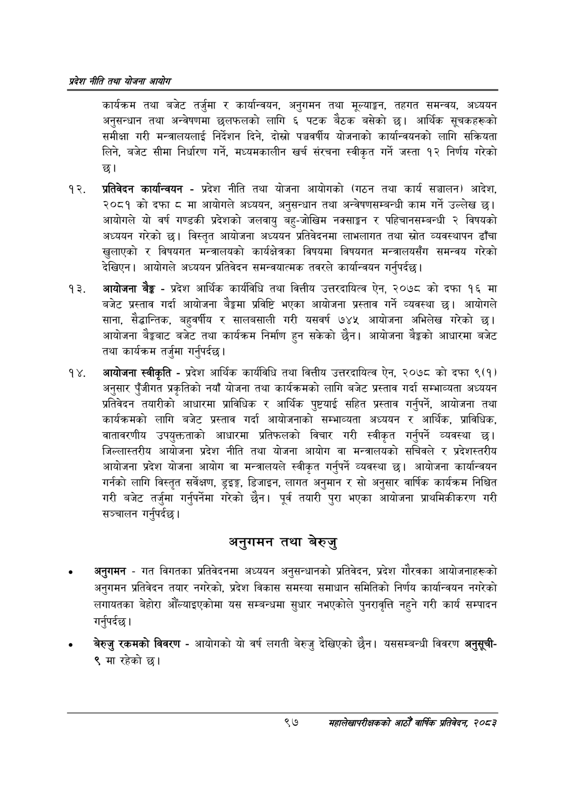

# Page 119 QA

## Rendered page


## Extracted text

```text
प्रदेश नीति तथा योजना आयोग
कार्यक्रम तथा बजेट तर्जुमा र कार्यान्वयन, अनुगमन तथा मूल्याङ्कन, तहगत समन्वय, अध्ययन अनुसन्धान तथा अन्वेषणमा छलफलको लागि ६ पटक बैठक बसेको छ। आर्थिक सूचकहरूको समीक्षा गरी मन्त्रालयलाई निर्देशन दिने, दोस्रो पञ्चवर्षीय योजनाको कार्यान्वयनको लागि सक्रियता लिने, बजेट सीमा निर्धारण गर्ने, मध्यमकालीन खर्च संरचना स्वीकृत गर्ने जस्ता १२ निर्णय गरेको छ।
प्रतिवेदन कार्यान्वयन -प्रदेश नीति तथा योजना आयोगको (गठन तथा कार्य सञ्चालन) आदेश, २०८१ को दफा ८ मा आयोगले अध्ययन, अनुसन्धान तथा अन्वेषणसम्बन्धी काम गर्ने उल्लेख छ। आयोगले यो वर्ष गण्डकी प्रदेशको जलवायु बहु-जोखिम नक्साङ्कन र पहिचानसम्बन्धी २ विषयको अध्ययन गरेको छ। विस्तृत आयोजना अध्ययन प्रतिवेदनमा लाभलागत तथा स्रोत व्यवस्थापन ढाँचा खुलाएको र विषयगत मन्त्रालयको कार्यक्षेत्रका विषयमा विषयगत मन्त्रालयसँग समन्वय गरेको देखिएन। आयोगले अध्ययन प्रतिवेदन समन्वयात्मक तवरले कार्यान्वयन गर्नुपर्दछ |
आयोजना बैङ्क -प्रदेश आर्थिक कार्यविधि तथा वित्तीय उत्तरदायित्व ऐन, २०७८ को दफा १६ मा बजेट प्रस्ताव गर्दा आयोजना बैङ्कमा प्रविष्टि भएका आयोजना प्रस्ताव गर्ने व्यवस्था छ। आयोगले साना, सैद्धान्तिक, बहुवर्षीय र सालबसाली गरी यसवर्ष ७४५ आयोजना अभिलेख गरेको छ। आयोजना बैङ्कबाट बजेट तथा कार्यक्रम निर्माण हुन सकेको छैन। आयोजना बेङ्गको आधारमा बजेट तथा कार्यक्रम तर्जुमा गर्नुपर्दछ |
आयोजना स्वीकृति -प्रदेश आर्थिक कार्यविधि तथा वित्तीय उत्तरदायित्व ऐन, २०७८ को दफा ९(१) अनुसार पुँजीगत प्रकृतिको नयाँ योजना तथा कार्यक्रमको लागि बजेट प्रस्ताव गर्दा सम्भाव्यता अध्ययन प्रतिवेदन तयारीको आधारमा प्राविधिक र आर्थिक पुष्टयाई सहित प्रस्ताव गर्नुपर्ने, आयोजना तथा कार्यक्रमको लागि बजेट प्रस्ताव गर्दा आयोजनाको सम्भाव्यता अध्ययन र आर्थिक, प्राविधिक, वातावरणीय उपयुक्तताको आधारमा प्रतिफलको विचार गरी स्वीकृत गर्नुपर्ने व्यवस्था जिल्लास्तरीय आयोजना प्रदेश नीति तथा योजना आयोग वा मन्त्रालयको सचिवले र प्रदेशस्तरीय आयोजना प्रदेश योजना आयोग वा मन्त्रालयले स्वीकृत गर्नुपर्ने व्यवस्था छ। आयोजना कार्यान्वयन गर्नको लागि विस्तृत सर्वेक्षण, ड्इङ्ग, डिजाइन, लागत अनुमान र सो अनुसार वार्षिक कार्यक्रम निश्चित गरी बजेट तर्जुमा गर्नुपर्नेमा गरेको छैन। पूर्व तयारी पुरा भएका आयोजना प्राथमिकीकरण गरी सञ्चालन गर्नुपर्दछ।
अनुगमन तथा बेरुजु
अनुगमन -गत विगतका प्रतिवेदनमा अध्ययन अनुसन्धानको प्रतिवेदन, प्रदेश गौरवका आयोजनाहरूको अनुगमन प्रतिवेदन तयार नगरेको, प्रदेश विकास समस्या समाधान समितिको निर्णय कार्यान्वयन नगरेको लगायतका बेहोरा आँल्याइएकोमा यस सम्बन्धमा सुधार नभएकोले पुनरावृत्ति नहुने गरी कार्य सम्पादन |
गर्नुपर्दछ
बेरुजु रकमको विवरण -आयोगको यो वर्ष लगती बेरुजु देखिएको छैन। यससम्बन्धी विवरण अनुसूची९ मा रहेको छ।
९७
महालेखापरीक्षकको आठौ वाषिकि प्रतिवेदन २०८२
```

## Flags
- None
